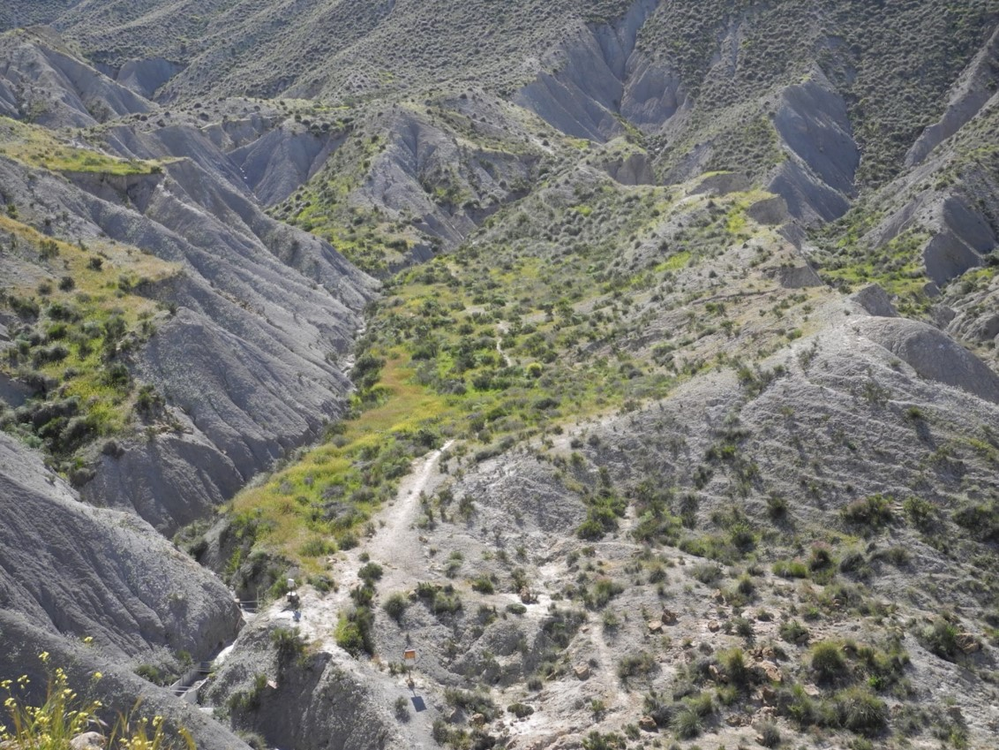
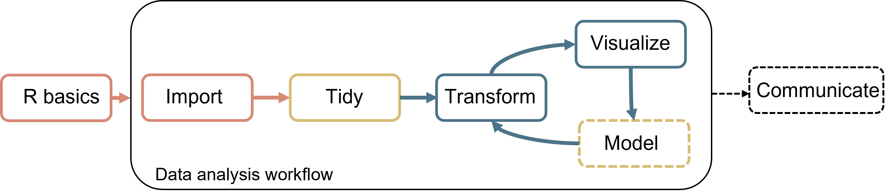

```{r setup, include=FALSE}
knitr::opts_chunk$set(echo = TRUE,
                      warning = FALSE,
                      message = FALSE)
library(fontawesome)
```

```{r child="title_slide_allison.Rmd"}

```

---

# Who am I?

.pull-left[

- Scientific modeller with ecology background

- Working in the [theoretical ecology group](https://www.bcp.fu-berlin.de/biologie/arbeitsgruppen/botanik/ag_tietjen/index.html) at Freie Universität

- PhD student at Freie Universität Berlin 
  - Topic: Modelling the impact of biological soil crusts on dryland hydrology

#### Teaching `r fa("r-project")`

- Statistics with R for Biology Master students
- Workshops on R packages, R development, ...
]

.pull-right[
.center[
<br><br>

]
]

---
# What do I use `r fa("r-project")` for?


- **Cleaning data**
- **Visualizing data**
- **Wrangling data**
- **Performing statistical analyses**
- Modelling biocrusts
- Writing documents 
- Presentations
- Workflow automation
- ...
  
---
# Who are you?

[Results of questionnaire](https://docs.google.com/forms/d/12t0jqM5-XjWKFLzbyoFUeGZsPNjokoygEiwo-iHlpEM/edit#responses)

---
# The Workshop: Topics

.center[]

--

<b>.col2[Day 1: Introduction to R and RStudio and data import]</b>

<b>.col1[Day 2: Data transformation and visualization with the tidyverse]</b>

<b>.col3[Day 3: Cleaning data (optional: statistical tests and models with R)]</b>

**Day 4: Bring your own data**

.footnote-right[Image adapted from Wickham & Grolemund: [R for Data Science](https://r4ds.had.co.nz/introduction.html)]

---
# The Workshop: Schedule and Organization

🕘 9 a.m. - 4 p.m. (🥪 ~ 12 a.m. - 1 p.m.)<br>
📍  We will meet in the `General` meeting on Webex

--

#### Organization

- **Input sessions**
  - Presentation and demonstration of a topic
  - Some examples
  
- **Tasks** regarding this topic
  - Solve them in small groups
  
- **Joint discussion** of tasks and additional questions

---
# The Workshop: Material

- All material can be found on the [workshop's website](https://selinazitrone.github.io/intro-r-data-analysis/)

  - Presentations
  - Tasks
  - Solutions
  - Additional resources
  
- The complete material can be downloaded from the website after the workshop
- Website will stay online after the workshop

---
# Bring your own data

On the last workshop day, you can work with your own research data.
I will also provide some real life data sets from different topics. 

--

#### Learning by doing

- Get started on using R for your analyses

- Use any of the methods from the course or try new things, ...

- Present/discuss your results, questions and problems at the end of the day

---
# Bring your own data

- Keep the last workshop day in mind during the next days

  - Remember if you learn something that might be applicable to your data
  
  - Think of questions that you would like to answer for your data set
  
- Add your name and some details on what you plan to do in this [joint table](https://docs.google.com/spreadsheets/d/1MuINiPjVvZrMRUYboDXdoPwj8daKj88k6K1hnfcoWxQ/edit?usp=sharing)

---
# Before we get started I

- Help each other if possible
  - Have an eye on the chat
  
--

- All questions and comments are welcome

--

- Feedback is welcome
  - Evaluation at the end of the workshop
  
--

- Do you want to record the input sessions?
  - Someone needs to be responsible for that

---
# Before we get started II

**How to use Webex teams**

- `General` channel for our joint meetings and chat

- `Groups 1-4` for group work
  
  - Group spaces have their own chat and meetings
  - Use the chat in the groups for questions 
  - Meet in your groups and solve the tasks jointly (if you want)

- Please always have a look at the general chat during the tasks

---
# Before we get started III

.large[Did anyone have problems installing R and RStudio?]

<br>

 Download and install R from [https://cran.r-project.org](https://cran.r-project.org/)

 Download and install RStudio from             [https://www.posit.co](https://posit.co/download/rstudio-desktop/)


