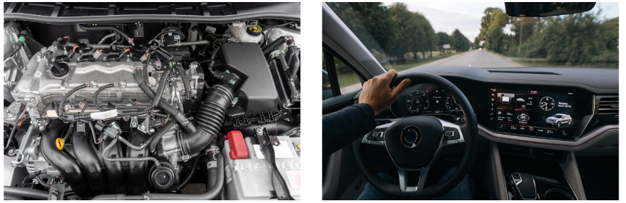
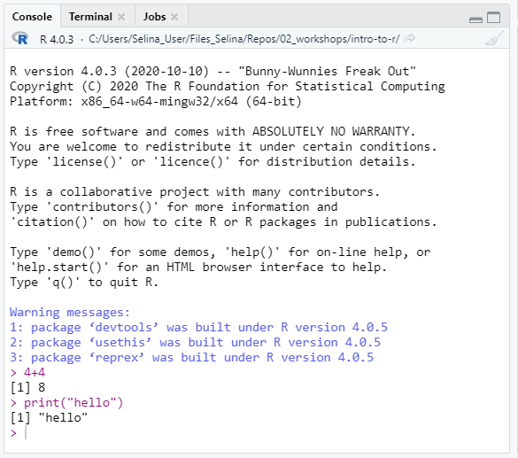
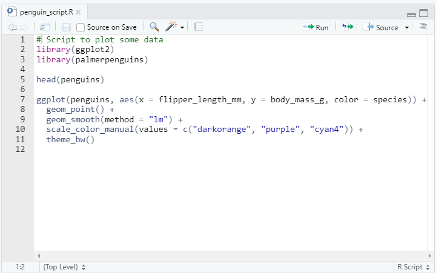
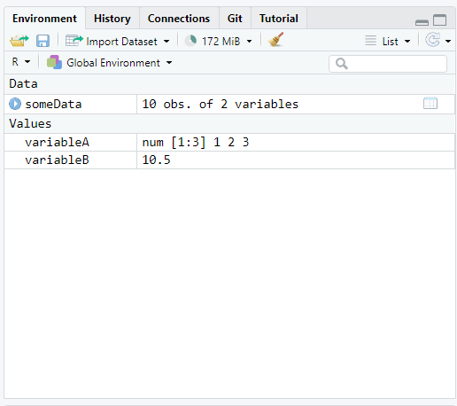
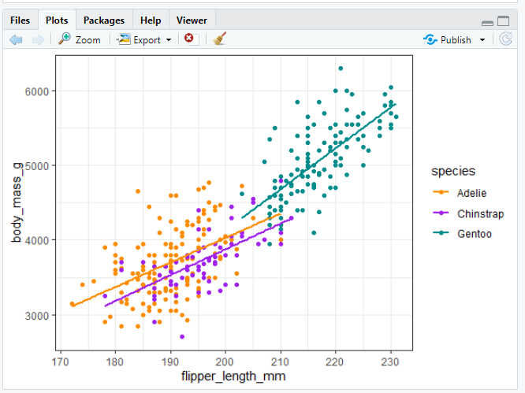
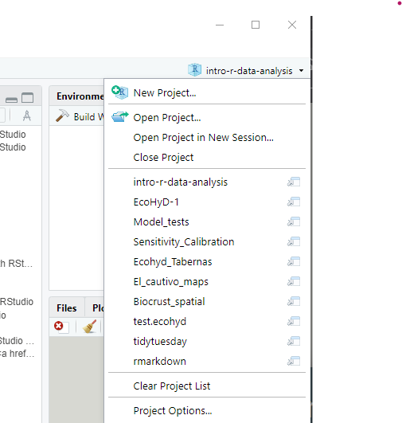

```{r setup, include=FALSE}
knitr::opts_chunk$set(echo = TRUE,
                      warning = FALSE,
                      message = FALSE)
library(fontawesome)
```

```{r child="title_slide.Rmd"}

```

---
# Difference between R and RStudio

--

.pull-left[
.center[
    <br>
    ]
    
  R is the **programming language** and the **program** that does the actual work
    
  - Can be use with many different programming environments (But RStudio is the best for R)
]

--
.pull-right[
.center[
    <br>
     ]
  
  RStudio is the **integrated development environment** (IDE)
   - Provides an interface to R
   - Specifically built around R code 
   - Execute code
   - Syntax highlighting
   - File and project management
   - ...
]

--
<br>

.content-box-gray[
`r fa("arrow-right")` You can use R without RStudio but RStudio without R would be of little use
]

---

# Difference between R and RStudio

.pull-left[
.center[
    **R** is like the engine
    ]
  ]
.pull-right[
.center[
  **RStudio** is more like the dashboard, etc.
     ]
     ]

.center[]


.footnote-right[analogy and image from 
[ModernDive Book](https://moderndive.com/1-getting-started.html#r-rstudio)]

---
# Basic idea of writing code for data analysis

- Break down your process into small steps

- Write precise instructions telling the computer what to do in each step
  - For this you can use the programming language R
  
- Tell R to execute these instructions
  - R will return the result of your instructions (or an error message)

- You can do all of this inside RStudio
  
---
# A quick tour around RStudio

.center[]

---
# Console pane

.pull-left[
- Execute R code

- Output from R code in scripts is printed there

- Type a command into the console and execute with `Enter/Return`

.content-box-yellow[`r fa("lightbulb")` Use arrow keys to bring back last commands
]]

.pull-right[
  
]

---
# Script pane

.pull-left[

- Write scripts with R code

  - Scripts are text files with R commands (file ending `.R`)
  
  - Use scripts to save commands for reuse

]

.pull-right[
  
]

---
# Script pane

.pull-left[

- Create a new R script: <br> `File -> New File -> R Script`
- Save an R script:<br> `File -> Save` (`Ctrl/Cmd + S`)
- Run code line by line with `Run` button (`Ctrl + Enter/Cmd + Return`)
- You can open multiple scripts at the same time

]

.pull-right[
  
]

--

<br>
.content-box-yellow[`r fa("lightbulb")` Use **scripts** for all your analysis and for commands that you want to save.]

.content-box-yellow[`r fa("lightbulb")` Use **console** for temporary commands, e.g. to test something.]

---
# Environment pane

.pull-left[

- Shows objects currently present in the R session

- Is empty if you start R
]

.pull-right[
  
]


---
# Files pane

.pull-left[

- Similar to Explorer/Finder

- Browse project structure and files
  - Find and open files
  - Create new folders
  - Delete files
  - Rename files 
  - ...
  
- Practical if you don't want to switch between File Explorer and RStudio all the time
]

.pull-right[
.right[
  ]
]

---
# Plot pane

.pull-left[
- Plots that are created with R will be shown here
]

.pull-right[
  
]

---
# How to organize an R project? 

I recommend a **project oriented workflow** with RStudio

.pull-left[
- One directory with all files relevant for project
  - Scripts, data, plots, documents, ...
  
- An RStudio project is just a normal directory with an `*.Rproj` file

- Advantages of using RStudio projects
    - Easy to navigate in R Studio (`File` pane)
    - Easy to find and access scripts and data in RStudio
    - Project root is working directory
    - Open multiple projects simultaneously in separate RStudio instances
]    

.pull-right[


```{}
Project
|
|- data
|
|- documents
|   |
|   |- notes
|   |
|   |- reports
|
|- analysis
|   |
|   |- clean_data.R 
|   |
|   |- statistics.R
|
|- *.RProj
```
.small[Example project structure]
]

---
# Create an RStudio project

.pull-left[

Create a project from scratch:
  
1. `File -> New Project -> New Directory -> New Project`
2. Enter a directory name (this will be the name of your project)
3. Choose the Directory where the project should be initiated
4. `Create Project`

RStudio will now create and open the project for you. 
]

.pull-right[

.small[Example project structure in RStudio]
]


---
# Navigate an RStudio project

.center[

]

---
# Open a project from outside RStudio

To open an RStudio project from your file explorer/finder, just double click on the `*.Rproj` file
.center[

]

---
# Open a project inside RStudio

To open an RStudio project from RStudio, click on the project symbol on the top right of R Studio and select the project from the list.

.center[
]

---
class: inverse, middle, center

# .large[Now you]

## Task 1: Set up your own RStudio project for this workshop (25 min)

#### Find the task description [here](https://selinazitrone.github.io/intro-r-data-analysis/01_tasks_controller.html#set-up-an-rstudio-project)
