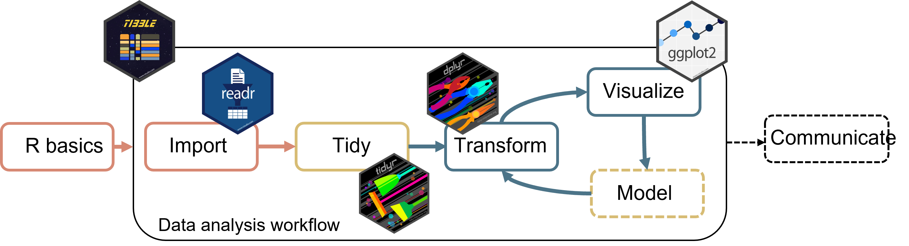
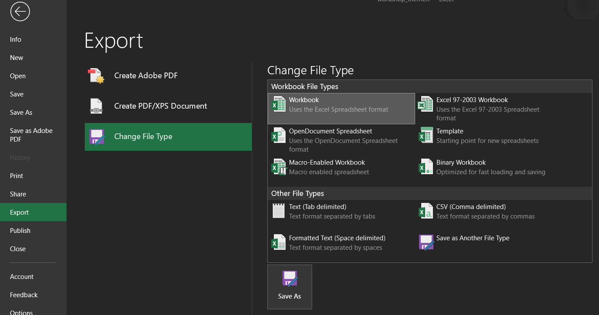

```{r setup, include=FALSE}
knitr::opts_chunk$set(echo = TRUE,
                      warning = FALSE,
                      message = FALSE)
library(fontawesome)
library(ggplot2)
```

```{r child="title_slide.Rmd"}

```

---
class: inverse, center, middle

# .large[The tidyverse]

.center[]

---
# The tidyverse

> The tidyverse is an opinonated <b>collection of R packages</b> designed for data science. All packages share an underlying design philosophy, grammar, and data structures.<br>
.small[([www.tidyverse.org](https://www.tidyverse.org/))]                                                                       

These are the main packages from the tidyverse that we will use:<br><br>

.center[]

---
# Workflow data analysis

.middle[
]

.footnote-left[Image adapted from Wickham & Grolemund: [R for Data Science](https://r4ds.had.co.nz/introduction.html)]

---
# The tidyverse

Install the tidyverse once with:

```{r eval=FALSE}
install.packages("tidyverse")
```

Then load and attach the packages at the beginning of your script:

```{r}
library(tidyverse)
```

--

You can also install and load the tidyverse packages individually, but since we will use so many of them together, it's easier to load and attach them together.

---
class: inverse, center, middle

# .large[Import data with readr]

.center[]

---
# Readr

`readr` is a tidyverse package so to use it you can do one of the following things:

```{r eval=FALSE}
library(tidyverse) # or library(readr) 
```

--

The most important functions are:

- `read_csv()`/`write_csv()` to read/write **comma delimited** files

- `read_csv2()`/`write_csv2()` to read/write **semicolon delimited** files

- `read_tsv()`/`write_tsv()` to read/write **tab delimited** files

- `read_delim()`/`write_delim()` to read/write files with **any delimiter**

---
# Read files with `read_*()`

All `read_*()` functions take a path to the data file as a first argument:

.center[<code><b>read_*(file = .col2["path/to/your/file"], ...)</b></code>]

--

Import files with a `readr` function fitting the delimiter of your file:

```{r eval=FALSE}
dat <- read_csv("./data/your_data.csv") # comma delimiter

dat <- read_csv2("./data/your_data.txt") # semicolon delimiter

dat <- read_tsv("./data/your_data.txt") # tab delimiter
```

--

Use `read_delim` for a generic type of delimiter:

```{r eval=FALSE}
dat <- read_delim("./data/your_data.txt", delim = "\t") # tab delimiter

dat <- read_delim("./data/your_data.txt", delim = "..xyz..") # ..xyz.. delimiter
```

--

All `read_*()` functions return a `tibble`

---
# Read files with `read_*()`

Have a look at `?read_delim` for more options.

You can e.g.

- specify number of lines to skip reading with `skip`

--

- specify whether the data has a header column or not with `col_names = TRUE/FALSE`

--

- change the data types of columns while reading them with `col_types`

- ...

---
# Write files with `write_*()`

Every `read_*()` function has a corresponding `write_*()` function to export data from R.

--

Write data from R e.g.

- If tasks take a lot of time and you want to do them only once
  - Run the code, save the intermediate result, work with intermediate result

- To share transformed data

- ...

---
# Write files with `write_*()`

All `write_*()` functions take the data to write as the first and the file to write to as the second argument:

.center[<code><b>write_*(x = .col1[dat], file = .col2["path/to/save/file"], ...)</b></code>]

--

```{r eval=FALSE}
write_csv(dat, file = "./data-clean/your_data.csv") # comma delimiter

write_csv2(dat, file = "./data-clean/your_data.txt") # semicolon delimiter

write_tsv(dat, file = "./data-clean/your_data.txt") # tab delimiter
```

--

Use `write_delim` for a generic type of delimiter:

```{r eval=FALSE}
write_delim(dat, file = "./data/your_data.txt", delim = "\t") # tab delimiter

write_delim(dat, file = "./data/your_data.txt", delim = "..xyz..") # ..xyz.. delimiter
```

---
# Absolute vs. relative paths

#### Absolute paths

`C:/Users/Selina/some_folder/another_folder/data/file_to_read.csv`

#### Relative paths

`./data/file_to_read.csv`

--

- relative paths are interpreted relative to the **working directory**
  - the `./` in the path stands for the working directory

- check out where your working directory is with `getwd()`

- in RStudio projects, the working directory is always the project root

---
# Absolute vs. relative paths

Working with R and RStudio, the best way is to:

- **Organize your work in an RStudio project**
  - The project root is automatically the working directory
  - All your files are in one place

- **Use paths relative to the project root**

--

#### Why?

--

- no need to change the working directory

--


- portable paths: will also work on other machines that copied the project

--

- makes the code more readable

--

- less error prone


---
class: inverse, middle, center

# .large[Some guidelines for data sets for `r fa("r-project")`]

---
# Data format

Follow these guidelines to make data import to R easier and less frustrating

- Readable file format: `.csv`, `.txt` & Co instead of `.xlsx`

--

Save an Excel spreadsheet as csv or txt either by

1. `File -> Save As` and select comma separated from the drop down menu
2. `File -> Export`


  
  
---
# Data format

Follow these guidelines to make data import to R easier and less frustrating

- Readable file format: `.csv`, `.txt` & Co instead of `.xlsx`

- No white space in column headers
  - use a character as separator, e.g. `species_name` instead of `species name`

  - if this is unpractical, have a look at the function `janitor::clean_names()` from the `janitor` package

--

- Avoid special characters
  - no ä, ö, ü, ß, é, ê, ...

--

- Avoid empty cells
  - if you have missing values, put `NA` in the cell

---
# Paths

- Avoid white space in paths

  - `data-raw/my_data.csv` instead of `data raw/my_data.csv`

--

- Avoid special characters in paths

  - no ä, ö, ü, ß, é, ê, ...

---
class: inverse, middle, center

# .large[Now you]

## Task 2-3: Read and write data files

#### Find the task description [here](www.github.com)

