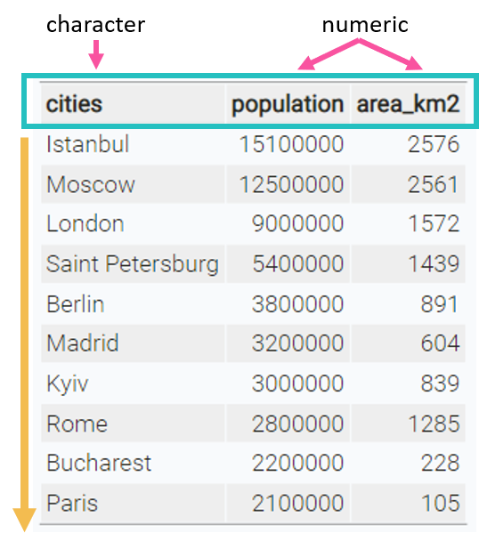
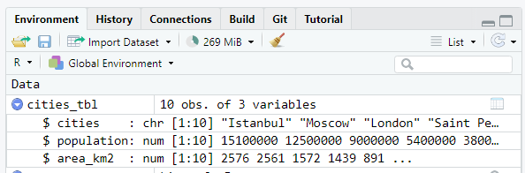
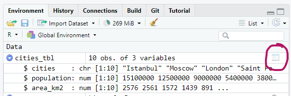

```{r setup, include=FALSE}
knitr::opts_chunk$set(echo = TRUE,
                      warning = FALSE,
                      message = FALSE)
library(fontawesome)
library(tibble)
```

```{r child="title_slide.Rmd"}

```

---
# Data frames

The built-in data structure for tables in R is a `data frame`.

--

.pull-left[

- Vectors in R can't represent a table with data that is connected via rows

> Data frames are one of the **biggest and most important ideas** in R, and one of the things that make R different from other programming languages.<br>.small[(Wickham, [Advanced R](https://adv-r.hadley.nz/vectors-chap.html#tibble))]

]

.pull-right[

```{r echo=FALSE}
# list of 10 biggest cities in Europe
cities <- c("Istanbul", "Moscow", "London", "Saint Petersburg", "Berlin", "Madrid", "Kyiv", "Rome", "Bucharest", "Paris")
population <- c(15.1e6, 12.5e6, 9e6, 5.4e6, 3.8e6, 3.2e6, 3e6, 2.8e6, 2.2e6, 2.1e6)
area_km2 <- c(2576, 2561, 1572, 1439,891,604, 839, 1285, 228, 105 )

data.frame(cities = cities,
           population = population,
           area_km2 = area_km2) |> 
  knitr::kable()
```

]

---
# Data frames

A data frame is a **named list of vectors** of the same length.

--

.pull-left[

#### Basic properties of a data frame

- every <b>.col1[column is a vector]</b>
- columns have a <b>.col2[header]</b>
  - this is the <b>.col2[name]</b> of the vector in the list
- within one column, all values are of the <b>.col3[same data type]</b>
- every column has the same length

]
.pull-right[
.center[

 ]
]

---
# Data frames

Data frames are created with the function `data.frame()`:

.pull-left[

```{r eval=FALSE}
cities <- c(
  "Istanbul", "Moscow", "London", 
  "Saint Petersburg", "Berlin","Madrid",
  "Kyiv", "Rome", "Bucharest","Paris")

population <- c(
  15.1e6, 12.5e6, 9e6, 5.4e6, 3.8e6,
  3.2e6, 3e6, 2.8e6, 2.2e6, 2.1e6)

area_km2 <- c(2576, 2561, 1572, 1439, 
  891, 604, 839, 1285, 228, 105)

```
```{r eval=FALSE}
data.frame( #<<
  cities = cities, #<<
  population = population, #<<
  area_km2 = area_km2#<<
  )#<<
```
]

--

.pull-right[
```{r echo=FALSE}
# list of 10 biggest cities in Europe
cities <- c("Istanbul", "Moscow", "London", "Saint Petersburg", "Berlin", "Madrid", "Kyiv", "Rome", "Bucharest", "Paris")
population <- c(15.1e6, 12.5e6, 9e6, 5.4e6, 3.8e6, 3.2e6, 3e6, 2.8e6, 2.2e6, 2.1e6)
area_km2 <- c(2576, 2561, 1572, 1439, 891, 604, 839, 1285, 228, 105)

data.frame(
  cities = cities,
  population = population,
  area_km2 = area_km2
)
```

]

---
# Tibbles

Tibbles are 

>a **modern reimagining of the data frame**. Tibbles are designed to be (as much as possible) **drop-in replacements** for data frames. <br>.small[(Wickham, [Advanced R](https://adv-r.hadley.nz/vectors-chap.html#tibble)) ]

--

Have a look at [this book chapter](https://adv-r.hadley.nz/vectors-chap.html#tibble) for a full list of the differences between data frames and tibbles and the advantages of using tibbles.

--

.pull-left[
- Tibbles have the same basic properties as data frames (named list of vectors)

- Everything that you can do with data frames, you can do with tibbles

]

.pull-right[
.center[
]
]

---
# Tibbles

Tibbles are a available from the `tibble` package.

--

.pull-left[

Before we use tibbles, we need to install the package once using the function `install.packages`:

```{r eval=FALSE}
# This has do be done only once (in the console, not in the script)
install.packages("tibble")
```

Then, we need to load and attach the package to our current R session using `library`:

```{r eval=FALSE}
# This has to be done every time R restarts
# Put it at the top of a script
library(tibble)
```
]

.pull-right[.center[]]

---
# Tibbles

Create a tibble using the `tibble()` function:

--

.pull-left[
```{r eval=FALSE}
library(tibble) #<<

tibble( #<<
  cities = cities,
  population = population,
  area_km2 = area_km2
) #<<
```
]
.pull-right[
```{r echo=FALSE}
cities_tbl<- tibble(
  cities = cities,
  population = population,
  area_km2 = area_km2
)
cities_tbl
```
]

---
# Exploring tibbles

Look at the structure of an object using `str()`:

```{r}
str(cities_tbl)
```
--

Or do it in the environment pane of RStudio, by clicking the little blue arrow next 
to the object:



--

- This works for every R object and is very useful if code doesn't work and you don't know why

---
# Exploring tibbles

How many rows?

```{r}
nrow(cities_tbl)
```
--
How many columns?

```{r}
ncol(cities_tbl)
```
--
What are the column headers?

```{r}
names(cities_tbl)
```

---
# Exploring tibbles

Look at the entire table in a separate window with `view()`:

```{r eval=FALSE}
tibble::view(cities_tbl)
```

--

Or click on the little table sign in the Environment pane:



---
# Exploring tibbles

Get a quick summary of all columns:

```{r}
summary(cities_tbl)
```

---
# Indexing tibbles

Indexing tibbles works similar to indexing vectors but with two dimensions instead of 1:<br>

<b>.center[ tibble [ .col1[row_index], .col2[col_index or col_name] ]]</b>

--

- Missing row_index or col_index means *all rows* or *all columns* respectively.

--

- Indexing a tibble using `[]` always returns another tibble.

---
# Indexing tibbles

```{r}
# First row and first column
cities_tbl[1, 1]
```

--

This is the same as 

```{r eval=FALSE}
cities_tbl[1, "cities"]
```

---
# Indexing tibbles: rows

```{r}
# rows 1 & 5, all columns:
cities_tbl[c(1, 5), ]
```

---
# Indexing tibbles: columns 

```{r eval=FALSE}
# All rows, first 2 columns
cities_tbl[ ,1:2] # same as cities_tbl[ , c(1, 2)]
# same as
cities_tbl[ ,c("cities", "population")]
```

```{r echo=FALSE}
print(cities_tbl[ ,c("cities", "population")], n=3)
```

---
# Indexing tibbles: columns

Indexing columns by name is usually preferred to indexing by position

```{r eval=FALSE}
cities_tbl[ ,1:2] # okay
cities_tbl[ ,c("cities", "population")] # better
```

#### Why?

--

- Code is much easier to read

--

- Code is more robust against
  - changes in column order
  - mistakes in the code (e.g. typos)

--
  
```{r eval=FALSE}
cities_tbl[ ,c(1,3)] # 3 instead of 2 -> wrong but no error
cities_tbl[ ,c("cities", "popluation")] # typo -> wrong and error
```

--

.content-box-yellow[`r fa("lightbulb")` General rule: Good code produces errors when something unintended or wrong happens]

---
# Tibbles: Select columns with `$`

Select an entire column from a tibble using `$` (this returns a vector instead of a tibble):

```{r}
cities_tbl$cities
```


---
# Adding new columns

New columns can be added as vectors using the `$` operator. The vectors need to have the same length as the tibble has rows.

--

```{r}
# add a country column
cities_tbl$country <- c(
  "Turkey", "Russia", "UK", "Russia", "Germany", "Spain",
  "Ukraine", "Italy", "Romania", "France"
)
```
```{r echo=FALSE}
cities_tbl
```

---
# Summary I

#### data frames and tibbles

- can be used to represent tables in R
- are pretty similar, however tibbles are slightly conventient and modern
- are **named lists of vectors of the same length**
  - every column is a vector
  - columns have a header which is the name of the vector in the list
  - within one column, values are of same data type
  - every column has the same length
  
#### tibbles

- to use tibbles, install the package once with `install.packages("tibble")`
- put `library(tibble)` at the beginning of your script to load package

---
# Summary II

#### Creating tibbles and data frames

```{r eval=FALSE}
# data frame
data.frame(
  a = 1:3,
  b = c("a", "b", "c"),
  c = c(TRUE, FALSE, FALSE) 
)
# tibble
tibble(
  a = 1:3,
  b = c("a", "b", "c"),
  c = c(TRUE, FALSE, FALSE) 
)
# convert data frame to tibble
as_tibble(df)
```

---
# Summary III

#### Looking at tibble structure

```{r eval=FALSE}
# structure of tibble and data types of columns
str(tbl)
# number of rows
nrow(tbl)
# number of columns
ncol(tbl)
# column headers
names(tbl)
# look at the data in a new window
tibble::view(tbl)
# summary of values from each column
summary(tbl)
```

---
# Summary IV

#### Indexing tibbles and selecting columns

Return result as tibble:

```{r eval=FALSE}
# rows and columns by position
tbl[1:3, c(1, 3)]
tbl[1:3, ] # all columns
tbl[, 3] # column 3, all rows
tbl[3] # same as above

# columns by name
tbl[, c("colA", "colB")]
tbl[c("colA", "colB")]
```

Return result as vector:

```{r eval=FALSE}
tbl$colA # select colA  
```

---
class: inverse, middle, center

# .large[Now you]

## Task 3: Tibbles (20 min)

#### Find the task description [here](https://selinazitrone.github.io/intro-r-data-analysis/01_tasks_controller.html#tibbles)
