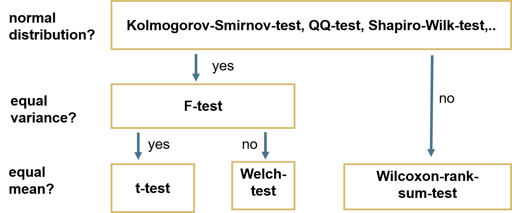

```{r setup, include=FALSE}
knitr::opts_chunk$set(
  echo = TRUE, 
  warning = FALSE, 
  message = FALSE, 
  collapse = TRUE,
  fig.height = 6.3,
  fig.allign = 'center',
  fig.retina = 3.5,
  fig.showtext = TRUE
)
library(fontawesome)
library(tidyverse)
library(patchwork)

theme_set(theme_classic(base_size=16))
options(scipen = 0)
```

```{r child="title_slide.Rmd"}

```

```{r setup, include = FALSE}
library(tibble)
```


---
# Overview of tests

.center[]

Note: Levene-test not necessary if you are interested in equal means but not equal variances!

---
# Test for normal distribution

There are **various tests** and the outcome might differ!

--

**Kolmogorov-Smirnov-Test (KS-Test)**

- how much does the cumulative probability of observed data differ from normal distribution
- very general test (also works for other distributions)
- low power: data not normally distributed but $H_0$ not rejected

--

**Shapiro-Wilk-Test**

- how much does variance of observed data differ from normal distribution
- specific test only for normal distribution
- high power, also for few data points

--

**Visual tests: QQ-Plot**

- quantiles of observed data plotted against quantiles of normal distribution
- scientist has to decide if normal or not

---
# Kolmogorov-Smirnov-Test

First, generate some normally distributed numbers (you would use real data instead).

```{r}
mydata <- tibble(
  some_var = rnorm(n=200, mean = 50, sd = 5)
)
```

--

To perform a KS-Test, use the `ks.test` function

```{r eval=FALSE}
ks.test(mydata$some_var, "pnorm", mean = mean(mydata$some_var), sd = sd(mydata$some_var))
```

---
# Short deviation: The `$` operator


