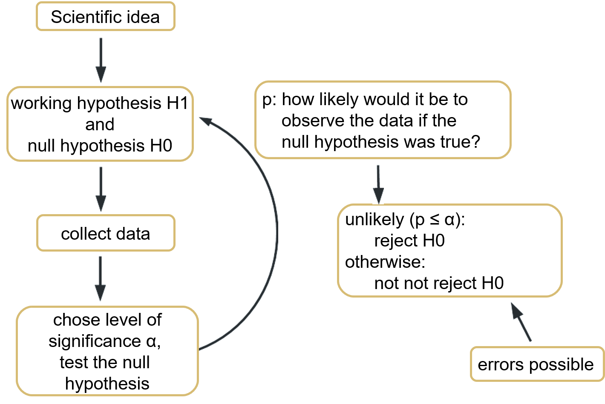
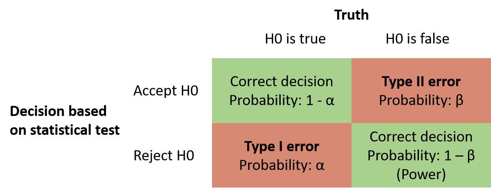
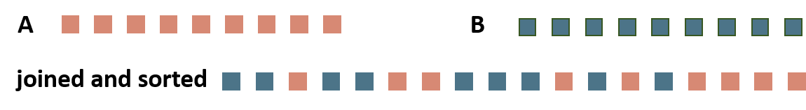

```{r setup, include=FALSE}
knitr::opts_chunk$set(
  echo = TRUE, 
  warning = FALSE, 
  message = FALSE, 
  collapse = TRUE,
  fig.height = 6.3,
  fig.allign = 'center',
  fig.retina = 3.5,
  fig.showtext = TRUE,
  error = TRUE
)
library(tidyverse)
theme_set(theme_grey(base_size=16))
options(scipen = 0)
```

```{r child="title_slide.Rmd"}

```

---
# Typical approach in statistics

.center[]

---
# Types of errors

.left[]

--
Keep error probability as low as possible

--

- Decrease type I errors: choose smaller $\alpha$ `r fontawesome::fa("arrow-right")` but increases type II errors
- Decrease type II errors: more data or different test

--

`r fontawesome::fa("arrow-right")` There are trade-offs and errors can't be completely avoided, especially with multiple tests applied in a row

---
# Overview of tests

.center[]


---
class: inverse, center, middle

# .large[Tests for normal distribution]

---
# Test for normal distribution

There are **various tests** and the outcome might differ!

--

**Kolmogorov-Smirnov-Test (KS-Test)**

- how much does the cumulative probability of observed data differs from normal distribution
- very general test (also works for other distributions)
- low power: data not normally distributed but $H_0$ not rejected

--

**Shapiro-Wilk-Test**

- how much does variance of observed data differ from normal distribution
- specific test only for normal distribution
- high power, also for few data points

--

**Visual tests: QQ-Plot**

- quantiles of observed data plotted against quantiles of normal distribution
- scientist has to decide if normal or not

---
# The data

.pull-left[

Create a tibble with two variables

- `normal`: 200 normally distributed values with mean 50 and standard deviation 5
- `non_normal`: 200 uniformly distributed values between 45 and 55

```{r}
set.seed(123)
mydata <- tibble(
  normal = rnorm(
    n = 200,
    mean = 50,
    sd = 5
  ),
  non_normal = runif(
    n = 200,
    min = 45,
    max = 55
  )
)

```

]

.pull-right[
```{r echo=FALSE}
mydata %>%
  pivot_longer(cols = 1:2, names_to = "type", values_to = "value") %>%
  ggplot()+
  geom_histogram(alpha = 0.5, aes( x = value, fill = type,y = ..density..)) + # plot probability instead of count on y axis
  stat_function(fun = dnorm,
                args = list(mean = 50,
                            sd = 5),
                color = "darkorange", size = 1)+
  stat_function(fun = dnorm,
                args = list(mean = mean(mydata$non_normal),
                            sd = sd(mydata$non_normal)),
                color = "cyan4", size = 1)+
    scale_fill_manual(values = c("cyan4", "darkorange"))+
  theme(legend.position = c(0.85,0.85))
```

]

---
# Kolmogorov-Smirnov-Test

$H_0$: Data does not differ from a normal distribution

--

```{r}
# Tests need the data as a vector input
ks.test(mydata$normal,
  "pnorm",
  mean = mean(mydata$normal),
  sd = sd(mydata$normal)
)
```

--

- D: test statistic, largest difference between cumulative distributions
- p-value: probability to observe data if $H_0$ was true
- two-sided test: we don't know in which direction our data deviates from normal distribution

--

**Result:** The data does not deviate significantly from a normal distribution (KS-Test, D = 0.054, p > 0.05)

---
# Kolmogorov-Smirnov-Test

$H_0$: Data does not differ from a normal distribution

```{r}
ks.test(mydata$non_normal,
  "pnorm",
  mean = mean(mydata$non_normal),
  sd = sd(mydata$non_normal)
)
```

--

**Result:** The data does not deviate significantly from a normal distribution (KS-Test, D = 0.077, p > 0.05)

--

**But:** We know that our data is not normally distributed. Nevertheless, we would not reject $H_0$ `r fontawesome::fa("arrow-right")` we would make a type II error here

---
# Shapiro-Wilk-Test

$H_0$: Data does not differ from a normal distribution

--

```{r}
shapiro.test(mydata$normal)
```

--

- W: test statistic
- p-value: probability to observe the data if $H_0$ was true

The data does not deviate significantly from a normal distribution (Shapiro-Wilk-Test, W = 0.991, p > 0.05)

---
# Shapiro-Wilk-Test

$H_0$: Data does not differ from a normal distribution

```{r}
shapiro.test(mydata$non_normal)
```

The data deviates significantly from a normal distribution (Shapiro-Wilk-Test, W = 0.95, p < 0.05)

---
# Visual test with QQ-Plot

Points should match the straight line. Small deviations are okay.

.pull-left[
```{r, fig.height=5.2}
ggplot(mydata, aes(sample = normal)) +
  stat_qq() +
  stat_qq_line()
```

]
.pull-right[
```{r, fig.height=5.2}
ggplot(mydata, aes(sample = non_normal)) +
  stat_qq() +
  stat_qq_line()
```

]

---
class: inverse, center, middle

# .large[Tests for equal variance]

---
# The data

Counts of insects in agricultural units treated with different insecticides.

.pull-left[

Compare treatments A, B and E:

- Create subsets before: count variable for each treatment as a vector

```{r}
TreatA <- filter(InsectSprays,
                 spray == "A")$count
TreatB <- filter(InsectSprays,
                 spray == "B")$count
TreatE <- filter(InsectSprays,
                 spray == "E")$count
```


]
.pull-right[
```{r echo=FALSE, fig.height = 6.0}
ggplot(InsectSprays, aes(x=spray, y=count))+
  geom_boxplot(notch=TRUE)
```
]

---
# Test for equal variance

First, test for normal distribution!

**F-Test**

- **normal distribution** of groups
- calculates ratio of variances (if equal, ratio = 1)
- p: How likely is ratio if variances were equal?
- only for normal distribution

**Levene test**

- **non-normal distribution** of groups
- compare difference between data sets with difference within data sets
- works with all distributions


---
# Test for equal variances

If we want to compare variances between treatments A, B and E, we first test for normal distribution

```{r}
shapiro.test(TreatA)
shapiro.test(TreatB)
shapiro.test(TreatE)
```

Result: All 3 treatments are normally distributed.

---
# F-Test

$H_0$: Variances do not differ between groups

--

```{r error=TRUE}
var.test(TreatA, TreatB)
```

--

- F: test statistics, ratio of variances (if F = 1, variances are equal)
- df: degrees of freedom of both groups
- p-value: how likely is it to observe the data if $H_0$ was true?

Result: The variances of sprays A and B do not differ significantly (F-Test, $F_{11,11}$ = 1.22, p > 0.05)

---
# F-Test

$H_0$: Variances do not differ between groups

--

```{r error=TRUE}
var.test(TreatA, TreatE)
```

Result: The variances of sprays A and E differ significantly (F-Test, $F_{11,11}$ = 7.42, p < 0.05)

---
class: inverse, center, middle

# .large[Test for equal means]

---
# Test for equal means

First test for normality and equal variances in the groups!

**t-test**

- **normal distribution** AND **equal variance**
- compares if mean values are within range or standard error of each other
- p: how likely is the difference if the means were equal

--

**Welch-Test**

- **normal distribution** but **unequal variance**
- corrected t-test

--

.pull-left[

**Wilcoxon rank sum test**

- **non-normal distribution** and **unequal variance**
- compares rank sums of the data
- non-parametric

]
.pull-right[
<br>
]

---
# t-test

$H_0$: The samples do not differ in their mean

--

Treatment A and B: **normally distributed** and **equal variance**

```{r}
t.test(TreatA, TreatB, var.equal = TRUE)
```

- t: test statistics (t = 0 means equal means)
- df: degrees of freedom of t-statistics
- p-value: how likely is it to observe the data if $H_0$ was true?

--

**Result:** The means of spray A and B do not differ significantly (t = -0.45, df = 22, p > 0.05)

---
# Welch-Test

$H_0$: The samples do not differ in their mean

--

Treatment A and E: **normally distributed** and **non-equal variance**

```{r}
t.test(TreatA, TreatE, var.equal = FALSE)
```

--

**Result:** The means of spray A and E do differ significantly (t = 7.58, df = 13.9, p < 0.05)

---
# Wilcoxon-rank-sum Test

$H_0$: The samples do not differ in their mean

--

We don't need the Wilcoxon test to compare treatment A and B, but for the sake of an example:

```{r}
wilcox.test(TreatA, TreatB)
```
--

**Result:** The means of spray A and E do not differ significantly (W = 62, p > 0.05)

---
# Paired values

Are there pairs of data points?

**Example: ** samples of invertebrates across various rivers before and after sewage plants.

- for each plant, there is a pair of data points (before and after the plant)
- Question: Is the change (before-after) significant

Use `paired = TRUE` in the test.

```{r eval=FALSE}
t.test(TreatA, TreatB, var.equal = TRUE, paired = TRUE)
t.test(TreatA, TreatB, var.equal = FALSE, paired = TRUE)
wilcox.test(TreatA, TreatB, paired = TRUE)

```

Careful: your treatment vector both have to have the same order

---
class: inverse, middle, center

# .large[Now you]

## Task 1: Statistical tests

#### Find the task description <a href="../03_tasks_controller.html#statistical-tests">here</a>

