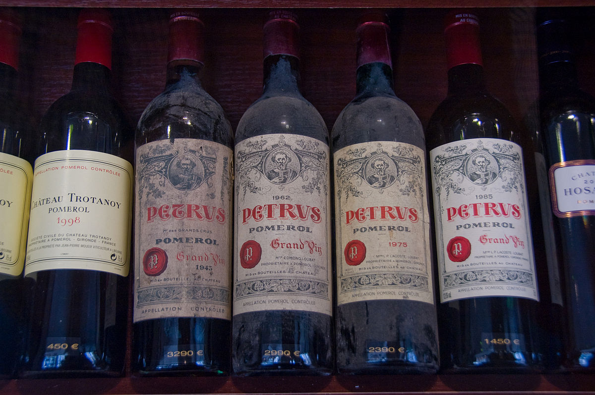
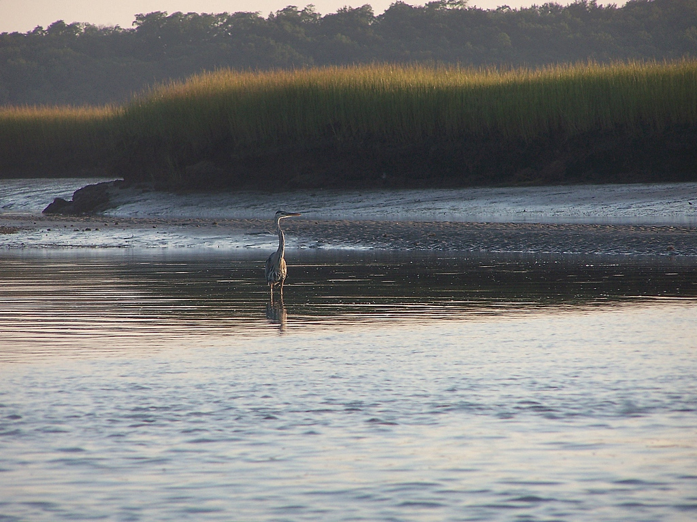
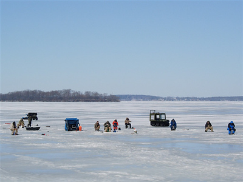
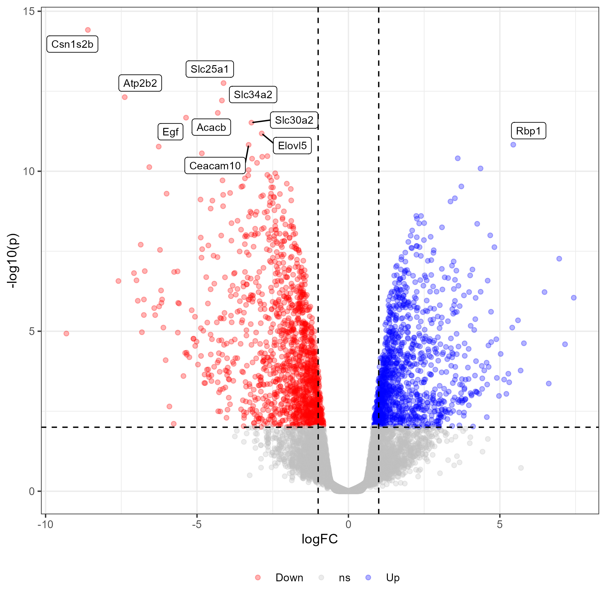
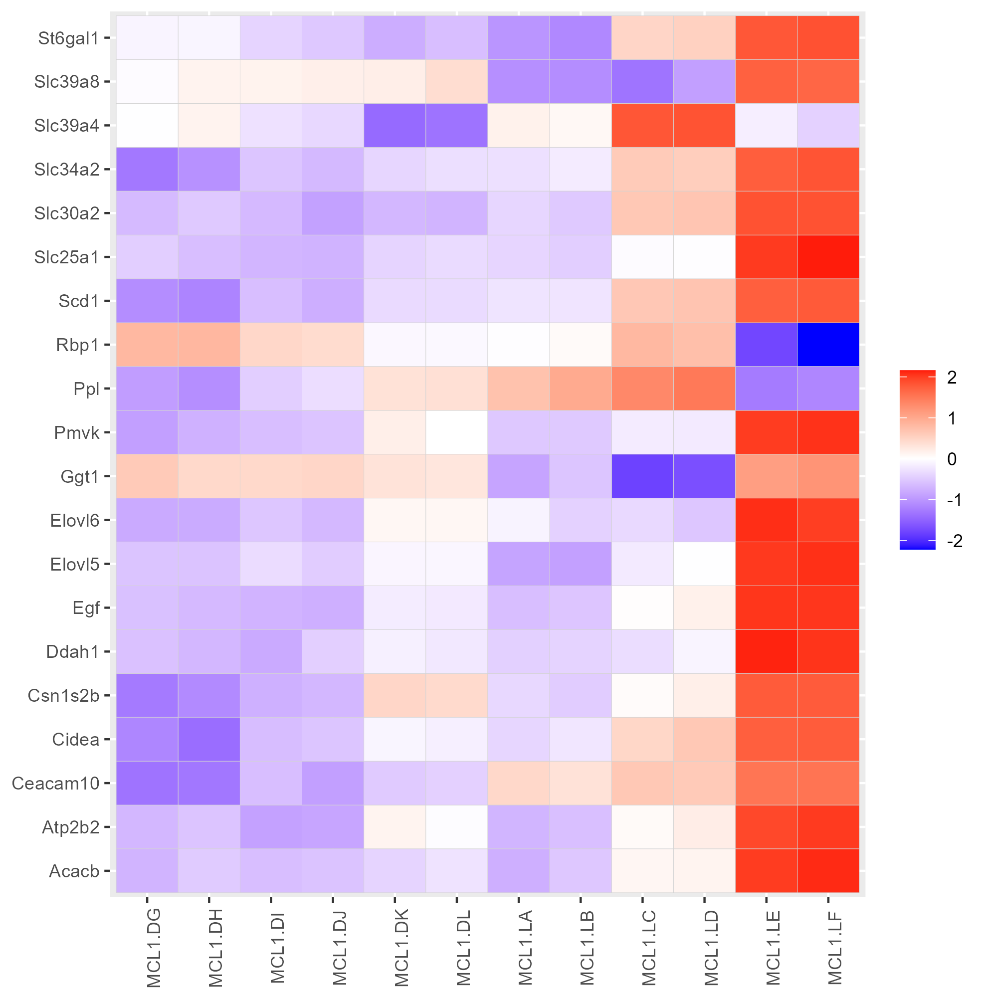
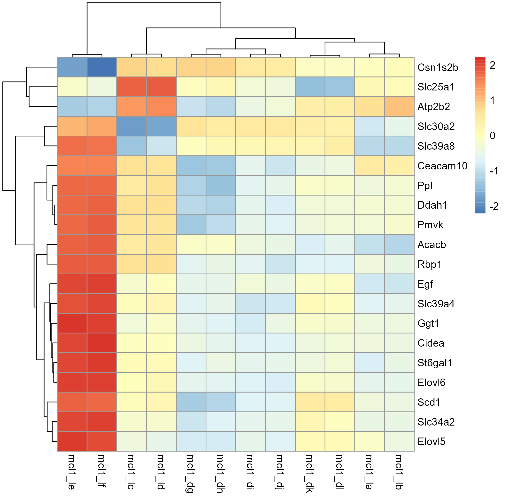

# Organization: Schedule

**Schedule of today**

- **Now - 14** (or 14.30 if you are enthusiastic still): Work on the data set(s)
  
  - Take break(s) as best fits your needs
  
- **14 (14.30) - 15**: Short feedback round

  - What did you find out about your data set? Plots, summaries, ...
  - Which methods did you use?
  - Did you learn something new?
  - Was there something you struggled with?
  - ...
  
- **15-16**: Feedback, conclusion

---
# Data set 1: What makes a good wine?

**Physicochemical properties of wine and quality judgements**

```{r echo=FALSE}
str(EcoData::wine)
```

Reference: P. Cortez, A. Cerdeira, F. Almeida, T. Matos and J. Reis.
Modeling wine preferences by data mining from physicochemical properties. In Decision Support Systems, Elsevier, 47(4):547-553, 2009.

---
# Data set 1: What makes a good wine?

.pull-left[

#### Ideas - know methods

- Plotting of wine quality against chemical properties
- Plotting of distribution of the different chemical properties
- Summary tables of the data using `dplyr`

#### Hints

- Transform the quality column to a factor before plotting: use `dplyr::mutate` and `as.factor()` to tranform the column
- Try the `janitor::clean_names()` function

]

.pull-right[

.footnote-right[.small[By Frederik Vandaele - originally posted to Flickr as Château Pétrus, CC BY 2.0, https://commons.wikimedia.org/w/index.php?curid=5145286]]]

---
# Data set 1: What makes a good wine?

#### Ideas - new methods

- **Correlation plots**: How are the different wine properties correlated with each other?
- **PCA**: How are the wine properties related to each other?

```{r echo=FALSE, message=FALSE, fig.width = 6, fig.height=6}
library(tidyverse)
library(corrplot)
library(factoextra)
library(patchwork)
wine <- read_csv("../data/wine.csv")
wine <- janitor::clean_names(wine)
wine <- wine %>% drop_na() %>% mutate(quality = as.factor(quality))

M <- wine %>%
  select(-quality) %>%
  drop_na() %>%
  cor()

res.pca <- wine %>%
  drop_na() %>%
  select(-quality) %>%
  prcomp(scale = TRUE)


fviz_pca_biplot(res.pca,
  label = "var",
  habillage = wine %>% pull(quality) %>% factor(),
  addEllipses = TRUE,
  ellipse.level = 0.95,
  palette = "Dark2"
)

corrplot.mixed(M, lower = "shade", upper = "pie", order = "hclust")

```
---
# Data set 1: What makes a good wine?

#### Hints

- [`corrplot` package](https://taiyun.github.io/corrplot/) for correlation plots
- [Tutorial for PCAs in R](http://www.sthda.com/english/articles/31-principal-component-methods-in-r-practical-guide/118-principal-component-analysis-in-r-prcomp-vs-princomp/)
- [`factoextra` package](https://rpkgs.datanovia.com/factoextra/index.html) for PCA visualization
- Correlations and PCAs do not work with `NA` values: use `tidyr::drop_na()` to remove all `NA` values from the data

---
# Data set 2: Paralympic games from 1980-2016

|variable |class     |description |
|:--------|:---------|:-----------|
|gender   |character | Binary gender |
|event    |character | Event name |
|medal    |character | Medal type |
|athlete  |character | Athlete name (LAST NAME first name|
|abb      |character | Country abbreviation |
|country  |character | Country name |
|grp_id   |integer   | Group ID as a count within team sports |
|type     |character | Type of sport |
|year     |double    | year of games |
|guide    |character | Guide (for vision impaired athletes) |
|pilot    |character | Pilot (for vision impaired athletes) |

Source: [International Paralympic Committee](https://db.ipc-services.org/sdms/hira/web/index) (provided by [tidytuesday](https://github.com/rfordatascience/tidytuesday/edit/master/data/2021/2021-08-03/readme.md))

---
# Data set 2: Paralympic games from 1980-2016

Get the data:

```{r eval=FALSE}
athletes <- readr::read_csv('https://raw.githubusercontent.com/rfordatascience/tidytuesday/master/data/2021/2021-08-03/athletes.csv')
```

#### Ideas - know methods

- Use dplyr to
  - Create summaries of medal counts for different groups
- Explores questions such as:
  - Did the ratio of men/women winning medals change over time?
  - Which countries were the most successful ones? Does this differ between sports type?
  - Which types of sports accumulated the most medals?
- Make plots such as:
  - Age distribution of athletes winning gold, silver and bronze
  - Compare the total number of medals over the years between winter and summer olympics
  - e.g. heat map showing the number of medals by medal type and sport/country/gender...

#### Hints

- To reduce complexity of the data, first filter only the athletes that won a medal (`!is.na(medal)`)

---
# Data set 3: Crab data set

.pull-left[

**Atlantic marsh fiddler crab (*Minuca pugnax*)**

- Crab from Florida is expanding northward due to ocean warming
- Data on 13 marshes across a range of latitude in the USA
- Recording of the size of of the crab
- Rather small and good to handle


]

.pull-right[

.center[]

.small[Source: [Johnson, D. 2019.](https://doi.org/10.6073/pasta/4c27d2e778d3325d3830a5142e3839bb) Fiddler crab body size in salt marshes from Florida to Massachusetts, USA at PIE and VCR LTER and NOAA NERR sites during summer 2016. ver 1. Environmental Data Initiative.]

]


.footnote-right[.small[Image under CC BY-SA 4.0]]

---
# Data set 3: Crab data set

```{r, echo=FALSE}
# install.packages("lterdatasampler")
library(lterdatasampler)
head(pie_crab)
```

.small[Source: [Johnson, D. 2019.](https://doi.org/10.6073/pasta/4c27d2e778d3325d3830a5142e3839bb) Fiddler crab body size in salt marshes from Florida to Massachusetts, USA at PIE and VCR LTER and NOAA NERR sites during summer 2016. ver 1. Environmental Data Initiative.]


.footnote-right[.small[Image by LTER under CC BY-SA 4.0]]

---
# Data set 3: Crab data set

.pull-left[

**Ideas - known methods**

- Explore Bergmann's rule (organisms are large in higher latitudes)
- t-tests to compare size between locations
- Plot relationship between latitude and size 
- Plot distributions of variables

]

.pull-right[

.center[]

.small[Source: [Johnson, D. 2019.](https://doi.org/10.6073/pasta/4c27d2e778d3325d3830a5142e3839bb) Fiddler crab body size in salt marshes from Florida to Massachusetts, USA at PIE and VCR LTER and NOAA NERR sites during summer 2016. ver 1. Environmental Data Initiative.]

]

.footnote-right[.small[Image under CC BY-SA 4.0]]

---
# Data set 4: Ice cover and temperature

.pull-left[
**Temperature and ice duration on lakes since 19th century**

- 2 data sets with measurements of
  - ice start, end and duration on 2 lakes in Wisconsin
  - daily air temperature since 1870
- Explore the effect of climate change on ice cover
]
.pull-right[



]

.footnote-right[.small[Image by LTER under CC BY-SA 4.0]]

.small[

Source ice data: [Magnuson, J.J., S.R. Carpenter, and E.H. Stanley. 2021.](https://doi.org/10.6073/pasta/ab31f2489ee436beb73fc8f1d0213d97) North Temperate Lakes LTER: Ice Duration - Madison Lakes Area 1853 - current ver 35. Environmental Data Initiative. 

Source temperature data: [Anderson, L. and D. Robertson. 2020.](https://doi.org/10.6073/pasta/e3ff85971d817e9898bb8a83fb4c3a8b) Madison Wisconsin Daily Meteorological Data 1869 - current ver 32. Environmental Data Initiative.
]

---
# Data set 4: Ice cover and temperature

Ice data:

```{r echo=FALSE}
# install.packages("lterdatasampler")
# library(lterdatasampler)
head(ntl_icecover)
```


Temperature data:

```{r echo=FALSE}
head(ntl_airtemp)
```

---
# Data set 4: Ice cover and temperature

.pull-left[
**Ideas - known methods**

- How did ice cover duration change over the years?
- How did air temperature change over the years?
  - Summarize mean annual temperature or mean temperature in winter
- How do ice duration on the lakes correlate with temperature (e.g. with mean winter 
  temperature)
  
]
.pull-right[

]

.footnote-right[.small[Image by LTER under CC BY-SA 4.0]]

#### Hints

- For some plots it might make sense to summarize annual means first
- Use `left_join` to combined the tables with annual mean temperature and ice duration

---
# Data set 5: RNAseq data

- Data from [FU et al. 2015, *Nature Cell Biology*](https://www.nature.com/articles/ncb3117)
- Data found via [Tutorial on heat maps](https://training.galaxyproject.org/training-material/topics/transcriptomics/tutorials/rna-seq-viz-with-heatmap2/tutorial.html) using this data

- 3 csv files:
  - `heatmap_genes.csv`: A list of the names of interesting genes to look at (Genes used in Figure 6b in paper)
  - `DE_results.csv`: Gene expression in luminal cells in pregnant versus lactating mice
    - logFC, AveExpr, t, p-value
    - Also contains non-significantly expressed genes
  - `normalized_counts`: Normalized counts for genes for the different samples
  
---
# Data set 5: RNAseq data

.pull-left[

#### Ideas:

- Create a heatmap of the top 20 most significant genes (see plot in the tutorial)
- Create a heatmap of the interesting genes (see Fig. 6 in the paper)
- Crate a volcano plot of the data similar to the one [here](https://training.galaxyproject.org/training-material/topics/transcriptomics/tutorials/rna-seq-viz-with-volcanoplot/tutorial.html)
]

.pull-right[


]

---
# Data set 5: RNAseq data

.pull-left[


]

.pull-right[

]

---
# Data set 5: RNAseq data

#### Some tips:

Data cleaning:
  - Read in the data and then use the `janitor::clean_names` function to make the column headers nicer
  - Join `DE_results` and `normalized_counts` by their shared columns
  - Use `select` to remove columns you don't need for analysis to get a better overview
  - Filter only significant genes ([tutorial](https://training.galaxyproject.org/training-material/topics/transcriptomics/tutorials/rna-seq-viz-with-volcanoplot/tutorial.html)) defines them as `p_value < 0.01 & abs(logFC)` > 0.58)
  
Data analysis:
  - Heatmap with ggplot or with `pheatmap::pheatmap()`
    - `pheatmap` takes a matrix as input (use `as_matrix` on tibble to transform)
  - scale the counts -> have a look at the `scale` function
    - `pheatmap` can scale but with ggplot you have to scale before plotting

---
# Some general tips

- First make a plan:

  - What do you want to achieve and what are the steps?
  - Try to think in technical terms

--

- Start with something small, e.g. reading in the data and bringing it into the right format.

--

- Google

--

- If you get stuck, ask in the chat or stop by in General

--

- Have a look at the cheat sheets [(list of all cheat sheets)](https://www.rstudio.com/resources/cheatsheets/)
  - [ggplot2](https://raw.githubusercontent.com/rstudio/cheatsheets/master/data-visualization-2.1.pdf)
  - [dplyr](https://raw.githubusercontent.com/rstudio/cheatsheets/master/data-transformation.pdf)
  - [Data import cheat sheet](https://raw.githubusercontent.com/rstudio/cheatsheets/master/data-import.pdf): readr and tidyr cheat sheet

---
class: inverse, middle, center

# .large[Now You: Working on your own research data]

#### - Meet in your group (if you want)
#### - Start working on a data set
#### - Take breaks as you need and be back at 14:00
#### - Keep an eye on your group and the general chat

 
---
class: inverse, middle, center

# .large[Now You: Working on a data set from me]

#### - Think about the data set you would like to work on 
#### - Build groups
#### - Meet in your group
#### - Start working on a data set
#### - Take breaks as you need and be back at 14:00
#### - Keep an eye on your group and the general chat

---
# Sharing

In 1-2 mins:

- What was the highlight of your analysis?
  - Your favorite plot
  - Some cool code
  - A problem that you finally solved
  - Something new you learned

- What was difficult?

- If you want: Share a screenshot in the chat or share your screen

---
# Feedback

Please take 10 mins to complete the feedback survey for the Graduate center (don't use Internet Explorer)

.center[https://votingo.cedis.fu-berlin.de/PCNLP3]

---
# Feedback


- Any other feedback or comments from your side?

---
# Conclusion


We learned a lot of stuff!

---
# Conclusion

#### How to continue from here?

.pull-left[

- Learning by doing!
- Have a look at some [online ressoures](https://selinazitrone.github.io/intro-r-data-analysis/online_resources.html), I recommend the R for Data Science book by Hadley Wickham
- If you use Twitter: Follow some people that post R content regarding your interest
- If you like plotting: Consider participating in the [tidytuesday](https://github.com/rfordatascience/tidytuesday)
- [FU statistical consulting](http://www.stat.fu-berlin.de/en/dienstleistungen/index.html) for questions regarding statistical methods
]
- [R Consulting by me](https://www.bcp.fu-berlin.de/en/graduiertenzentrum/promovierende/beratung/index.html)
- Workshop on reproducible documents with Rmarkdown this summer
- Monthly R/programming topic

.pull-right[


]

.footnote-right[Artwork by [Allison Horst](https://twitter.com/allison_horst)]

---
class: inverse, middle, center

# .large[The End]
## Thanks a lot for participating!


.footnote-right[Artwork by [Allison Horst](https://twitter.com/allison_horst)]
