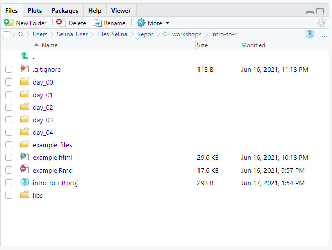
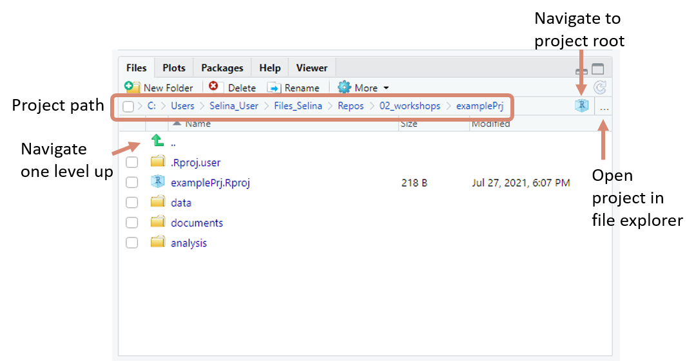
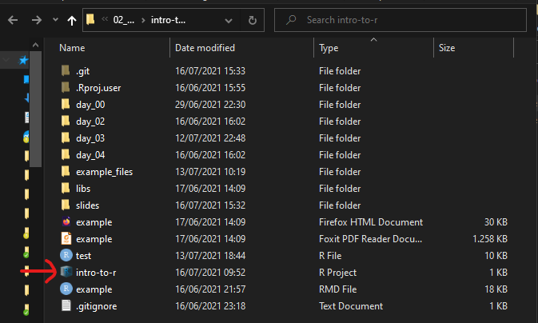

```{r setup, include=FALSE}
knitr::opts_chunk$set(echo = TRUE,
                      warning = FALSE,
                      message = FALSE)
library(fontawesome)
```

```{r child="title_slide.Rmd"}

```

---
# Project oriented workflow with RStudio

.pull-left[
- One directory with all files relevant for project
  - Scripts, data, plots, documents, ...
- An RStudio project is just a normal directory with an `*.Rproj` file

- Advantages of using RStudio projects
    - Easy to navigate in R Studio (`File` pane)
    - Easy to find and access scripts in RStudio
    - Project root is working directory
    - Open multiple projects simultaneously in separate RStudio instances
]    

.pull-right[


```{}
Project
|
|- data
|
|- documents
|   |
|   |- notes
|   |- reports
|
|- analysis
|   |
|   |- clean_data.R 
|   |
|   |- statistics.R
|
|- *.RProj
```
.small[Example project structure]
]

---
# Create an RStudio project

.pull-left[
Create a project from scratch:
  
1. `File -> New Project -> New Directory -> New Project`
2. Enter a directory name (this will be the name of your project)
3. Choose the Directory where the project should be initiated
4. `Create Project`

RStudio will now create and open the project for you. 
]

.pull-right[

.small[Example project structure in RStudio]
]


---
# Navigate an RStudio project

.center[

]

---
# Open a project from outside RStudio

To open an RStudio project from your file explorer/finder, just double click on the `*.Rproj` file
.center[

]