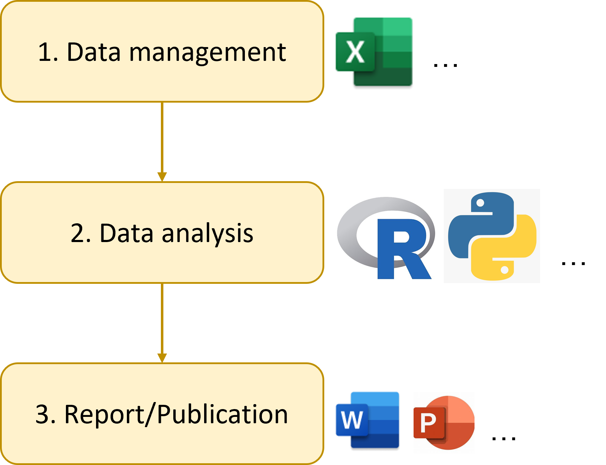
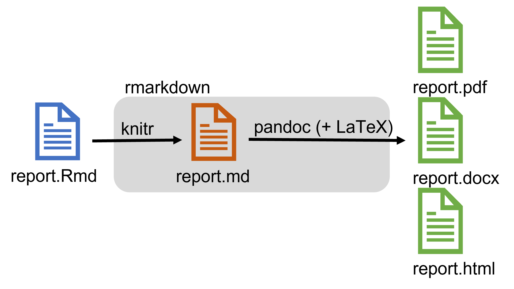
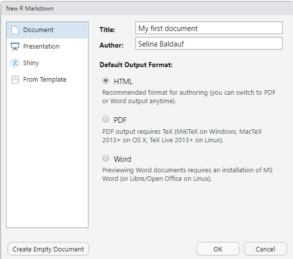
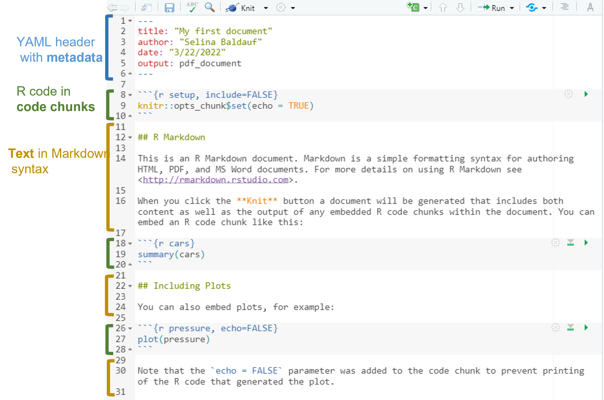
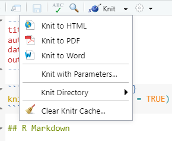
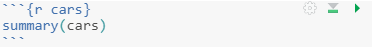
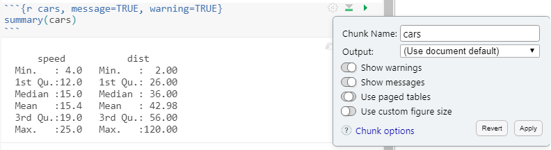

```{r setup, include=FALSE}
knitr::opts_chunk$set(echo = TRUE,
                      warning = FALSE,
                      message = FALSE)
library(fontawesome)
```

```{r child="title_slide.Rmd"}

```

---

# Topics today

- Introduction to the package

- Basic workflow

- First R Markdown document

---

# A standard workflow

.pull-left[
.center[]
]

--

.pull-right[

**Hard to answer questions:**

- How did you produced this figure? What analysis is behind it?

- Were does this value come from?

- I found an error in the raw data. Can you repeat the analysis?

]

---

# A standard workflow


.pull-left[
.center[]
]

.pull-right[


Main problem with this workflow: **error prone** and **non-reproducible** (and it can be annoying)

If you have to repeat the analysis

- Redo all figures and tables

- Update document and presentation manually
  
  - Manual copy pasting of values is very error prone
  
- You probably have to repeat this several times

]

---

# Solution: A workflow using R Markdown

**Basic idea: ** Have everything (code, text, metadata) in one place. Let `{rmarkdown}` do the magic:

  - Run code and add output
  - Return a nice document of the desired output format

.center[]

.footnote-right[Artwork by [Allison Horst](https://twitter.com/allison_horst)]


---

# Motivation for using R Markdown

- **Reproducibility**

  - Easy to redo analysis
  - Easy to verify and check
  - No more copy pasting
  - Continuous workflow that is independent of the person that wrote the workflow (no clicking involved)
  
--

- Documentation/Text, Code & Output in one place

--

- Use R pipeline to produce documents 
  - Create an automatic workflow
  
--

- Fun


---
# Example use cases

Any type of document, especially if it contains something produced by code

--

- Data analysis reports

  - For yourself
  - For your supervisors
  - ...
  
--
  
- Publication + Publication of analysis
  - E.g. also good for publishing code

--

- Presentations

- Websites

- Books

- ...

---

# The R Markdown universe

- Many packages that provide additional functionality
  
  - Additional output formats
  - Templates
  - Formatting tools
  - Printing tools
  - ...
  
Just some examples:

.center[]

There are many more ...

---

# The basic workflow

--

<br>

.pull-left[

1. Create an `.Rmd` document 

2. Write text and R code into the document

3. Render the document to a defined output format using `rmarkdown`
  
]

.pull-right[.center[]]

.footnote-right[Figure adapted from [BES Guides to better science: Reproducible code](https://www.britishecologicalsociety.org/wp-content/uploads/2019/06/BES-Guide-Reproducible-Code-2019.pdf)]

---
# Basic workflow in practice

**Step 1: Create a new `.Rmd` document**

- **Empty**: Create a new file in your project and save it with file ending `.Rmd`

- **From a template**:

  Rmarkdown itself comes with some templates
    - `File` -> `New File` -> `Rmarkdown...`
    
  Additional packages come with additional packages
    - [`{rticles}`](https://pkgs.rstudio.com/rticles/) for article templates
    - [`{xaringan}`](https://github.com/yihui/xaringan) for presentations ...
  
  
---
# Basic workflow in practice

**Step 1: Create a new `.Rmd` document**

.pull-left[
`File` -> `New File` -> `Rmarkdown...`

- Select template on left

- Add title and author metadata 
  - Can also be left blank and done later
  
- Select output format

- Click `OK`
]

.pull-right[

]

---
# Structure of an R Markdown document

.center[]

---
# Basic workflow in practice

**Step 2: Write your document**

--

- Metadata
- Text 
- R code

---
# Basic workflow in practice

**Step 3: Render/Knit the document to the desired output format**

--

.pull-left[

A multipstep process that is coordinated by the `{rmarkdown}` package

1. [`{knitr}`](https://yihui.org/knitr/) (an R package) runs the code and adds the output to the text

2. `knitr` creates a `.md` document

3. [Pandoc](https://pandoc.org/) (+ LaTeX) converts the markdown document to the desired output format

- Document is knitted in a new R session
  - This makes sure that the document is reproducible and that it does
  not depend on the current environment

]

.pull-right[.center[]]

---
# Basic workflow in practice

**Step 3: Render/Knit the document to the desired output format**

.pull-left[

- Click the `Knit` Button

- Use the keyboard shortcut `Ctrl/Cmd + Shift + K`
- For more options, click the little arrow next to the `Knit` button

]

.pull-right[.center[ 
 ]
]

<br>

--

`r fa("arrow-right")` Iterate through steps 2 and 3 until finished

I recommend to knit often, otherwise it can become a pain to debug.

---
class: inverse, center, middle

.large[# The text body: Markdown]

---
# The text body

- Text body in Markdown syntax

- Markdown is simple markup language to create formatted text

- Rmarkdown uses pandoc's markdown syntax
  - Find a full documentation [here](https://pandoc.org/MANUAL.html#pandocs-markdown)
  
---
# The text body

**The basics**

- Bold: `**text**` becomes **text**

- Italic: `*text*` becomes *text*

--

- Subscript: `H~3~PO~4~` becomes H<sub>3</sub>PO<sub>4</sub>

- Superscript: `Cu^2+^` becomes Cu<sup>2+</sup>

---
# The text body

**Code blocks**

- Inline code:  fenced of with 1 backtick becomes `code`

--

- Code blocks: fenced of with 3 backticks 

````markdown
```
code
```
````

becomes

```markdown
code
```

---
# The text body

- Links: `[text](link)`
  - `[RStudio](https://www.rstudio.com)` becomes [RStudio](https://www.rstudio.com)
  
  
---
# The text body
  
- Include image (from file/web): ``
  - `` becomes 
  
  .center[
  <br>Markdown logo
  ]
  
--

- Footnote: `^[a footnote]`
  - Markdown logo by Dustin Curtis`^[available on [Wikimedia](https://en.wikipedia.org/wiki/Markdown#/media/File:Markdown-mark.svg)]` becomes
  - Markdown logo by Dustin Curtis<sup>1</sup>
  
.footnote-right[

<sup>1</sup> available on [Wikimedia](https://en.wikipedia.org/wiki/Markdown#/media/File:Markdown-mark.svg)

]

---
# The text body

**Headers**

```markdown
# First level header

## Second level header

### Third level header
```

---
# The text body

**Itemized lists**

```markdown
- item 1
  - another item
- item 2
- item 3
```

becomes

- item 1
  - another item
- item 2
- item 3

--

**Numbered lists**

```markdown
1. item 1
2. item 2
3. item 3
```

---
# The text body

**Math expressions** can be written in in LaTeX syntax

--

- Inline (enclosed with `$`)


`$f(k) = {n \choose k} p^{k} (1-p)^{n-k}$` returns $f(k) = {n \choose k} p^{k} (1-p)^{n-k}$

--

- As a separate block (enclosed with `$$`)

$$
f(k) = {n \choose k} p^{k} (1-p)^{n-k}
$$

---
# The text body


You don't need to remember all of this. [Here](https://raw.githubusercontent.com/rstudio/cheatsheets/master/rmarkdown-2.0.pdf) is a quick reference for the most important things.

--

Always use spaces around markdown objects so that they can be rendered correctly, e.g.

```markdown
## My section

This is an ordered list:

1. item 1
2. item 2
```

instead of 


```markdown
## My section
This is an ordered list:
1. item 1
2. item 2
```

---

# The text body

**Let's look at an example together**

Can you identify the formatting elements in <a href="../tasks/day1/solution_docs/penguin_paper_1.html">this document</a>?

---
class: inverse, middle, center

# .large[Now you]

## Task 1: Create a first docuemnt and add some text

#### Find the task description <a href="../01_tasks_controller.html#first-document-and-text">here</a>

---
class: inverse, center, middle

.large[# The R code]

---

# The R code

R code can be included in **code chunks** as **inline code**

--

- R code can be displayed or hidden in output document

  - Inline code is hidden
  
--
  
- Code chunks can contain any type of R code

--

- R code is (by default) executed and output is included in document
  - Text output
  - Figures
  - Prepare future data analysis
  - ...


---

# The R code

**Code chunks** starts and ends with 3 backticks

````md
`r ''````{r}
# code goes here
```
````

--

**Example**

````md
`r ''````{r}
mean(1:3)
```
````

looks like this:

```{r}
mean(1:3)
```

---

# The R code

**Inline code** starts and ends with 1 backtick

```{r, echo=FALSE}
code = '`r `'
cat(code)
```

--

**Example**

````md
The mean of the values 1, 2 and 3 is `r knitr::inline_expr("mean(1:3)")`
```` 

looks like this:

The mean of the values 1, 2 and 3 is `r mean(1:3)`.

---

# The R code

**Insert a code chunk**

- Insert a code chunk by going to `Code` -> `Insert chunk`

- Use the keyboard shortcut `Ctrl + Alt + I` / `Cmd + Option + I`

- Inline chunks have to be typed

---
# The R code 

**Chunk names**

- Code chunks can have names (but they don't have to)

- Names are added inside the code chunk

````md
`r ''````{r calculate-mean}
mean(1:3)
```
````

--

- Easier to debug

- Code chunks appear in document outline

---

# The R code

**Run code chunk**

--

- Code chunks are evaluated by `knitr` when rendering the document

--

- Code chunks can also be run like normal R code

- Run Code chunk by clicking on the green arrow next to the chunk



---

# Chunk options

- Code chunks options give you fine control over the behavior of a chunk

--

- Chunk options are separated by commas

````md
`r ''````{r calculate-mean, warning=TRUE, message=TRUE}
mean(1:3)
```
````

--

- Chunk options have a `name` and a `value`

  - Chunk options have default values
  
---

# Chunk options

**Some important general options**

- `message`: `TRUE`, `FALSE`, Show message in output?

- `warning`: `TRUE`, `FALSE`, Show warning in output?

--

- `eval`: `TRUE`, `FALSE`, Evaluate the chunk?

- `echo`: `TRUE`, `FALSE`, Show source code in output?

- `include`: `TRUE`, `FALSE`, Include anything from the chunk in the output?
  - Runs the code but does not show any output or source code


---
# Chunk options

**Some important figure related options**

--

- `fig.width` and `fig.height`: Size of graphical device in inches (i.e. size of the plots)

--

- `out.width` and `out.height`: Scale output of R plots, e.g. to scale images `out.width = "80%"`

--

- `fig.align`: Plot alignment, one of `"left"`, `"center"`, `"right"`

--

- `fig.cap`: A figure caption as a string


````md
`r ''````{r important-figure, fig.cap="This is a nice plot.", fig.width=4, fig.height=4}
plot(1:10, 1:10)
```
````

---

# Chunk options

- Some chunk options can be set by clicking on the gear icon next to the chunk




--

- See [here](https://yihui.org/knitr/options/) for a comprehensive list of all chunk options

---

# The setup chunk

--

- Set default chunk options in the beginning of the document

- Default options can be overwritten in individual chunks

- Default chunk options can be set via `knitr` in an R code chunk:


````md
`r ''````{r setup, inlcude=FALSE}
knitr::opts_chunk$set(
  echo = TRUE, 
  warning = FALSE
  )
```
````

---

# Other language engines

You can also run code chunks of other languages:


```{r}
names(knitr::knit_engines$get())
```


See [here](https://bookdown.org/yihui/rmarkdown/language-engines.html) if you are interested

---
class: inverse, middle, center

# .large[Now you]

## Task 2: Add some R code to the document

#### Find the task description <a href="../01_tasks_controller.html#add-r-code">here</a>

---
class: inverse, center, middle

.large[# The YAML (/ˈjæməl/) header]


---

# YAML (/ˈjæməl/) header

- YAML is a data-serialization language

- Goes between `---` on top

- Used for
  - Meta data
  - Document output formats and their options
  
- Is used by Pandoc, `rmarkdown` and `knitr`

---

# YAML (/ˈjæməl/) header

.pull-left[
**Example**

```yaml
---
title: "My first document"
author: "Selina Baldauf"
date: "3/22/2022"
output: 
  html_document:
    toc: true
    toc_float: true
bibliography: references.bib
---
```
]

--

.pull-right[
  
- YAML Syntax: Indentation is important
  - Two spaces or a tab for lists
  - Values follow a `:`

- Translation:
  - `TRUE`, `FALSE`, `NULL` become `true`, `false`, `null`
  - Strings can be quoted but don't have to (if they don't contain special characters)
  
- Can also contain inline code to be evaluated

]


---

# YAML (/ˈjæməl/) header

**Metadata**

.pull-left[
```yaml
---
title: "My first document"
subtitle: "Whatever subtitle makes sense"
author: "Selina Baldauf"
date: "`r knitr::inline_expr("Sys.Date()")`"
---
```
]

.pull-right[

- Inline R code can print the current date at knitting time

]

---

# YAML (/ˈjæməl/) header

**Document outputs**

- `html_document`
- `pdf_document`
- `word_document`
- `beamer_presentation`
- `powerpoint_presentation`
- ...


--

To use the default version of an output format add

```yaml
output: html_document
```

or

```yaml
output:
  html_document: default
``` 

---

# YAML (/ˈjæməl/) header

**Document output options**

- Every output format has options than can be specified in the YAML header

  - Some options are shared between formats
  - Some options are specific to formats
  
--
  
- Have a look at `?rmarkdown::pdf_document`, `?rmarkdown::html_document`, etc. to see all options and their default values

- Use the [R Markdown cheat sheet](https://raw.githubusercontent.com/rstudio/cheatsheets/master/rmarkdown-2.0.pdf) as reference for the most important options

---

# YAML (/ˈjæməl/) header

**Document output options**

.pull-left[

```yaml
output: 
  html_document:
    toc: true
    toc_depth: 2
    number_sections: true
    fig_caption: true
    highlight: "espresso"
```

]
.pull-right[

- `toc`: Show table of contents?
- `toc_depth`: Lowest header level for table of contents
- `number_sections`: Should sections be numbered?
- `fig_caption`: Render figure captions?
- `highlight`: Which style to use for syntax highlighting?
  - Some options: `"kate"`, `"tango"`, `"zenburn"`

]

---
class: inverse, middle, center

# .large[Now you]

## Task 3: Change meta data and document options

#### Find the task description <a href="../01_tasks_controller.html#change-yaml-header">here</a>
