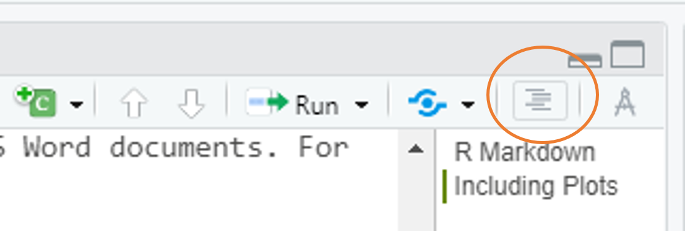
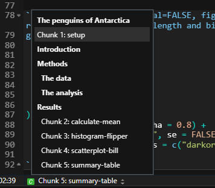

```{r setup, include=FALSE}
knitr::opts_chunk$set(echo = TRUE,
                      warning = FALSE,
                      message = FALSE)
library(fontawesome)
library(palmerpenguins)
```

```{r child="title_slide.Rmd"}

```


---

# Tip 1: Keep your document clean
  
`.Rmd` documents can quickly become large and messy. To keep them clean, you can

--
  
- Use headers to mark sections in your document
- Navigate the file using the document outline



--
  
- Use names for your code chunks
- Navigate code chunks with the code and document outline (bottom left of script)



---
  
# Tip 2: Source large data preparation scripts
  
- Related to Tip 1

- If it's not necessary for the document, do data preparation in a separate R Script

- Place that R Script in the project where the `.Rmd` is located

- Then source the script in a code chunk:

--

````md
`r ''````{r prepare-data, warning=TRUE, message=TRUE}
source("path/to/script.R")
```
````

--

- This runs all the R code in `script.R` and loads the results into the `.Rmd` document

---

# Tip 3: Split larger documents into multiple `.Rmd` files

- Related to Tip 1

- Write separate `.Rmd` files e.g. for Introduction, Methods and Results

--

- Have on main `.Rmd` file that
  - Combines the sections into one
  - Controls YAML options of the output
  
--

- You can load an `.Rmd` file into another one using the `child` chunk option

````md
`r ''````{r load-child, child="path/to/child.Rmd"}
```
````

---

# Tip 3: Split larger documents into multiple `.Rmd` files


.pull-left[

- 3 separate files `Introduction.Rmd`, `Methods.Rmd`, `Results.Rmd`

- The separate files control everything that happens on the lower levels of the documents, e.g.

````md
## First results

`r ''````{r result-plot, fig.width=3}
plot(1:10, 1:10)
```
````

- `Main.Rmd` (see right) controls
  - YAML options 
  - Global setup options
  - Includes the sections via the `child` option
  

]

--

.pull-right[

````md
---
title: "My paper"
author: "Selina Baldauf"
output: 
  pdf_document:
    toc: true
---

```{r global-setup, include = FALSE}`r ''`
knitr::opts_chunk$set(echo = FALSE)
```

# Introduction

```{r intro, child="Introduction.Rmd"}`r ''`
```

# Methods

```{r methods, child="Methods.Rmd"}`r ''`
```

# Results

```{r results, child="Results.Rmd"}`r ''`
```

````

]

---

# Tip 4: Read through some online resources

- Read or scroll through some R Markdown books or tutorials to
  
  - See what is possible with R Markdown
  - Find thing that are relevant for your own documents

- I recommend to start with the two books:
  - [R Markdown Cookbook](https://bookdown.org/yihui/rmarkdown-cookbook/)
  - [R Markdown - The Definitve Guide](https://bookdown.org/yihui/rmarkdown/)
  
- You can also find some <a href="../online_resources.html">resources on the workshop website</a>