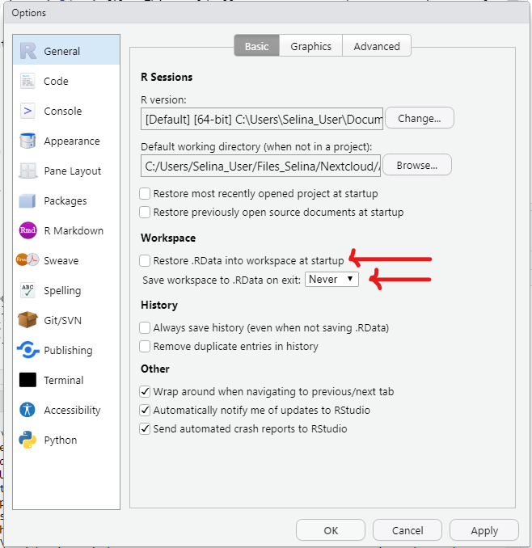

## Change settings

Before you get started, there is an important setting that you should change in RStudio.
By default, RStudio will save an the workspace of your current session in an `.Rdata` file. This would allow you to start the next session exactly where you left by loading this `.Rdata` file.

This is not a good default. We always want to start R from a clean slate to ensure reproducibility and minimize error potential.

In RStudio Go to `Tools -> Global Options -> General` and set the following workspace options:

```{r}

```

## Create an RStudio project

Create an RStudio project that you can use for all the scripts, notes, data, etc. from this workshop.

- Create a project in a directory of your choice following the instructions from the slides
- Use the `File` pane in RStudio to create a basic folder structure in your project which will be filled with files in the next days
  - e.g. create folders for `data`, `scripts`, `documents`,...
  - you can always change the structure of your project later, but for now, we want some basic folders that we can navigate
- Now close the project
- Find the project your computer's file explorer and open it

You can add files to your project either directly in RStudio, or in the file explorer of your operating system.

## Add an R script to the project

- create a new R script, save it in the appropriate folder of your project (e.g. `scripts` or `R`)
- copy paste the code from below into your script
  - don't worry if you don't understand the code yet, we will learn all this later
- run the code in the script line by line. Try both, running code using the `Run` button and the keyboard shortcut `Ctrl/Cmd + Enter/Return`
  - for each line that you run, observe what is happening to the other panes (console, environment, ...) in RStudio. Can you explain what is happening?

```{r eval=FALSE}
# Look at the first lines of the iris dataset
head(iris)
# What is the iris dataset -> Call the help
?iris
# How many rows and columns does the data set have?
rownum <- nrow(iris)
colnum <- ncol(iris)
print(paste0("The iris dataset has ", rownum, " rows and ", colnum, " columns."))
# Some summary statistics on the iris data set
summary(iris)

# create a plot
plot(iris$Petal.Length, iris$Petal.Width, 
     xlab = "Petal Length",
     ylab = "Petal Width",
     main = "Petal Width vs Petal Length",
     pch = 20,
     col=ifelse(iris$Species == "setosa","coral1", 
                ifelse(iris$Species == "virginica","cyan4", 
                       ifelse(iris$Species ==  "versicolor",
                              "darkgoldenrod2", "grey"))))
# add a legend
legend("bottomright", c("setosa","virginica", "versicolor"),
       col = c("coral1","cyan4", "darkgoldenrod2"), pch=20)

```
