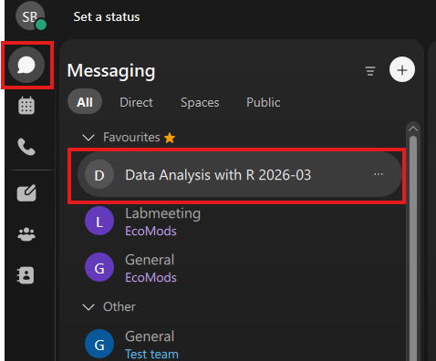

If anything doesn’t work, please email me: [selina.baldauf@fu-berlin.de](mailto:selina.baldauf@fu-berlin.de)

## Download the app (recommended)

Webex works in the browser, but the desktop app is usually more stable.  
Download and install Webex: [https://www.webex.com/downloads.html](https://www.webex.com/downloads.html)

## Log in

Open the Webex app **or** go to [https://teams.webex.com/signin](https://teams.webex.com/signin) (Chrome/Firefox recommended).

Log in with the email address you used to register for the workshop.

- If your university email is connected to Webex, you are prompted to sign in via your university login.
- Otherwise, create a Webex account with that email.

:::{.callout-note}

## Change my email address

If you registered with a private email and want to use your university email instead, email me and I will re-invite you with the new address.

:::

## Get started with the space

In Webex, go to **Messaging** (left sidebar) and look for the space: **Data Analysis with R 2026-03**.

## Say hello

To confirm everything is working, please send a quick hello message in the chat.

## Joining the workshop sessions

You can join each session from inside this Webex space. When a meeting starts, it will appear in the space (in the chat area / meeting banner).  
Alternatively, use the meeting link you receive by email.

