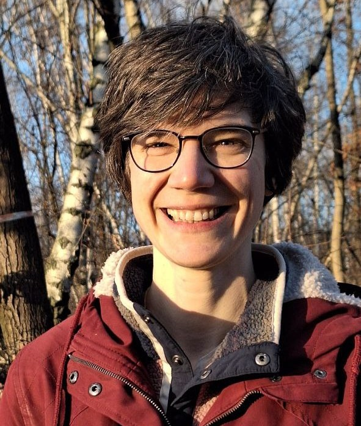

```{r setup, include=FALSE}
library(fontawesome)
```

## Welcome

:::{.columns}
::: {.column width="70%"}

- (Theoretical) Ecology
- Scientific programmer at Freie Universität Berlin
- Research + Coding + Teaching

:::
::: {.column width="20%"}


:::
:::


## Workshop topics

](img/day1/workshop_topics.png){fig-align="center"}

. . .

<b><span style="color:#68bda0;">Day1</span></b>
Introduction to R and RStudio and data import

. . .

<b><span style="color:#ff9dd8;">Day2</span></b>
Data visualization and transformation with the tidyverse

. . .

<b><span style="color:#FFD166;">Day3</span></b>
Cleaning data, statistical tests, and reproducible reports with Quarto

. . .

**Day 4** Bring your own data

. . .

## Schedule

📅 09.03.2026 - 10.03.2026 from 🕘 9 a.m. - 4 p.m. <br>
📅 16.03.2026 - 17.03.2026 from 🕘 9 a.m. - 4 p.m. <br>
:ramen: ~ 12 a.m. - 1 p.m.,  :coffee: short breaks in between<br>
:pushpin: Join from the Webex space or via the meeting link

## Organization

- Input sessions + Tasks + Discussion/Questions

- Materials on the [workshop's website](https://selinazitrone.github.io/intro-r-data-analysis/): Presentations, Tasks, Solutions, Additional resources
- Website will stay online after the workshop
- Questions and feedback welcome
- Contact me: [selina.baldauf@fu-berlin.de](mailto:selina.baldauf@fu-berlin.de) or on Webex

## Bring your own data

On the last workshop day, you can **work with your own research data**.
I will also provide some **real life data sets** from different topics. 

. . .

- You really learn R by working with your own data and questions
- Use the methods you learned in the workshop or try new things
- Let me know if there's something specific you want to do

- Add your name and some details on what you plan to do in this [joint table](https://docs.google.com/spreadsheets/d/1MuINiPjVvZrMRUYboDXdoPwj8daKj88k6K1hnfcoWxQ/edit?usp=sharing)

## Before we get started

Did anyone have problems with the course preparations?

:::{.nonincremental}

- Download and install R from [https://cran.r-project.org](https://cran.r-project.org/)
- Download and install RStudio from [https://www.posit.co](https://posit.co/download/rstudio-desktop/)

:::

# Quick round (~10 min){.inverse}

> Let's get to know each other

:::{.nonincremental}

Tell us your **name**, what **organism/system** you work with and whether you've **used R before**.

:::
