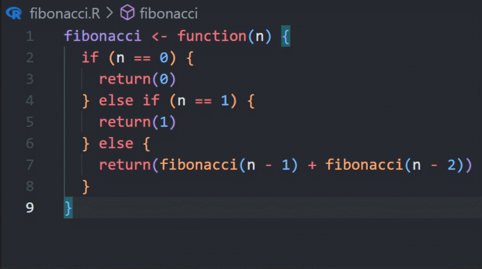

## Motivation

- Speed up repetitive tasks
- Learn new methods and languages
- Support debugging, documenting, refactoring, ...

## AI tools for programming

:::{.nonincremental}
- Browser-based chat bots (ChatGPT, etc.)
- Web-tools for data analysis (Data analyst GPT, JuliusAI, ...)
- **IDE-integrated AI tools** (GitHub Copilot, Claude Code, ...)
:::

. . .

Integrated tools

- know your project structure
- see your code and console output
- respond in context while coding

## Github Copilot

- [https://github.com/features/copilot](https://github.com/features/copilot)
- Basic idea: Integrate directly into your IDE
- Two modes:
  - Real-time code suggestions (inline as you type)
  - Chat with the AI
- RStudio only supports the real-time code suggestions

## Inline code suggestions

Available for RStudio and Positron

:::{.columns}

:::{.column width="50%"}

-  Copilot tries to predict what you want to do next
-  Suggestions are based on the context
   -  Previous code
   -  Comments
   -  Variable and function names
   -  ...

:::

:::{.column width="50%"}

:::

:::
  
## Get better suggestions

- **Provide context**
  - Add top level comments explaining the purpose of the script
  - Name variables and functions properly
  - Copy-paste sample code and delete it later

- **Be consistent**
  - "Garbage in, garbage out"
  - Have a nice and consistent coding style

- **Acceptance discipline**
  - Don't auto-accept everything
  - Review and modify suggestions if needed

. . .

Nice side effect of using Copilot: More good-practice coding

## Chat with GH Copilot about your code

Only available in Positron or VS Code

- Open a chat window
- The AI can access your files and projects
- The AI can make tailored suggestions based on your project
- Great for
  - Debugging
  - Getting explanations
  - Getting good-practice suggestions
  - ...
  
## How to get GitHub Copilot

See [this website](https://selinazitrone.github.io/tools_and_tips/sessions/additional_material/07_ai_tools/get_copilot_step_by_step.html) for step-by-step guide and more information.

It's really easy, but you need:

- GitHub Account
- Active GH Copilot subscription
  - Limited free tier available (2,000 completions/month)
  - Pro plan: 10$ per month (free for academics with an educational account)
- IDE that supports Copilot

## Claude Code

- [AI coding agent](https://claude.com/solutions/coding) that runs in your **terminal**
- Pro plan: ~17€ per month
- Works with any IDE (RStudio, Positron, VS Code, ...)
- Can read and edit files, run R code, use git, ...

. . .

**What makes it different from Copilot?**

- Works at the **project level**, not just single files
- You describe a task and it autonomously works through it
- Great for larger tasks like refactoring, writing tests, or creating reports

## Limitations

- AI can suggest **outdated** functions and code
- AI can suggest patterns that are **common but not best practice**
- AI predicts **plausible** code, not necessarily **correct** code
  - Code can be subtly wrong or inappropriate
- Risk of **over-reliance**

## Responsible use

- Don't treat AI as an authority: review and double-check
- Use version control as a safety net: review and trace changes
- Privacy: Code, comments and console output may be shared with model providers
  - Beware if you have sensitive data
- Check institutional and journal guidelines
- Transparency: Disclose your use of AI tools
- You are responsible for your scientific output
