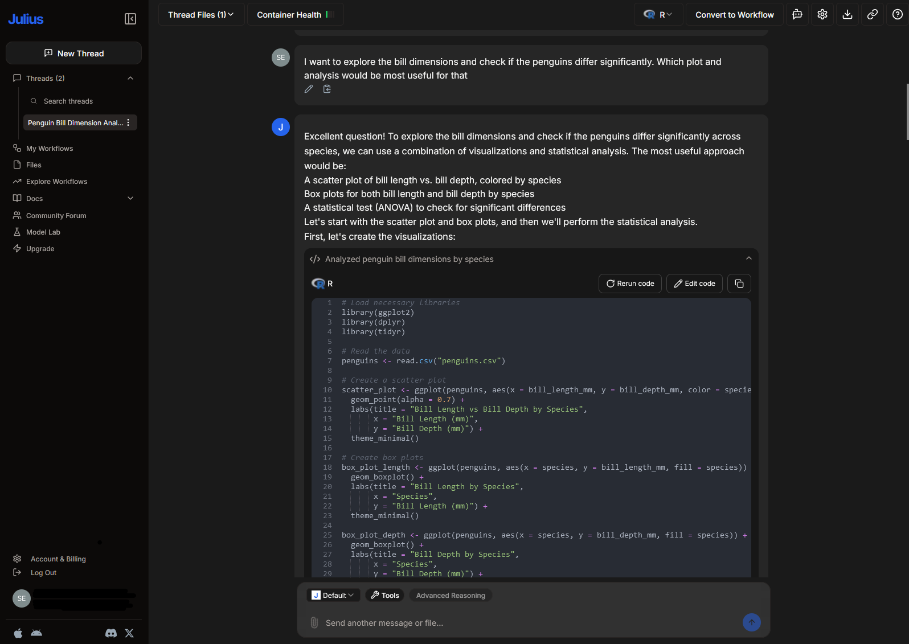

## Motivation

:::{.columns}

:::{.column width="50%"}

- AI tools assist programmers with
  - Coding
  - Debugging
  - Learning
  - ...
- Higher productivity and efficiency
- More motivation
- But careful: You still need to understand what's going on!

:::

:::{.column width="50%"}

:::

:::

## Overview of tools

:::{.nonincremental}

- **Browser-based chat bots** ([ChatGPT](https://chat.openai.com), [Claude](https://claude.ai), ...)
  - General-purpose 

:::

. . .

:::{.nonincremental}

- **Data-analysis tools** ([Julius AI](https://julius.ai/), [RTutor](https://rtutor.ai/), ...)
  - Upload data and ask questions about it
  - Can also execute code
  - Chat with your data

:::

. . .

:::{.nonincremental}

- **Integrated AI tools** ([GitHub Copilot](https://github.com/features/copilot), ...)
  - Integrated directly in programming environment
  - Real-time suggestions, chat, debugging, ...

:::

. . .

Find the tools that best fit your workflow!

## Julius AI

:::{.columns}

:::{.column width="30%"}

:::{.nonincremental}

- [https://julius.ai/](https://julius.ai/)
- Try for free
- Basic plan ~20€ per months (-50% academic discount)
- Upload data and ask questions about it

:::

:::

:::{.column width="70%"}

:::

:::

## Github Copilot

- [https://github.com/features/copilot](https://github.com/features/copilot)
- Based on models specifically trained on source code
- Basic idea: Integrate directly into your IDE
  - Real-time code suggestions (inline as you type)
  - Chat with the AI
- Works best for well-represented languages (Python, JS, ...), but R is also pretty good

## Inline code suggestions

Available for RStudio and Positron

:::{.columns}

:::{.column width="50%"}

-  Copilot tries to predict what you want to do next
-  Suggestions are based on the context
   -  Previous code
   -  Comments
   -  Variable and function names
   -  ...

:::

:::{.column width="50%"}

:::

:::
  
## Get better suggestions

- **Provide context**
  - Open other files
  - Add top level comments explaining the purpose of the script
  - Name variables and functions properly
  - Copy-paste sample code and delete it later

- **Be consistent**
  - "Garbage in, garbage out"
  - Have a nice and consistent coding style
  
. . .

Nice side effect of using Copilot: More good-practice coding

## Chat with GH Copilot about your

Only available in Positron or VS Code

- Open a chat window
- The AI can access you files and projects
- The AI can make taylored suggestions based on your project
- Great for
  - Debugging
  - Getting explanations
  - Getting good-practice suggestions
  - ...
  
## How to get GitHub Copilot

See [this website](https://selinazitrone.github.io/tools_and_tips/sessions/additional_material/07_ai_tools/get_copilot_step_by_step.html) for step-by-step guide and more information.

It's really easy, but you need:

- GitHub Account
- Active GH Copilot subscription (10$ per month)
  - Get it for free as an academic with an educational account
- IDE that supports Copilot

## Things to consider I

- **Privacy**
  - Check privacy guidelines before you use tools (e.g. `Github -> Seetings -> Copilot -> Policies`)
- **Plagiarism**
  - Block suggestions matching public code (`Github -> Seetings -> Copilot -> Policies`)

## Things to consider II

- **Responsibility**
  - You are responsible for your scientific output
  - Stay critical, double-check
- **Transparency**
  - Make clear for which tasks you used which AI
- **Know relevant guidelines**
  - Journals
  - Your university
- **Still understand what is happening!**
