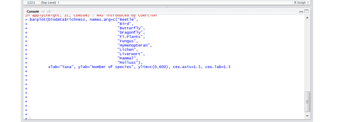
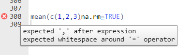

# {.background-no-title}

When learning a programming language, you will run into errors all the time.
That's completely normal and it's how programming works!

](img/AllisonHorst/debugging.jpg){fig-align="center" width=80%}

:::{.aside}

[Artwork by [Allison Horst](https://twitter.com/allison_horst)]{.small}

:::

## Errors are how you learn

- Reading and understanding error messages is one of the **most important skills** you will learn

- Every error you fix teaches you something about how R works

- It will get easier over time and you will start recognizing patterns

- Even experienced programmers spend a lot of time fixing errors

## First things first: Set R to English

- The R language setting follows your operating system language by default
- Errors might not be in English - hard to find help online

. . .

#### Fix: Change the R language setting to English

```r
# For the current session
Sys.setenv(LANGUAGE = "en")
```

:::{.fragment}

:::{.callout-tip}

## Add it to your .Rprofile

Commands in the `.Rprofile` file run automatically every time you start R.

Open the file with:

```{r}
#| eval: false
# install the usethis package
# install.packages("usethis")
# Open the .Rprofile file in RStudio
usethis::edit_r_profile()
```

and add the line `Sys.setenv(LANGUAGE = "en")` to the file, then save it.

:::

:::

# Most common errors for beginners {.inverse}

> and how to deal with them

## Console prints `+`

R is not running code anymore and the console only prints `+`



. . .

#### How to fix it

- Go to the console and hit `Escape`. Then you should see the `>` sign instead of `+` again.
- Likely you forgot to close a bracket or a quote somewhere. Go to your script and check where this happened (look for &nbsp;&nbsp; next to line numbers)

## Syntax errors

#### Example

```{r}
mean(c(1, 2, 3)na.rm = TRUE)
```

<br>

#### How to fix

- Look for missing commas, misspelled arguments, unclosed brackets, ...
- Read the error message, it often points you to where the problem is
- The RStudio syntax checker warns you **before** you run code with syntax errors
  - Look for &nbsp;&nbsp; next to line numbers in your script
  
:::{.fragment}



:::

## Error: object not found

#### Example

```{r}
variable_A
```

<br>

:::{.fragment}

#### How to fix

- You are trying to access an object that does not exist. Common reasons:
  - Typo in the variable name (e.g. you created `variableA` but typed `variable_A`)
  - You forgot to run the line of code that creates the variable
  - You forgot to put quotes around a string: `print(hello)` looks for a **variable** named `hello`, but you wanted `print("hello")`
  
:::

## Error: could not find function

#### Example

```{r}
read_csv("data/penguins.csv")
```

<br>

:::{.fragment}

#### How to fix

"Could not find function" errors have two main reasons:

1. You forgot to **load the package** that the function belongs to
    - Load the package first: `library(readr)` or `library(tidyverse)`
    - Or call the function with `readr::read_csv()`
2. You have a **typo** in the function name (e.g. `lenght()` instead of `length()`)

:::

## Error: package not found


```{r}
library(thispackagedoesntexist)
```

. . .

<br>

This means the package is **not installed** on your computer.

. . .

#### How to fix

- Check for a typo in the package name
- Install the package first, then load it:

```r
install.packages("thispackagedoesntexist")
library(thispackagedoesntexist)
```

- Remember: you only need to **install once**, but you need to **load with `library()` every time** you start R

## File not found

When reading data, you might see errors like:

```{r}
readr::read_csv("data/penguins.csv")
```

. . .

or

```r
read_csv("data/penguins.csv")
#> Error: cannot open the connection
```

## File not found

When reading data, you might see errors like:

```{r}
readr::read_csv("data/penguins.csv")
```


#### How to fix

- Check that you are in the **correct RStudio project** (look at the top right corner of RStudio)
- Check the **file name**: is it spelled exactly right?
- Check the **folder path**: is the file actually in the `data/` folder?

:::{.fragment}

:::{.callout-tip}

## Build your path with auto-completion

When you start typing a path in RStudio, you can use auto-completion to avoid typos. Start with `""` and then hit tab to see suggestions for files and folders in your project.

:::

:::

## Warnings vs. errors

R can give you **warnings** for many reasons, e.g.

:::{.fragment}

:::{.nonincremental}

- you have `NA` values in your data
- the package you are using was built for another version of R

:::

:::

. . . 

Warnings are **not errors**, your code still ran. But:

- Make sure to **read and understand** warnings
- Only ignore them if you know that's okay, otherwise fix the underlying issue

## R crashes

Sometimes R crashes completely and you see this:


. . .

#### How to fix it

- This happens sometimes
- There is no fix but to **start a new R session**
- Make sure to **save your scripts regularly** so you don't lose your work

# How to troubleshoot R code {.inverse}

> A step by step approach

## What to do when you're stuck

:::{.nonincremental}

- Read the error message
- Check your data: use summary() or View() to see if your data looks the way you expect
- Read the function help with ?function_name
- Restart R and run your script from the top (Session > Restart R in RStudio)
- Search online: Google R + the error message (in English)
- Ask for help: Ask people or an AI chatbot

:::