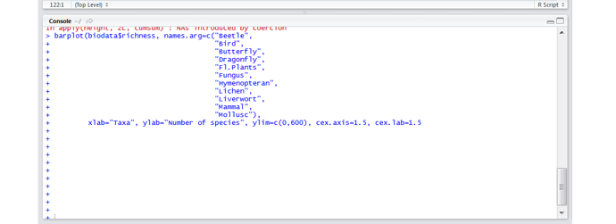
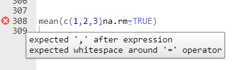

## Errors are how you learn

When learning a programming language, you will run into errors all the time.
That's completely normal and it's how programming works!

](img/AllisonHorst/debugging.jpg)

## First things first: Set R to English

- The R language setting follows your operating system language by default
- Errors might not be in English - hard to find help online

. . .

#### Fix: Change the R language setting to English

```r
# For the current session
Sys.setLanguage("en")
```

:::{.fragment}

:::{.callout-tip}

## Add it to your .Renviron

The `.Renviron` file is read automatically every time you start R.

Open the file with:

```{r}
#| eval: false
# install the usethis package
# install.packages("usethis")
# Open the .Renviron file in RStudio
usethis::edit_r_environ()
```

and add the line `LANGUAGE=en` to the file. Save it and restart R.

:::

:::

# Most common errors for beginners {.inverse}

> and how to deal with them

## Console prints `+`

R is not running code anymore and the console only prints `+`



. . .

#### How to fix it

- Go to the console and hit `Escape`. Then you should see the `>` sign instead of `+` again.
- Likely you forgot to close a bracket or a quote somewhere. Go to your script and check where this happened (look for &nbsp;&nbsp; next to line numbers)

## Syntax errors

#### Example

```{r}
mean(c(1, 2, 3)na.rm = TRUE)
```

<br>

#### How to fix

- Look for missing commas, misspelled arguments, unclosed brackets, ...
- Read the error message, it often points you to where the problem is
- The RStudio syntax checker warns you **before** you run code with syntax errors
  - Look for &nbsp;&nbsp; next to line numbers in your script
  
:::{.fragment}



:::

## Error: object not found

#### Example

```{r}
variable_A
```

<br>

:::{.fragment}

#### How to fix

- You are trying to access an object that does not exist. Common reasons:
  - Typo in the variable name (e.g. you created `variableA` but typed `variable_A`)
  - You forgot to run the line of code that creates the variable
  - You forgot to put quotes around a string: `print(hello)` looks for a **variable** named `hello`, but you wanted `print("hello")`
  
:::

## Package problems

:::{.columns}

:::{.column width="50%"}

#### Could not find function

```{r}
read_csv("data/penguins.csv")
```

- You forgot to **load the package**: `library(tidyverse)`
- You have a **typo** in the function name (e.g. `lenght()` instead of `length()`)

:::

:::{.column width="50%"}

:::{.fragment}
#### Package not found

```{r}
library(thispackagedoesntexist)
```

:::

- The package is **not installed**: `install.packages("thispackagedoesntexist")`
- You have a **typo** in the package name

:::

:::

:::{.fragment}

Remember for packages: **install once**, but **load every time** you start R

:::

## File not found

When reading data, you might see errors like:

```{r}
readr::read_csv("data/penguins.csv")
```


#### How to fix

- Check that you are in the **correct RStudio project** (look at the top right corner of RStudio)
- Check the **file name**: is it spelled exactly right?
- Check the **folder path**: is the file actually in the `data/` folder?

:::{.fragment}

:::{.callout-tip}

## Build your path with auto-completion

When you start typing a path in RStudio, you can use auto-completion to avoid typos. Start with `""` and then hit tab to see suggestions for files and folders in your project.

:::

:::

## Not all red text is an error

- **Errors**: something went wrong and your code did not run
- **Warnings**: your code still ran, but R tells you something might be wrong (e.g. `NA` values in your data)
  - Make sure to **read and understand** warnings
  - Only ignore them if you know that's okay
- **Messages**: just information, e.g. when you load the tidyverse

## What to do when you're stuck

:::{.nonincremental}

- Read the error message
- Check your data: use summary() or View() to see if your data looks the way you expect
- Read the function help with ?function_name
- Restart R and run your script from the top (Session > Restart R in RStudio)
- Search online or ask AI

:::

<br>

Make sure to **save your scripts regularly**. Sometimes R crashes and you have to start a new R session.