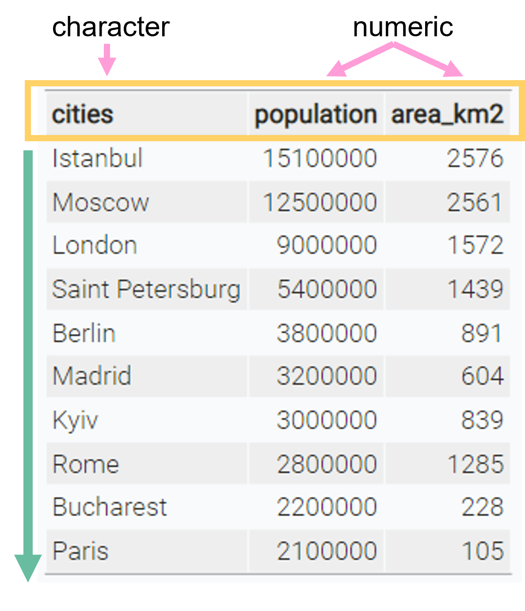

## Data frames

The built-in data structure for tables in R is a **data frame**.

. . .

:::{.columns}

:::{.column width="40%"}

Vectors in R can't represent a data table where values are connected via rows

> Data frames are one of the **biggest and most important ideas** in R, and one of the things that make R different from other programming languages.<br>[(H. Wickham, [Advanced R](https://adv-r.hadley.nz/vectors-chap.html#tibble))]{.text-small}

:::

:::{.column width="60%"}

```{r}
#| echo: false
# list of 10 biggest cities in Europe
cities <- c("Istanbul", "Moscow", "London", "Saint Petersburg", "Berlin", 
            "Madrid", "Kyiv", "Rome", "Bucharest", "Paris")
population <- c(15.1e6, 12.5e6, 9e6, 5.4e6, 3.8e6, 3.2e6, 3e6, 2.8e6, 2.2e6, 2.1e6)
area_km2 <- c(2576, 2561, 1572, 1439,891,604, 839, 1285, 228, 105 )

data.frame(city_name = cities,
           population_size = population,
           city_area = area_km2) |> 
  knitr::kable()
```

:::

:::

## Properties of a data frame

A data frame is a **named list of vectors** of the same length.<br>

. . .

:::{.columns}

:::{.column width="50%"}
<br>

- every [column is a vector]{.highlight-grn}
- columns have a [header]{.highlight-ylw}
- within one column, all values are of the [same data type]{.highlight-pink}
- every column has the same length

:::

:::{.column width="50%"}

{width=85%}

:::

:::

## Creating data frames

Data frames are created with the function `data.frame()`:

:::{.columns}

:::{.column width="50%"}

```{r}
#| eval: false
cities <- c(
  "Istanbul", "Moscow", "London", 
  "Saint Petersburg", "Berlin","Madrid",
  "Kyiv", "Rome", "Bucharest","Paris")

population <- c(
  15.1e6, 12.5e6, 9e6, 5.4e6, 3.8e6,
  3.2e6, 3e6, 2.8e6, 2.2e6, 2.1e6)

area_km2 <- c(2576, 2561, 1572, 1439, 
  891, 604, 839, 1285, 228, 105)

cities_dataframe <- data.frame(
  city_name = cities,
  population_size = population,
  city_area = area_km2
  )

```

:::

:::{.column width="50%"}

:::{.fragment}

```{r}
#| echo: false
# list of 10 biggest cities in Europe
cities <- c("Istanbul", "Moscow", "London", "Saint Petersburg", "Berlin", 
            "Madrid", "Kyiv", "Rome", "Bucharest", "Paris")
population <- c(15.1e6, 12.5e6, 9e6, 5.4e6, 3.8e6, 3.2e6, 3e6, 2.8e6, 2.2e6, 2.1e6)
area_km2 <- c(2576, 2561, 1572, 1439, 891, 604, 839, 1285, 228, 105)

cities_dataframe <- data.frame(
  city_name = cities,
  population_size = population,
  city_area = area_km2
  )
cities_dataframe
```

:::

:::

:::


## Tibbles

Tibbles are

> a **modern reimagining of the data frame**. Tibbles are designed to be (as much as possible) **drop-in replacements** for data frames.
<br>[(Wickham, [Advanced R](https://adv-r.hadley.nz/vectors-chap.html#tibble))]{.text-small}

. . .

Have a look at [this book chapter](https://adv-r.hadley.nz/vectors-chap.html#tibble) for a full list of the differences between data frames and tibbles and the advantages of using tibbles.

. . .


:::{.nonincremental}

- Tibbles have the same basic properties as data frames

- Everything that you can do with data frames, you can do with tibbles

- Tibbles are part of the `tibble` package

:::

## Packages

**Base R** functions and data types: built into R

```{r}
#| eval: false
mean()         # calculate mean
summary()      # show summary of a table
data.frame()   # create a data frame
```

. . .

**Additional packages** extend R with new functions and data types

```{r}
#| eval: false
# install once (in the console, not in the script)
install.packages("packageName")

# load every time R restarts (at the top of your script)
library(packageName)
```


## Tibbles

Create a tibble using the `tibble()` function:

. . .

:::{.columns}

:::{.column width="50%"}

```{r}
#| eval: false
#| install the tibble package once
# install.packages("tibble") 
library(tibble)

cities_tbl <- tibble(
  city_name = cities,
  population_size = population,
  city_area = area_km2
)
```

:::

:::{.column width="50%"}

```{r}
#| echo: false
cities_tbl <- tibble(
  city_name = cities,
  population_size = population,
  city_area = area_km2
)
cities_tbl
```

:::

:::

## Exploring tibbles

How many rows?

```{r}
nrow(cities_tbl)
```

. . .

How many columns?

```{r}
ncol(cities_tbl)
```

. . .

What are the column headers?

```{r}
names(cities_tbl)
```

## Exploring tibbles

Look at the entire table in a separate window with `view()`:

```{r}
#| eval: false
view(cities_tbl)
```

## Exploring tibbles

Get a quick summary of all columns:

```{r}
summary(cities_tbl)
```

- Very useful for checking if everything is ok with your research data

## Indexing tibbles

Indexing tibbles works similar to indexing vectors but with 2 dimensions instead of 1:<br>

:::{.r-stack}

<b>tibble [ row_index, col_index or col_name ]</b>

:::

- Missing row_index or col_index means *all rows* or *all columns* respectively.
- Indexing a tibble using `[]` always returns another tibble.

## Indexing tibbles

```{r}
# First row and first column
cities_tbl[1, 1]
```

. . .

This is the same as 

```{r}
#| eval: false
cities_tbl[1, "city_name"]
```

## Indexing tibbles: rows

```{r}
# rows 1 & 5, all columns:
cities_tbl[c(1, 5), ]
```

## Indexing tibbles: columns 

```{r}
#| eval: false
# All rows, first 2 columns
cities_tbl[ ,1:2] # same as cities_tbl[ , c(1, 2)]
# same as
cities_tbl[ ,c("city_name", "population_size")]
```

```{r}
#| echo: false
print(cities_tbl[ ,c("city_name", "population_size")], n=3)
```

## Indexing tibbles: columns

Indexing columns by name is usually preferred to indexing by position

```{r}
#| eval: false
cities_tbl[ ,1:2] # okay
cities_tbl[ ,c("city_name", "population_size")] # better
```

. . .

#### Why?

- Code is much easier to read

- Code is more robust against
  - changes in column order
  - mistakes in the code (e.g. typos)

:::{.fragment}
  
```{r}
#| eval: false
cities_tbl[ ,c(1,3)] # 3 instead of 2 -> wrong but no error
cities_tbl[ ,c("city_name", "popluation_size")] # typo -> wrong and error
```

:::

:::{.fragment}

:::{.callout-tip}

## General rule

Good code produces errors when something unintended or wrong happens

:::

:::

## Tibbles: Select columns with `$`

Select an entire column from a tibble using `$` (this returns a vector instead of a tibble):

```{r}
cities_tbl$city_name
```

## Adding new columns

New columns can be added as vectors using the `$` operator. The vectors need to have the same length as the tibble has rows.

. . .

```{r}
# add a country column
cities_tbl$country <- c(
  "Turkey", "Russia", "UK", "Russia", "Germany", "Spain",
  "Ukraine", "Italy", "Romania", "France"
)
```
```{r}
#| echo: false
cities_tbl
```

## Summary I

- Install and load a package before using it:

```{r}
#| eval: false
# install the tibble package once
# install.packages("tibble") 
library(tibble)
```

#### Creating tibbles and data frames

```{r}
#| eval: false
# data frame
data.frame(
  a = 1:3,
  b = c("a", "b", "c"),
  c = c(TRUE, FALSE, FALSE) 
)
# tibble
tibble(
  a = 1:3,
  b = c("a", "b", "c"),
  c = c(TRUE, FALSE, FALSE) 
)
# convert data frame to tibble
as_tibble(df)
```

## Summary II

#### Looking at tibble structure

```{r}
#| eval: false
# structure of tibble and data types of columns
str(tbl)
# number of rows
nrow(tbl)
# number of columns
ncol(tbl)
# column headers
names(tbl)
# look at the data in a new window
view(tbl)
# summary of values from each column
summary(tbl)
```

## Summary III

#### Indexing tibbles and selecting columns

Return result as tibble:

```{r}
#| eval: false
# rows and columns by position
tbl[1:3, c(1, 3)]
tbl[1:3, ] # all columns
tbl[, 3] # column 3, all rows
tbl[3] # same as above

# columns by name
tbl[, c("colA", "colB")]
tbl[c("colA", "colB")]
```

Return result as vector:

```{r}
#| eval: false
tbl$colA # select colA  
```

# Now you{.inverse}

[Task (15 min)]{.highlight-blue}<br>

[Tibbles]{.big-text}

**Find the task description [here](https://selinazitrone.github.io/intro-r-data-analysis/sessions/04_data-tibbles.html)**
