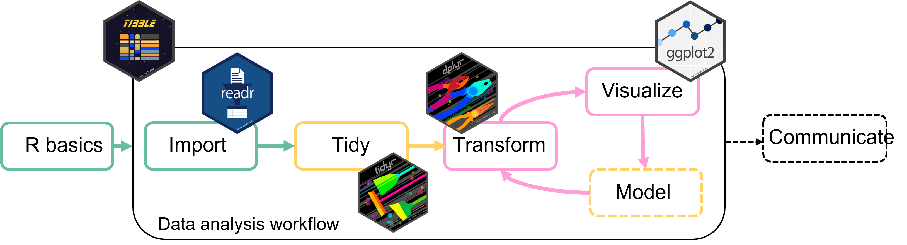
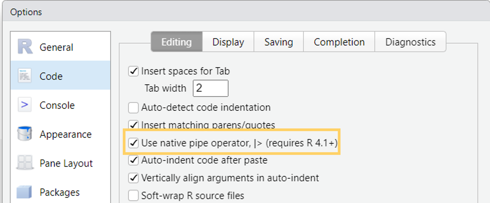
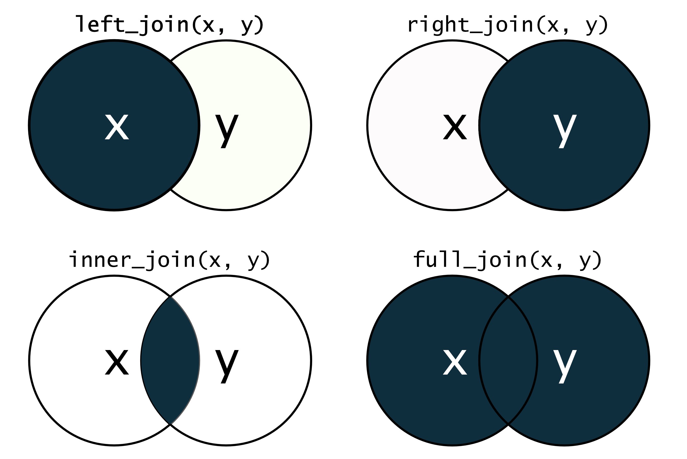

```{r setup, include=FALSE}
library(tidyverse)
library(gapminder)
theme_set(theme_grey(base_size = 16))
options(dplyr.print_max = 5, pillar.print_max = 5)
```

## Data transformation

Data transformation is an important step in **understanding** the data and **preparing** it for further analysis.



<br>

We can use the tidyverse package `dplyr` for this.

## Data transformation

With `dplyr` we can (among other things)

:::{.nonincremental}

- **Filter** data to analyse only a part of it
- **Create** new variables
- **Summarize** data
- **Combine** multiple tables
- **Rename** variables
- **Reorder** observations or variables

:::

. . .

To get started load the package `dplyr`:

```{r}
#| eval: false
library(dplyr)
# or
library(tidyverse)
```

## Dplyr basic vocabulary

All of the `dplyr` functions work similarly: <br>

- **First argument** is the data (a tibble)
- **Other arguments** specify what to do exactly
- **Return** a tibble

## The data

The `gapminder` dataset contains data on life expectancy, GDP per capita, and population for 142 countries from 1952 to 2007.

```{r}
# install.packages("gapminder")
library(gapminder)
gapminder
```

# `filter()` {.inverse}

> picks rows based on their value

## `filter()`

Filter only European countries:

```{r}
filter(gapminder, continent == "Europe")
```

. . .

`filter()` goes through each row and returns only rows where the `continent` is `"Europe"`

. . .

:::{.callout-note}

## To reuse, save result in a variable

```{r}
#| eval: false
gapminder_europe <- filter(gapminder, continent == "Europe")
```

:::

## `filter()`: comparison operators

:::{.nonincremental}

- `==` equal to
- `!=` not equal to
- `<`, `>` less than, greater than
- `<=`, `>=` less than or equal to, greater than or equal to
- `%in%` in a set of values

:::

. . .

Other examples

```{r}
#| eval: false
# Filter for life expectancy greater than 80
filter(gapminder, lifeExp > 80)

# All rows except European countries
filter(gapminder, continent != "Europe")

# All rows where continent is either "Africa", "Americas", or "Asia"
filter(gapminder, continent %in% c("Africa", "Americas", "Asia"))
```

## `filter()`: combine conditions

Use `&` (and) - both conditions must be true:

. . .

```{r}
filter(gapminder, continent == "Europe" & year == 2007)
```

## `filter()`: combine conditions

Use `|` (or) - one conditions must be true:

. . .

```{r}
# Filter years outside the range 1970–2005
filter(gapminder, year >= 2005 | year <= 1970)
```

## `filter_out()`: opposite of filter

Relatively new function - keeps rows that **don't** match the condition:

```{r}
# Keep rows that are NOT from Europe
filter_out(gapminder, continent == "Europe")
```

. . .

<br>

```{r}
#| eval: false
# equivalent to
filter(gapminder, continent != "Europe")
```


## `filter_out()` + `is.na()`

You can use `is.na()` to check for missing values and filter them out:

```{r}
# Filter rows where lifeExp is missing
filter_out(gapminder, is.na(lifeExp))
```

. . .

The gapminder data has no missing values, so the filter doesn't change anything here.


# `select()` {.inverse}

> picks columns based on their names

## `select()`

Select the columns `country`, `year`, and `lifeExp`

```{r}
select(gapminder, country, year, lifeExp)
```

. . .

Remove variables using `-`

```{r}
#| eval: false
select(gapminder, -country, -year, -lifeExp)
```

## `select()` + `starts_with()`

Select all columns that start with `"c"`

```{r}
select(gapminder, starts_with("c"))
```

. . .

There are also `ends_with()`, `contains()`, and more - see `?select` for details.

# `mutate()` {.inverse}

> Adds new columns to your data

## `mutate()`

New columns can be added based on values from other columns

```{r}
#| eval: false
mutate(gapminder, gdp = gdpPercap * pop)
```

## `mutate()`

Add multiple new columns at once:

```{r}
mutate(gapminder, gdp = gdpPercap * pop, pop_million = pop / 1e6)
```

## `mutate()` + `case_when()`

Use `case_when` to add column values conditional on other columns.

```{r}
mutate(
  gapminder,
  life_category = case_when(
    lifeExp < 50 ~ "low", # case 1
    lifeExp < 70 ~ "medium", # case 2
    lifeExp >= 70 ~ "high", # case 3
    .default = NA # all other
  )
)
```

# `summarize()` {.inverse}

> summarizes data

## `summarize()`

`summarize` will **collapse the data to a single row**

. . .

```{r}
summarize(
  gapminder,
  mean_lifeExp = mean(lifeExp),
  mean_gdpPercap = mean(gdpPercap)
)
```

## `summarize()` by group

`summarize` is much more useful in combination with the grouping argument `.by`

- **summary** will be calculated **separately for each group**

. . .

```{r}
#| flourish:
#|   - target: ".by = continent"
# summarize the grouped data
summarize(
  gapminder,
  mean_lifeExp = mean(lifeExp),
  mean_gdpPercap = mean(gdpPercap),
  .by = continent
)
```

. . .

- Combine variables if you want to summarize by more than one group (e.g. `.by = c(continent, year)`)

## `count()`

Counts observations by group

```{r}
# count rows grouped by continent
count(gapminder, continent)
```

# The pipe ` |> ` {.inverse}

> Combine multiple data operations into one command

## The problem: multiple steps

Data cleaning and manipulation usually requires **several steps in sequence**.

. . .

```{r}
# Step 1: Remove missing values
gapminder_clean <- filter_out(gapminder, is.na(lifeExp))
# Step 2: Select only European countries
gapminder_clean <- filter(gapminder_clean, continent == "Europe")
# Step 3: Add a new variable
gapminder_clean <- mutate(gapminder_clean, gdp = gdpPercap * pop)
```

. . .

This works, but creates lots of intermediate steps.

## The pipe `|>`

The pipe operator passes the result of one step as the **first argument** to the next step.

```{r}
#| eval: false
# This
filter(gapminder, continent == "Europe")

# is the same as
gapminder |> filter(continent == "Europe")
```

. . .

This is perfect for dplyr because:

:::{.nonincremental}

- First argument is the data (a tibble)
- Output (return value) is also a tibble 

:::

## The pipe `|>`

The pipe operator passes the result of one step as the **first argument** to the next step.

. . .

::: {.columns}
::: {.column}

Instead of this: 

```{r}
#| eval: false
# Step 1: Remove missing values
gapminder_clean <- filter_out(gapminder, is.na(lifeExp))
# Step 2: Select only European countries
gapminder_clean <- filter(gapminder_clean, continent == "Europe")
# Step 3: Add a new variable
gapminder_clean <- mutate(gapminder_clean, gdp = gdpPercap * pop)
```

:::
::: {.column}

:::{.fragment}

We can do this: 

```{r}
#| eval: false
gapminder_clean <- gapminder |>
  filter_out(is.na(lifeExp)) |>
  filter(continent == "Europe") |>
  mutate(gdp = gdpPercap * pop)
```

:::
:::
:::

. . .

<br>

Read `|>` as **"and then"**:

Take gapminder, **and then** drop NAs, **and then** filter, **and then** add a column.

## The pipe `|>`

- 2 different pipes in R (work similarly):
  - `|>`: base R pipe, available in R 4.1 and later
  - `%>%`: magrittr pipe, used in older versions and still common in tidyverse code

- I prefer `|>` because it's built into R

- Turn on the base R pipe in RStudio: Tools > Global Options > Code > Editing > Use native pipe operator (`|>`)

{width=50%}

. . .

:::{.callout-tip}
Use the keyboard shortcut `Ctrl/Cmd + Shift + M` to insert `|>`
:::

## The pipe `|>`

Piping also works well together with `ggplot`

```{r}
#| echo: false
theme_set(theme_bw(base_size = 16))
```

:::{.columns}

:::{.column width="50%"}


```{r}
#| eval: false
gapminder |>
  filter(year == 2007) |>
  ggplot(aes(x = gdpPercap, y = lifeExp, color = continent)) +
  geom_point(size = 3) +
  scale_x_log10()
```

:::

:::{.column width="50%"}

```{r}
#| echo: false
gapminder |>
  filter(year == 2007) |>
  ggplot(aes(x = gdpPercap, y = lifeExp, color = continent)) +
  geom_point(size = 3) +
  scale_x_log10()
```

:::
:::


## The pipe `|>`

You can also combine dplyr operations and ggplot:

:::{.columns}

:::{.column width="50%"}

```{r}
#| eval: false
gapminder |>
  summarize(
    mean_lifeExp = mean(lifeExp),
    .by = c(continent, year)
  ) |>
  ggplot(
    aes(
      x = year,
      y = mean_lifeExp,
      color = continent
    )
  ) +
  geom_line(linewidth = 1)
```

- Use `|>` between dplyr steps
- Switch to `+` once you start the ggplot

:::

:::{.column width="50%"}

```{r}
#| echo: false
gapminder |>
  summarize(
    mean_lifeExp = mean(lifeExp),
    .by = c(continent, year)
  ) |>
  ggplot(
    aes(
      x = year,
      y = mean_lifeExp,
      color = continent
    )
  ) +
  geom_line(linewidth = 1)
```

:::

:::

# Combining multiple tables{.inverse}

## Combine two tibbles by row `bind_rows`

Situation: Two (or more) `tibbles` with the same variables (column names)

```{r}
tbl_a <- gapminder[1:2, ] # first two rows
tbl_b <- gapminder[3:nrow(gapminder), ] # the rest
```

<br>

```{r}
#| eval: false
tbl_a
```

```{r}
#| echo: false
print(tbl_a, n = 2)
```

<br>

```{r}
#| eval: false
tbl_b
```

```{r}
#| echo: false
print(tbl_b, n = 2)
```

## Combine two tibbles by row `bind_rows`

Bind the rows together with `bind_rows()`:

```{r}
#| eval: false
bind_rows(tbl_a, tbl_b)
```

```{r}
#| echo: false
print(bind_rows(tbl_a, tbl_b), n = 2)
```

. . .

You can also add an ID-column to indicate which line belonged to which table:

```{r}
#| eval: false
bind_rows(a = tbl_a, b = tbl_b, .id = "id")
```

```{r}
#| echo: false
print(bind_rows(a = tbl_a, b = tbl_b, .id = "id"), n = 3)
```

. . .

You can use `bind_rows()` to bind as many tables as you want:

```{r}
#| eval: false
bind_rows(a = tbl_a, b = tbl_b, c = tbl_c, ..., .id = "id")
```

## Join tibbles with `left_join()`

Situation: Two tables that share some but not all columns.

. . .

```{r}
#| echo: false
continent_info <- select(gapminder, continent) |>
  distinct() |>
  mutate(
    region = case_when(
      continent == "Africa" ~ "Global South",
      continent == "Americas" ~ "Western Hemisphere",
      continent == "Asia" ~ "Global East",
      continent == "Europe" ~ "Western World",
      continent == "Oceania" ~ "Pacific"
    )
  )
```

```{r}
#| eval: false
gapminder
```

```{r}
#| echo: false
print(gapminder, n = 2)
```

<br>

```{r}
# table with more information on the continents
continent_info
```

## Join tibbles with `left_join()`

Join the two tables by the common column `continent`

```{r}
left_join(gapminder, continent_info, by = "continent")
```

. . .

`left_join()` means that the resulting tibble will contain all rows of `gapminder`,
but not necessarily all rows of `continent_info` (in this case it does though).

## Different `*_join()` functions

{width=70% fig-align="center"}

# Summary{.inverse}

> Data transformation with dplyr

## Summary I

All `dplyr` functions take a tibble as first argument and return a tibble.

#### `filter()`

:::{.nonincremental}

- **pick rows** with helpers
  - relational and logical operators
  - `%in%`
  - `is.na()` and `filter_out()`
  - `between()`
  - `near()`

:::

## Summary II

:::{.nonincremental}

All `dplyr` functions take a tibble as first argument and return a tibble.

#### `select()`

- **pick columns** with helpers
  - `starts_with()`, `ends_with()`
  - `contains()`
  - `matches()`
  - `any_of()`, `all_of()`

:::

## Summary III

#### `arrange()`

:::{.nonincremental}

- **change order** of rows (adscending)
  - or descending with `desc()`

#### `mutate()`

- **add columns** but keep all columns
  - `case_when()` for conditional values

:::

## Summary IV

:::{.nonincremental}

#### `summarize()`

- **collapse rows** into one row by some summary
  - use `.by` argument to summarize by group

#### `count`

- **count rows** based on a group

:::

## Summary V

:::{.nonincremental}

#### `bind_rows()`

- **combine rows** of multiple tibbles into one
  - the tibbles need to have the same columns
  - add an id column with the argument `.id = "id"`
  - function `bind_cols()` works similarly just for columns

#### `left_join()`

- **combine tables** based on common columns

:::

# Now you {.inverse}

[Task (30 min)]{.highlight-blue}<br>

[Transform the penguin data set]{.big-text}

**Find the task description [here](https://selinazitrone.github.io/intro-r-data-analysis/sessions/08_dplyr.html)**
