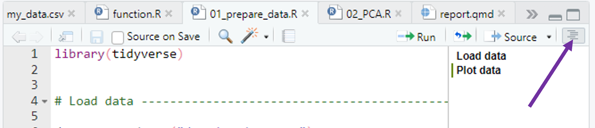
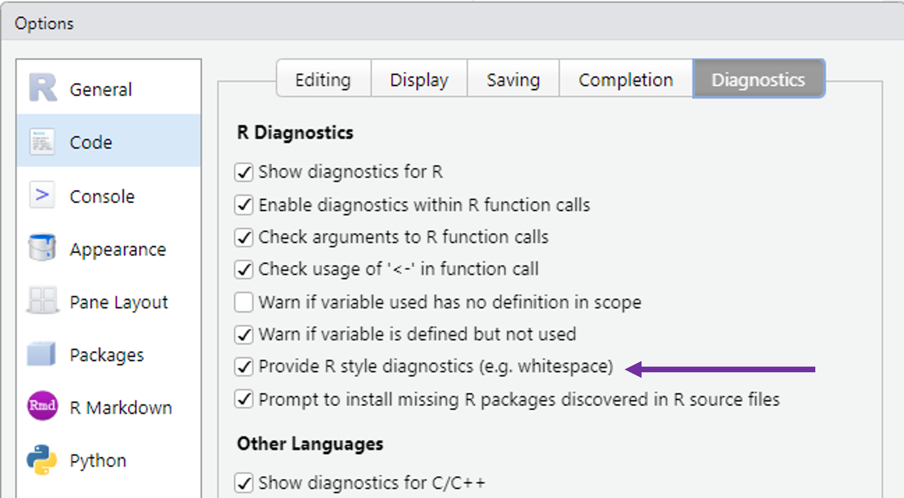
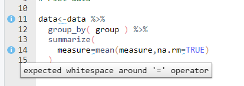
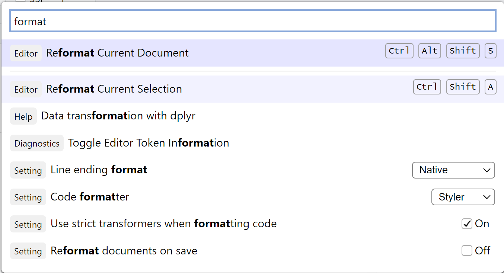

```{r setup}
#| include: false
# fmt: skip file
```

## Chaotic projects and workflows ...

... can make even small changes frustrating and difficult.
  
, CC BY 4.0](img/2023_04_20_what_they_forgot_to_teach_you/02_kitchen_chaos.png){fig-alt="A frustrated looking little monster in front of a very disorganized cooking area, with smoke and fire coming from a pot surrounded by a mess of bowls, utensils, and scattered ingredients." width=80%}

# Set up your project properly {.inverse}

Consistent structure and filenames

## Have a clear project structure

:::{.columns}

:::{.column width="50%"}

- One directory with all files relevant for project
  - Scripts, data, plots, documents, ...
- Choose a meaningful project structure [^1]
- Add a readme file (usually `README.md`) in which you document the project structure

:::

:::{.column width="50%"}

```md
MyProject
|
|- data
|
|- docs
|   |
|   |- notes
|   |
|   |- reports
|
|- R
|   |
|   |- clean_data.R 
|   |
|   |- statistics.R
|
|- MyProject.RProj
|
|- README.md
```

[Example RStudio project structure]{.text-small}

:::

:::

[^1]: you can orient yourself at the [R package structure](https://doi.org/10.1080/00031305.2017.1375986)


## Use RStudio projects

Always make your project an RStudio Project (if possible)!

. . .

:white_check_mark: You already did that.

## Name your files properly

Your collaborators and your future self will love you for this.

. . .

### Principles [^2]

File names should be

:::{.nonincremental}

  1. Machine readable
  2. Human readable
  3. Working with default file ordering

:::

[^2]: From [this talk](https://speakerdeck.com/jennybc/how-to-name-files) by J. Bryan

## 1. Machine readable file names

Names should allow for easy **searching**, **grouping** and **extracting information** 
from file names.

. . .

- No space & special characters

. . .

#### Bad examples :x:

:page_facing_up: `2023-04-20 temperature göttingen.csv ` <br>
:page_facing_up: `2023-04-20 rainfall göttingen.csv ` <br>

::: {.fragment}

#### Good examples :heavy_check_mark: 

:page_facing_up: `2023-04-20_temperature_goettingen.csv ` <br>
:page_facing_up: `2023-04-20_rainfall_goettingen.csv ` <br>

:::

## 2. Human readable file names

Which file names would you still understand in 1 year?

- File names should reveal the file content
- Use separators to make it readable

. . .

#### Bad examples :x:

:page_facing_up: `01preparedata.R` <br>
:page_facing_up: `01firstscript.R` <br>

::: {.fragment}

#### Good examples :heavy_check_mark: 

:page_facing_up: `01_prepare-data.R` <br>
:page_facing_up: `01_temperature-trend-analysis.R` <br>

:::

## 3. Default ordering

If you order your files by name, the ordering should make sense:

- (Almost) always put something numeric first
  - Left-padded numbers (`01`, `02`, ...)
  - Dates in `YYYY-MM-DD` format

. . .

#### Chronological order

:page_facing_up: `2023-04-20_temperature_goettingen.csv ` <br>
:page_facing_up: `2023-04-21_temperature_goettingen.csv ` <br>

:::: {.fragment}

#### Logical order

:page_facing_up: `01_prepare-data.R` <br>
:page_facing_up: `02_lm-temperature-trend.R` <br>

:::

# Let's start coding {.inverse}

> Good practice R coding

## Write beautiful code

:::{.columns}

:::{.column width="50%"}

- Try to write code that others (i.e. future you) can understand
- Follow standards for readable and maintainable code
  - For R: [tidyverse style guide](https://style.tidyverse.org/index.html) defines code organization, syntax standards, ...

:::

:::{.column width="50%"}

, CC BY 4.0](img/2023_04_20_what_they_forgot_to_teach_you/17_beatuiful_code.png)

:::

:::

## Standard code structure

. . .

::: {.columns}

::: {.column width="50%"}
::: {.nonincremental}

1. General comment with purpose of the script, author, ...
2. `library()` calls on top
3. Set default variables and global options
4. Write the actual code, starting with loading all data files
:::
:::

::: {.column width="50%"}


```{r example-structure-1}
# Analysis of tree growth data
# Author: Selina Baldauf
# Date: 2026-03-09

library(tidyverse)

# set defaults
input_file <- "data/tree_growth.csv"

# read input
trees <- read_csv(input_file)

# analyse data
summary(trees)
```

:::
:::

## Mark sections

:::{.nonincremental}
- Use comments to break up your file into sections
:::

. . .

```{r code-section}
# Load data ---------------------------------------------------------------

trees <- read_csv("data/tree_growth.csv")

# Explore data -------------------------------------------------------------

summary(trees)
```

- Insert a section label with `Ctrl/Cmd + Shift + R`
- Navigate sections in the file outline

. . .

{width="75%"}

## Coding style - Object names

. . .

- Variables should only have *lowercase letters*, *numbers*, and *_*
- Use `snake_case` for longer variable names
- Try to use concise but meaningful names

. . .

```{r object-names-snake}
# Good
day_one
day_1

# Bad
DayOne
dayone
first_day_of_the_month
dm1
```

## Coding style - Spacing

. . .

Use spaces to make your code more readable:

:::{.nonincremental}

- Always put spaces after a comma
- Spaces around most operators (`<-`, `+`, etc.)
- No spaces around parentheses for normal function calls

:::

```{r spaces-combined}
# Good
x[, 1]
height <- (feet * 12) + inches
mean(x, na.rm = TRUE)

# Bad
x[,1]
height<-feet*12+inches
mean(x,na.rm=TRUE)
```

## Coding style - Line width

Try to limit your line width to 80 characters.

- You don't want to scroll to the right to read all code
- 80 characters can be displayed on most displays and programs
- Split your code into multiple lines if it is too long
  - See this grey vertical line in R Studio?

## Coding style

Do I really have to remember all of this?

. . .

Luckily, no! R and R Studio provide some nice helpers

## Coding style helpers - RStudio

RStudio has style diagnostics that tell you where something is wrong

**Tools -> Global Options -> Code -> Diagnostics**

::: {.columns}

::: {.column width="65%"}



:::

::: {.column width="35%"}

:::

:::

## Coding style helpers - Auto-formatting

RStudio can automatically format your code!

{width="40%"}

. . .

Try it now: open your script from today and use **Code -> Reformat Code** to auto-format it.

## Clean projects and workflows ...

... allow you and others to work productively. 

But don't get overwhelmed by all the
advice. Just start with one thing.

, CC BY 4.0](img/2023_04_20_what_they_forgot_to_teach_you/03_kitchen_clean.png){fig-alt="An organized kitchen with sections labeled \"tools\", \"report\" and \"files\", while a monster in a chef's hat stirs in a bowl labeled \"code.\"" width=80%}
