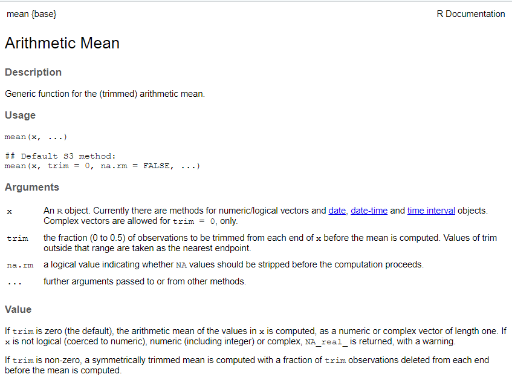

```{r setup, include=FALSE}
library(fontawesome)
```

## R as a calculator

### Arithmetic operators

<br>

:::{.columns}

:::{.column width="50%"}

<table style='width:100%;font-size:16pt'>
  <tr>
    <td><b>Addition</b></td>
    <td><code>+</code></td>
  </tr>
  <tr>
    <td><b>Subtraction</b></td>
    <td><code>-</code></td>
  </tr>
  <tr>
    <td><b>Multiplication</b></td>
    <td><code>*</code></td>
  </tr>
    <tr>
    <td><b>Division</b></td>
    <td><code>/</code></td>
  </tr>
  <tr>
    <td><b>Power</b></td>
    <td><code>^</code></td>
  </tr>
</table>

:::

:::{.column width="50%"}

```{r arithmetic operators, eval=FALSE}
# Addition
2 + 2
# Subtraction
5.432 - 34234
# Multiplication
33 * 42
# Division
3 / 42
# Power
2^2
# Combine operations
((2 + 2) * 5)^2
```

:::

:::

## Basic R Syntax

Whitespace does not matter

. . .

```{r}
#| eval: false

# this
head(airquality)

# is the same as this
head(
  airquality
)
```

. . .

- There are good practice rules however -> More on that later

- RStudio will (often) tell you if something is incorrect
  - Find  on the side of your script

## Comments vs. Code

Everything that follows a `#` is a comment

```{r, eval=FALSE}
# Look at the first rows of the built-in airquality dataset
head(airquality)

# How many rows and columns does it have?
nrow(airquality)
ncol(airquality)
```

- Only code is executed, comments are ignored by R
- Notes that make code more readable or add information

## Variables

Store values under meaningful names **to reuse** them

. . .

```{r}
# Create a variable
value1 <- 5
value2 <- 10
value1 + value2
```

:::{.fragment}

R is case sensitive: **v**alue != **V**alue

```{r}
Value1
```

:::

## Data types

The most **basic data types** in R:

. . .

**Numeric**: numbers like `1.243`, `-0.5`, `42`, `1e6`

. . .

**Logical:** only two possible values `TRUE` and `FALSE`

. . .

**Character:** sequence of characters surrounded by quotes (`"hello"`, `"sample_1"`)

. . .

<br>

**Vectors** are a **collections of values** that are all **of the same basic data type**.

. . .

Use the function `c()` to *combine* values into a vector

```{r}
num_vector <- c(1, 2, 3)
lgl_vector <- c(TRUE, TRUE, FALSE)
chr_vector <- c("These are", "just", "some strings")
```

## Working with vectors

```{r}
# 5 biggest cities in Europe
cities <- c("Istanbul", "Moscow", "London", "Saint Petersburg", "Berlin")

population <- c(15.1e6, 12.5e6, 9e6, 5.4e6, 3.8e6)

area_km2 <- c(2576, 2561, 1572, 1439, 891)
```

::: {.aside}

Data from [Wikipedia](https://en.wikipedia.org/wiki/List_of_European_cities_by_population_within_city_limits)

:::

## Vector arithmetic

Arithmetic operations work **element by element**:

```{r}
# Population density (people per km²)
population / area_km2
```

. . .

Same when dividing by a single number:

```{r}
# Population in millions
population / 1e6
```

## Indexing vectors

Use square brackets `[]` to access specific elements from a vector.

. . .

```{r}
cities[3]
```

<br>

. . .

```{r}
# Multiple elements
cities[c(1, 3, 5)]
```

<br>

. . .

```{r}
# Multiple elements (consecutive)
cities[1:3] # same as cities[c(1, 2, 3)]
```

## Functions

Functions make multiple operations available under one command.

. . .


. . .

General structure of a function call:

```{r}
#| eval: false
function_name(input1, input2, ...)
```

## The mean function

```{r}
mean(c(1, 5, 6))
```

. . .

<br>

```{r}
# Input and output can also be variables
values <- c(1, 5, 6)
result <- mean(values)
result
```

## Missing values

`NA` represents a **missing value** in R.

. . .

```{r}
values <- c(1, 5, 6, NA)
mean(values)
```

. . .

R doesn't compute the mean if a value is missing.

. . .

How do we fix this? Let's check the function help!

## The function help

Access the help file of each function with `?functionName`

. . .

:::{.columns}

:::{.column width="50%"}


```{r eval=FALSE}
?mean
```

:::

:::{.column width="50%"}



:::

:::

. . .

`r fontawesome::fa("arrow-right")`&nbsp; The `na.rm` argument is `FALSE` by default. Set it to `TRUE` to ignore missing values:

```{r}
mean(values, na.rm = TRUE)
```

## Summary

:::{.nonincremental}

- **Variables** store values: `radius <- 5`
- **Data types**: numeric, logical, character
- **Vectors**: collection of values of the same type, created with `c()`
- **Indexing**: 
  - Single element: `v[3]`
  - Multiple elements: `v[1:4]`, `v[c(1, 5)]`
- **Functions**: `function_name(input1, input2, ...)`
- **NA** are missing value → use `na.rm = TRUE` in functions like `mean()`
- **Function help**: `?function_name`

:::

# Now you {.inverse}

[Task (20 min)]{.highlight-blue}<br>

[R Basics: Variables, Vectors & Functions]{.big-text}

**Find the task description [here](https://selinazitrone.github.io/intro-r-data-analysis/sessions/02_intro-r.html)**
