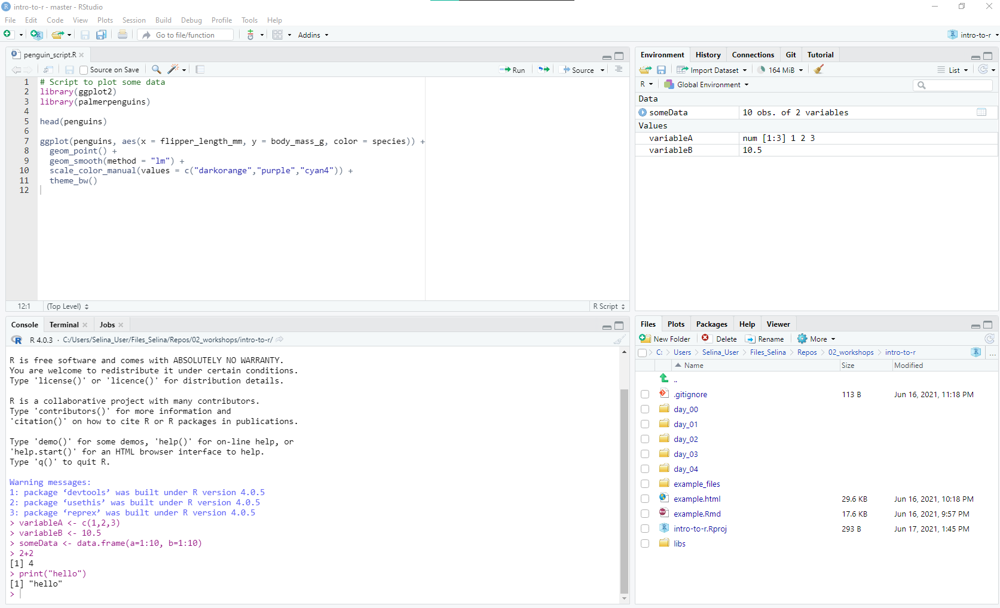
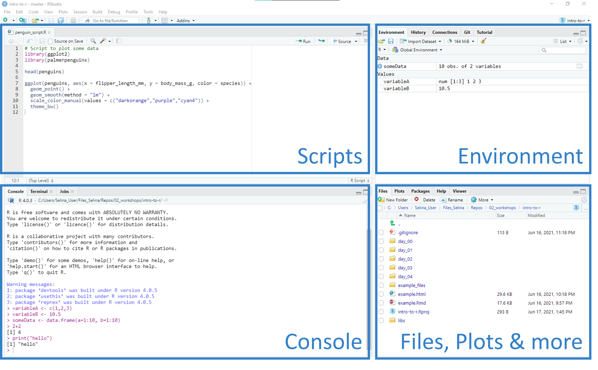
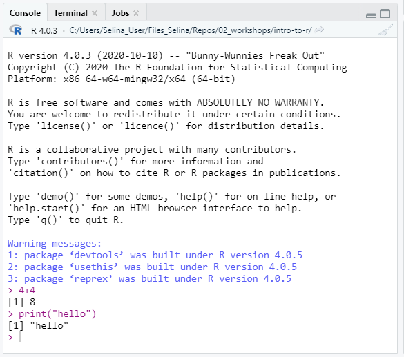
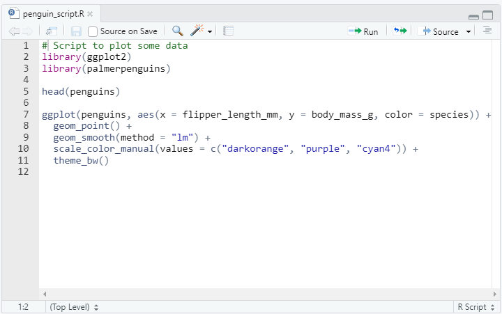
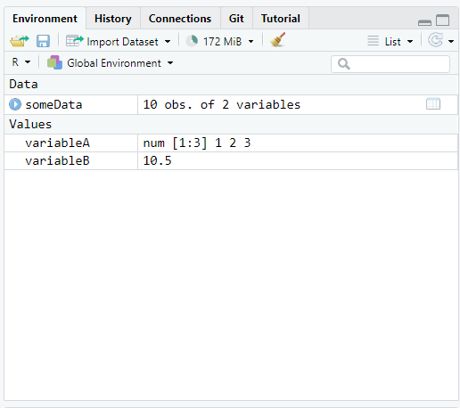
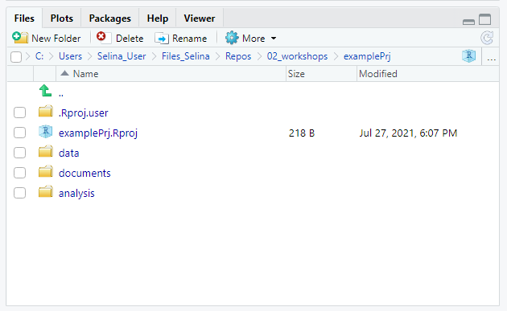
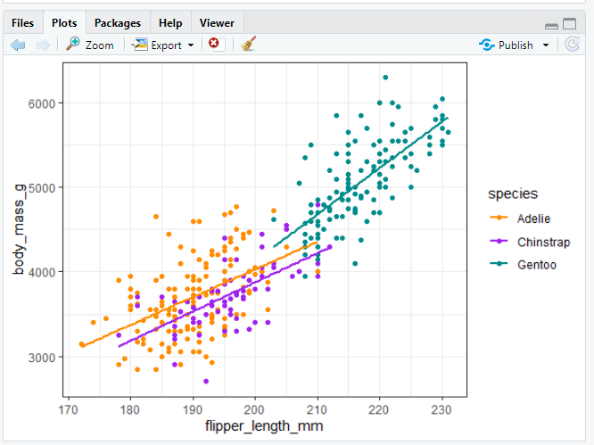
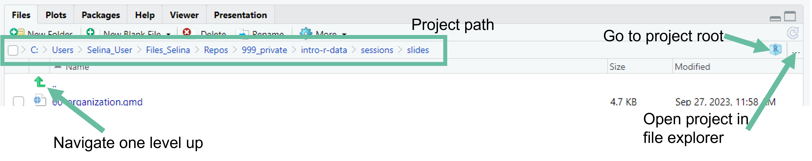
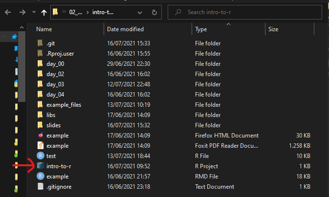
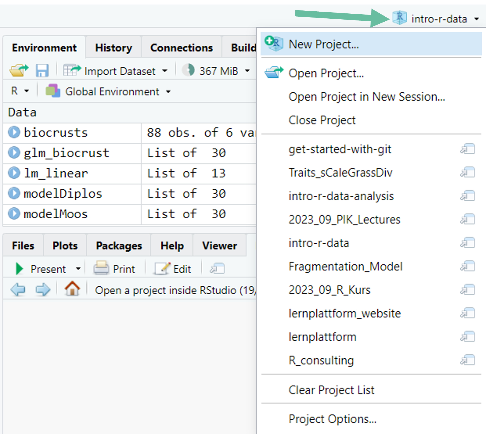

```{r}
#| include: false
library(fontawesome)
```

## Difference between R and RStudio

](img/day1/car_engine.png)

:::{.columns}

:::{.column width="50%"}

:::{.fragment}

R is the **programming language** and the **program** that does the actual work

:::

:::

:::{.column width="50%"}

:::{.fragment}

RStudio is the **integrated development environment** (IDE).

Interface to R, syntax highlighting, file management, ...

:::

:::

:::

 
## A quick tour around RStudio

{fig-align="center" width=85%}

## A quick tour around RStudio

{fig-align="center" width=85%}

## Console pane{.nonincremental}

:::{.columns}

:::{.column width="50%"}

- Execute R code

- Output from R code in scripts is printed there

- Type a command into the console and execute with `Enter/Return`

::: {.callout-tip}

Use arrow keys to bring back last commands

:::

:::

:::{.column width="50%"}



:::

:::

## Script pane

:::{.columns}

:::{.column width="50%"}


- Write scripts with R code

  - Scripts are text files with R commands (file ending `.R`)
  
  - Use scripts to save commands for reuse

:::

:::{.column width="50%"}



:::

:::

## Script pane

:::{.columns}

:::{.column width="50%"}

- Create a new R script: <br> **File -> New File -> R Script**
- Save an R script:<br> **File->Save (Ctrl/Cmd + S)**
- Run code line by line with **Run button (Ctrl+Enter/Cmd+Return)**
- You can open multiple scripts

:::

:::{.column width="50%"}

 

:::

:::

::: {.callout-tip}

## Script vs Console

Use **scripts** for all your analysis and for commands that you want to save.<br>
Use **console** for temporary commands, e.g. to test something.

:::

## Environment pane

:::{.columns}

:::{.column width="50%"}

- Shows objects currently present in the R session

- Is empty if you start R

:::

:::{.column width="50%"}



:::

:::

## Files pane

:::{.columns}

:::{.column width="50%"}

- Similar to Explorer/Finder

- Browse project structure and files
  - Find and open files
  - Create new folders
  - Delete and rename files
  - ...

:::

:::{.column width="50%"}



:::

:::

## Plot pane {.nonincremental}

:::{.columns}

:::{.column width="50%"}

- Plots that are created with R will be shown here

:::

:::{.column width="50%"}



:::

:::

## A tip before we get started

Learn the most important keyboard shortcuts of RStudio.

. . .

Find all shortcuts under **Tools -> Keyboard Shortcuts Help**

:::{.nonincremental}
- Save active file: Ctrl/Cmd + S
- Run current line: Ctrl/Cmd + Enter
- Create new R Script: Ctrl/Cmd + N
- Undo: Ctrl/Cmd + Z
- Redo: Ctrl/Cmd + Y
- Copy/Paste: Ctrl/Cmd + C/V
:::

## RStudio projects

:::{.columns}

:::{.column width="50%"}

Idea: One directory (folder) with all files relevant for project (data, R scripts, figures, ...)

:::{.nonincremental}

- An **RStudio project** is just a normal folder with an **.Rproj** file
- Helps R to find your project files

:::

:::

:::{.column width="50%"}

```md
MyProject
|
|- data
|
|- R
|   |
|   |- clean_data.R 
|   |
|   |- statistics.R
|
|- figures
|
|- MyProject.RProj
```

[Example RStudio project structure]{.text-small}

:::

:::

## Create an RStudio project {.nonincremental}

:::{.columns}

:::{.column width="60%"}

:::{.nonincremental}

Create a project from scratch:
  
1. **File -> New Project -> New Directory -> New Project**
2. Enter a directory name (this will be the name of your project)
3. Choose the Directory where the project should be initiated
4. **Create Project**

:::

:::

:::{.column width="40%"}

![[Example RStudio project structure in the Files pane]{.text-small}](img/day1/RStudio_Files.png)

:::

:::

RStudio will now create and open the project for you.  

## Navigate an RStudio project

:::{.r-stack}



:::

## Open an RStudio project

:::{.columns}

:::{.column width="50%"}

**From file explorer/finder:**<br>
Double click on the **.Rproj** file



:::

:::{.column width="50%"}

:::{.fragment}

**From inside RStudio:**<br>
Click the project symbol on the top right



:::

:::

:::

# Now you {.inverse}

[Task 1 (15 min)]{.highlight-blue}<br>

[Set up your own RStudio project for this workshop]{.big-text}

**Find the task description [here](https://selinazitrone.github.io/intro-r-data-analysis/sessions/01_intro-rstudio.html)**
