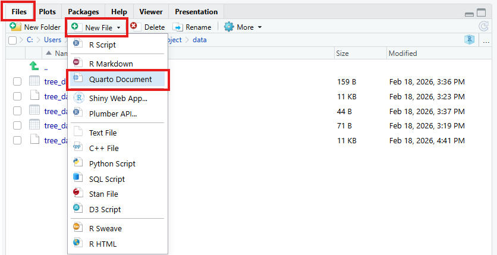
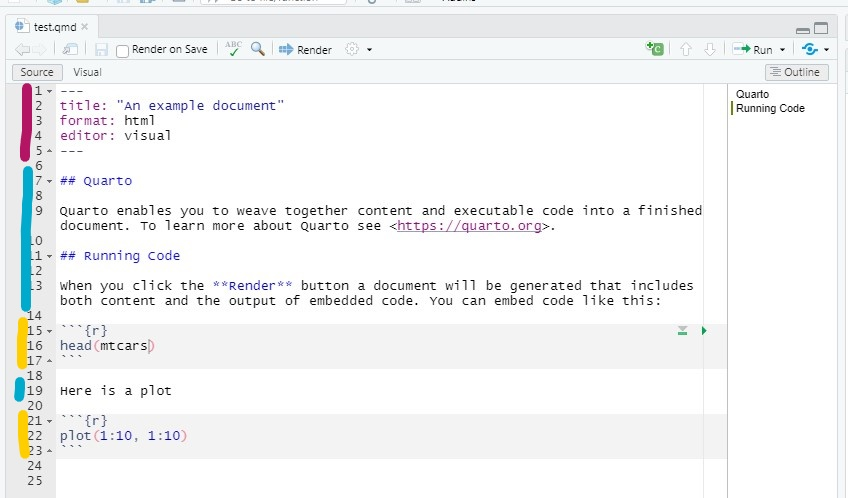
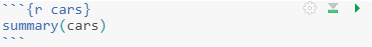
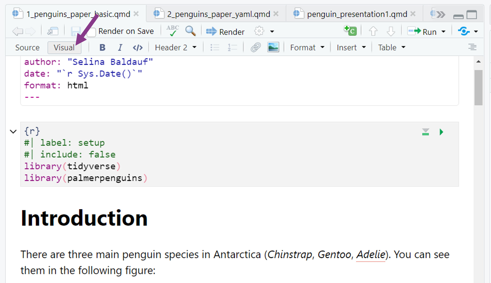

```{r setup, include=FALSE}
library(ggplot2)
library(dplyr)
library(gapminder)
```

## From R scripts to documents

So far in the workshop, you've been writing `.R` scripts.

. . .

This is great for running code, but what if you want to

- share your analysis with collaborators?
- add explanations and interpretations to your code?
- create a report with figures and tables?

## A standard workflow


. . .

If you have to repeat the analysis

- Redo all figures and tables
- Update document manually
- Manual copy pasting of values is very error prone

## A Quarto workflow

**Quarto** lets you combine **code**, **text**, and **output** in one document.

. . .


. . .

**Advantages:**

- Easy to redo the analysis
- No more copy pasting
- Reproducible
- Documentation, code & output in one place

## What is Quarto?

> Quarto is an open-source scientific and technical publishing system

. . .

- Built into RStudio but can also be installed separately
- Create different types of outputs:
  - Documents: HTML, PDF, Word
  - Presentations, Websites, Books, ...

. . .

Today we focus on **documents**.

# The basic Quarto workflow {.inverse}

## Three steps

1. **Create** a `.qmd` document

2. **Write** text and code into the document

3. **Render** the document to an output format (e.g. HTML)

## Step 1: Create a `.qmd` document

In the **Files pane**, click `New File -> Quarto Document`

. . .



. . .

Give it a name (e.g. `my_report.qmd`) and it opens as an empty file in RStudio.

## Step 2: Write the document

A `.qmd` file has three types of content:

:::{.columns}

:::{.column width="55%"}



:::

:::{.column width="43%"}

- [YAML header]{style="color:#b31464"}: Metadata and output format
- [Markdown text]{style="color:#00abcd"}: Formatted text body
- [Code chunks]{style="color:#ffcf01"}: R code that produces output

:::

:::

## Step 3: Render the document

:::{.nonincremental}

- Click the **Render** button in RStudio
- Or use the keyboard shortcut `Ctrl + Shift + K`

:::

. . .

RStudio will run all the code, combine it with your text, and produce the output document.

# Elements of a `.qmd` document {.inverse}

> Markdown text, Code, YAML header

## Markdown text

Markdown is a simple markup language to create formatted text.

. . .

**The basics**

- Bold: `**text**` becomes **text**
- Italic: `*text*` becomes *text*

. . .

**Headers**

```md
# First level header
## Second level header
### Third level header
```

## Markdown text

**Lists**

```md
- item 1
- item 2
- item 3
```

. . .

**Links**

`[Quarto website](https://quarto.org)` becomes [Quarto website](https://quarto.org)

. . .

You don't need to memorize all of this. [Here](https://quarto.org/docs/authoring/markdown-basics.html) is a quick reference.

## Code chunks

Code chunks start and end with 3 backticks and contain R code:

```` md
```{{r}}
library(gapminder)

ggplot(gapminder, aes(x = gdpPercap, y = lifeExp)) +
  geom_point()
```
````

. . .

**Insert a code chunk**

:::{.nonincremental}

- Menu: `Code` -> `Insert chunk`
- Keyboard shortcut: `Ctrl + Alt + I` / `Cmd + Option + I`

:::

## Code chunks

**Run a code chunk**

- Code chunks are run when you **render** the document
- You can also run them like normal R code by clicking the green arrow

. . .



## Code chunks — options

Code chunks have special comments starting with `#|` that control the output:

```` md
```{{r}}
#| echo: false
#| warning: false

ggplot(gapminder, aes(x = gdpPercap, y = lifeExp)) +
  geom_point()
```
````

. . .

:::{.nonincremental}

- `echo`: `true/false` — Show the code in the output?
- `eval`: `true/false` — Run the code?
- `warning`: `true/false` — Show warnings?
- `message`: `true/false` — Show messages?

:::

## Inline code

You can also include R code **inside text** using inline code:

. . .

```md
The gapminder data contains `r knitr::inline_expr("nrow(gapminder)")` observations.
```

becomes:

The gapminder data contains `r nrow(gapminder)` observations.

. . .

This is powerful because the **number updates automatically** when the data changes.

## YAML header — metadata

The YAML header is at the top of the document between `---` markers:

```yaml
---
title: "My analysis"
author: "Selina Baldauf"
date: today
format: html
---
```

. . .

This sets the **title**, **author**, **date**, and **output format**.

## YAML header — execute options

You can set **default options** for all code chunks:

```yaml
---
title: "My analysis"
author: "Selina Baldauf"
format: html
execute:
  warning: false
  message: false
---
```

. . .

These can be overwritten by individual chunk options.

# Now you {.inverse}

[Task (30 min)]{.highlight-blue}<br>

[Reproducible documents with Quarto]{.big-text}

**Find the task description [here](https://selinazitrone.github.io/intro-r-data-analysis/sessions/11_quarto.html)**

# Additional Quarto features {.inverse}

## Render to PDF

Change the output format in the YAML header:
````yaml
---
format: pdf
---
````

. . .

You might need to install LaTeX first. The most convenient is to use the [`tinytex` package](https://yihui.org/tinytex/):

````r
# Run this in the R console
# install.packages("tinytex")
tinytex::install_tinytex()
````

## Render to Word
````yaml
---
format: docx
---
````

. . .

You can also specify **multiple output formats**:
````yaml
---
format:
  html: default
  pdf: default
  docx: default
---
````

## Document options

Add options under the format to customize your document:
````yaml
---
format:
  html:
    toc: true
    toc-location: left
    number-sections: true
    code-fold: true
---
````

. . .

:::{.nonincremental}

- `toc`: Add a table of contents
- `number-sections`: Number the section headers
- `code-fold`: Hide code behind a button (HTML only)

:::

. . .

Be careful with the **indentation**, YAML is sensitive to spaces.

## Figure options

Control how figures appear in the output:
```` md
```{{r}}
#| label: fig-life-exp
#| fig-cap: "Life expectancy vs. GDP per capita in 2007"
#| fig-align: center
#| out-width: "80%"

ggplot(gapminder, aes(x = gdpPercap, y = lifeExp)) +
  geom_point(aes(color = continent)) +
  theme_minimal()
```
````

. . .

:::{.nonincremental}

- `fig-cap`: Figure caption
- `fig-align`: `left`, `center`, or `right`
- `out-width`: Width of the figure in the output
- `label`: Must start with `fig-` for figures

:::

## Cross-references

You can reference labeled figures in the text:
````md
As we can see in @fig-life-exp, life expectancy increases with GDP.
````

. . .

becomes:

As we can see in Figure 1, life expectancy increases with GDP.

## Nice tables with `kable()`

By default, tibbles print as plain text. Use `knitr::kable()` to render a nice table:
````{{r}}
penguins |>
  group_by(species) |>
  summarize(
    mean_mass = mean(body_mass, na.rm = TRUE),
    mean_flipper = mean(flipper_len, na.rm = TRUE)
  ) |>
  knitr::kable()
````

. . .

No extra installation needed — `knitr` is already loaded when you render a `.qmd`.

## Nice test results with `broom`

Remember the statistical tests from earlier today?

. . .

Test output in R is not table-friendly. The `broom` package can fix that:
````{{r}}
#| eval: false
# install.packages("broom")

t.test(adelie, gentoo, var.equal = TRUE) |>
  broom::tidy() |>
  knitr::kable()
````

. . .

`broom::tidy()` turns test results into a clean tibble — works with `t.test()`, `wilcox.test()`, `shapiro.test()`, and many more.

. . .

This is a great reason to use Quarto: **run the test and format the result in one document**.

## The visual editor

RStudio has a **visual editor** that provides a word-like interface for editing `.qmd` files.



## The visual editor

The visual editor makes it easy to:

- Format text with buttons instead of markdown syntax
- Insert images, tables, and links via menus
- Add citations from Zotero, DOI, or PubMed

## Outlook

Quarto can do much more:

- **Presentations** (like the slides in this workshop!)
- **Websites** (like the [workshop website](https://selinazitrone.github.io/intro-r-data-analysis/))
- **Books**
- Publish online with [Quarto Pub](https://quartopub.com/) or GitHub Pages

. . .

Check out the [Quarto website](https://quarto.org/) for guides, examples, and a gallery.

## References

:::{.nonincremental}

- [Quarto website](https://quarto.org/) — everything you need to get started
- [Markdown syntax reference](https://quarto.org/docs/authoring/markdown-basics.html)
- [HTML document options](https://quarto.org/docs/reference/formats/html.html)
- [PDF document options](https://quarto.org/docs/reference/formats/pdf.html)
- [Gallery with examples](https://quarto.org/docs/gallery/)

:::