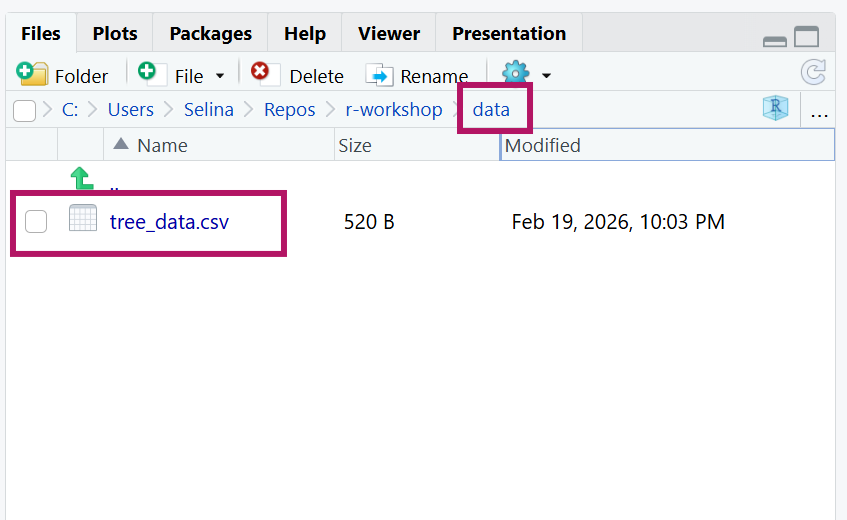
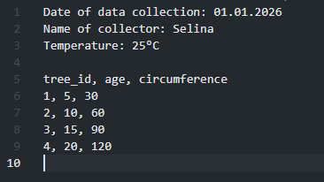
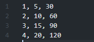

# The tidyverse {.inverse background-image="img/hex-stickers/tidyverse.png" background-size="12vw" background-position="90% 75%" background-repeat="no-repeat"}

## The tidyverse

> The tidyverse is an opinonated <b>collection of R packages</b> designed for data science. All packages share an underlying design philosophy, grammar, and data structures.<br>
[([www.tidyverse.org](https://www.tidyverse.org/))]{.text-small}                                                                   

These are the main packages from the tidyverse that we will use:<br><br>

](img/day1/datascience_workflow_tidyverse.png){fig-align="center"}

:::

## The tidyverse

Install the tidyverse once with:

```{r eval=FALSE}
install.packages("tidyverse")
```

<br>

Then load and attach the packages at the beginning of your script:

```{r}
library(tidyverse)
```

. . .

<br>

You can also install and load the tidyverse packages individually, but since we will use so many of them together, it's easier to load and attach them together.

# Import and export text data with readr {.inverse background-image="img/hex-stickers/readr.png" background-size="12vw" background-position="90% 75%" background-repeat="no-repeat"}

## Reading CSV files with readr

```{r}
library(tidyverse)
trees <- read_csv("data/tree_data.csv")
```

. . .

**Where does R look for the file?**

:::{.columns}
:::{.column width="50%"}
- "data/tree_data.csv" is a **relative path**: it starts from your project folder
- R looks for files starting from the project folder
- Your data files need to be inside your project for R to find them easily
:::

:::{.column width="50%"}


:::
:::


## Other `read_*` functions

All `read_*` functions take a path to the data file as a first argument:

:::{.r-stack}

<code><b>read_*("path/to/your/file", ...)</b></code>

:::

```{r}
#| eval: false
# semicolon delimiter
dat <- read_csv2("data/your_data.csv")
# tab delimiter
dat <- read_tsv("data/your_data.txt") # tab delimiter
# any delimiter, e.g. ";" or "----"
dat <- read_delim("data/your_data.csv", delim = ";")
dat <- read_delim("data/your_data.txt", delim = "----")
```


## Dealing with messy files

The read functions provide several options for non-perfect data.

Have a look at `?read_delim` for all options. 

. . .

Useful if your data is not a "perfect table"

## Skipping lines

Use `skip` to skip lines at the top of a file


:::{.columns}

:::{.column width="50%"}

:::{.fragment}

```{r}
#| flourish:
#|   - target: "skip = 4"
# skip 4 metadata lines
read_csv(
  "data/tree_data_metadata_on_top.csv",
  skip = 4
)
```

:::

:::

:::{.column width="50%"}



:::

:::

## Missing or bad headers

Use `col_names` if your file has no header row

:::{.columns}

:::{.column width="70%"}

:::{.fragment}

```{r}
#| flourish:
#|   - target: "col_names = FALSE"
# assign default column names
read_csv(
  "data/tree_data_no_header.csv",
  col_names = FALSE
)
```

:::

:::

:::{.column width="30%"}



:::

:::


## Missing or bad headers

Use `col_names` if your file has no header row

:::{.columns}

:::{.column width="70%"}

```{r}
#| flourish:
#|   - target-rx: "col_names = c(.*)"

# specify custom column names
read_csv(
  "data/tree_data_no_header.csv",
  col_names = c("tree_id", "age", "circumference")
)
```

:::

:::{.column width="30%"}


:::

:::

## Write files with `write_*()`

Every `read_*` has a corresponding `write_*` function to export data from R.

. . .

```{r eval=FALSE}
# Comma delimiter
write_csv(dat, file = "data-clean/your_data.csv")
# Semicolon delimiter
write_csv2(dat, file = "data-clean/your_data.csv")
# tab delimiter
write_tsv(dat, file = "data-clean/your_data.txt")
# Any delimiter, e.g. ";" or "----"
write_delim(dat, file = "data-clean/your_data.csv", delim = ";")
write_delim(dat, file = "data-clean/your_data.txt", delim = "----")
```

# Import excel files {.inverse background-image="img/hex-stickers/readxl.png" background-size="12vw" background-position="90% 75%" background-repeat="no-repeat"}

## Reading Excel files with readxl

The `readxl` package is part of the tidyverse, but you need to load it explicitly

```{r}
library(readxl)
```

. . .

Use `read_excel()` to read an Excel file:

```{r eval = FALSE}
trees <- read_excel("data/tree_data.xlsx")
```

. . .

By default, this reads the first sheet. You can read other sheets with:

```{r eval = FALSE}
trees <- read_excel("data/tree_data.xlsx", sheet = "sheetName")
trees <- read_excel("data/tree_data.xlsx", sheet = 2)
```


. . .

- `read_excel` also has other functionality, like skipping rows etc.
- Check out `?read_excel` and the [package documentation](https://readxl.tidyverse.org/index.html) for more functionality

## Reading Excel files with readxl

A little warning:

- Reading from a text file (.txt or .csv) is more reliable
- Be careful with complicated excel sheets with formulas etc.
- Always double check the data that you imported, e.g. by using the `summary` function and checking 
if the number of rows etc. is correct

## Other read and write options

:::{.nonincremental}
- Write Excel file with the [writexl package](https://docs.ropensci.org/writexl/) (`write_excel`)
- Read and write SPSS, Stata, and SAS files with the [haven package](https://haven.tidyverse.org/) (`read_dta`, `read_spss`, `write_dta`, `write_spss`, ...)
- Read and write Google Sheets with the [googlesheets4 package](https://googlesheets4.tidyverse.org/) (`read_sheet`, `write_sheet`)
- ...
:::

## Important for all read_* functions

```{r eval=FALSE}
trees <- read_csv("data/tree_data.csv")
```

- Save the result of `read_*()` in a variable (e.g. `trees`) to work with it later
- Choose a meaningful name for the variable (e.g. `trees` instead of `data` or `my_data`)
- Use the function help `?` if in doubt
  - Shows you all available arguments and examples.

# Now you {.inverse}

[Task (20 min)]{.highlight-blue}<br>

[Read and write data files]{.big-text}

**Find the task description [here](https://selinazitrone.github.io/intro-r-data-analysis/sessions/05_readr.html)**

# Guidelines for reading data sets in `r fontawesome::fa("r-project")`{.inverse}

## Use relative paths

```{r}
#| eval: false
# Absolute path
trees <- read_csv(
  "C:/Users/Selina/Repos/Teaching/intro-r-data-analysis/data/tree_data.csv"
)
# Relative path
trees <- read_csv("data/tree_data.csv")
```

- Relative paths are interpreted relative to the **working directory**
- In RStudio projects, the **working directory is always the project root**

. . .

#### Why?

- Portable: will also work on other machines that copied the project
- More readable and less error prone

## Tips for clean data import

- Prefer machine-readable file formats (`.csv`, `.txt` instead of `.xlsx`)
- No white space in column headers
  - Use a character as separator, e.g. `species_name` instead of `species name`
  - If this is unpractical, have a look at `janitor::clean_names()` from the [`janitor` package](https://garthtarr.github.io/meatR/janitor.html)
- No special characters in column headers (ä, ß, é, ê, %, °C, µ ...)
- Use `.` as a decimal separator (not `,`)
- Avoid white space and special characters in paths and file names
  - `data-raw/my_data.csv` instead of `data raw/my data.csv`

## Summary I

#### Reading text files

```{r}
#| eval: false
# Comma separated (e.g. 1.5, 2.3, 3.1)
dat <- read_csv("data/your_data.csv")
# Semicolon separated (e.g. 1,5; 2,3; 3,1)
dat <- read_csv2("data/your_data.csv")
# Tab separated
dat <- read_tsv("data/your_data.txt")
# Any delimiter
dat <- read_delim("data/your_data.csv", delim = ";")
```

#### Writing text files

```{r}
#| eval: false
write_csv(dat, file = "data-clean/your_data.csv")
write_csv2(dat, file = "data-clean/your_data.csv")
write_tsv(dat, file = "data-clean/your_data.txt")
write_delim(dat, file = "data-clean/your_data.csv", delim = ";")
```

## Summary II

#### Reading Excel files

```{r}
#| eval: false
library(readxl)
dat <- read_excel("data/your_data.xlsx")
dat <- read_excel("data/your_data.xlsx", sheet = "sheetName")
dat <- read_excel("data/your_data.xlsx", sheet = 2)
```

#### Dealing with messy files

```{r}
#| eval: false
# Skip metadata lines at the top
dat <- read_csv("data/your_data.csv", skip = 4)
# No header row — assign default names
dat <- read_csv("data/your_data.csv", col_names = FALSE)
# No header row — assign custom names
dat <- read_csv("data/your_data.csv", col_names = c("id", "age", "size"))
```
