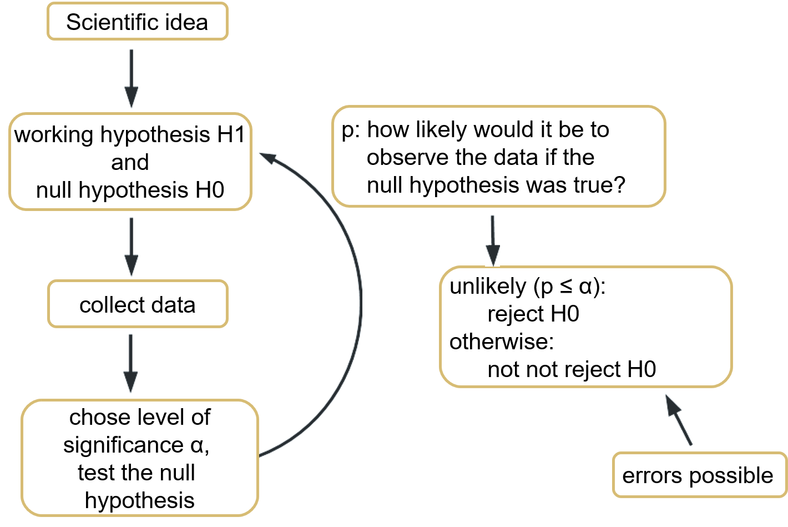
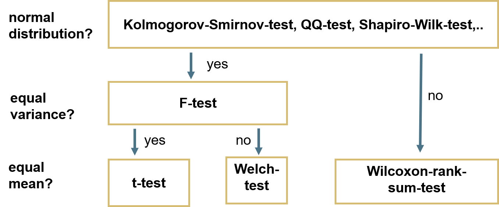

```{r setup, include=FALSE}
library(dplyr)
library(ggplot2)
library(tidyr)
theme_set(theme_grey(base_size = 16))
options(scipen = 0)
```

## General approach

{width="70%"}

:::{.aside}

Please note the discussion about p-values as a basis for binary decisions.
  See e.g. [here](https://www.nature.com/articles/s41592-019-0470-3) or [here](https://www.nature.com/articles/d41586-019-00857-9) as a starting point
  
:::


## Overview of tests




# Tests for normal distribution{.inverse}

## Test for normal distribution

There are **various tests** and the outcome might differ!

. . .

**Shapiro-Wilk-Test**

- Tests whether the data could have been drawn from a normal distribution
- Specific test only for normal distribution
- High power, also for few data points

. . .

**Visual tests: QQ-Plot**

- Quantiles of observed data plotted against quantiles of normal distribution
- Scientist has to decide if normal or not

## The data

A tibble with two variables: `normal` and `non_normal`

:::{.columns}

:::{.column width="50%"}

```{r}
#| echo: true
#| code-fold: true
#| code-summary: "Expand to reproduce the data"
set.seed(123)
mydata <- tibble(
  normal = rnorm(
    n = 200,
    mean = 50,
    sd = 5
  ),
  non_normal = runif(
    n = 200,
    min = 45,
    max = 55
  )
)
```

```{r}
mydata
```

:::

:::{.column width="50%"}


```{r}
#| fig-width: 6
#| fig-height: 6
#| code-fold: true
#| code-summary: "Code to generate histogram"
mydata |>
  pivot_longer(
    cols = 1:2,
    names_to = "type",
    values_to = "value"
  ) |>
  ggplot() +
  geom_histogram(
    alpha = 0.5,
    aes(
      x = value,
      fill = type,
      # plot probability instead of count on y axis
      y = after_stat(density)
    )
  ) +
  stat_function(
    fun = dnorm,
    args = list(
      mean = 50,
      sd = 5
    ),
    color = "darkorange",
    linewidth = 1
  ) +
  stat_function(
    fun = dnorm,
    args = list(
      mean = mean(mydata$non_normal),
      sd = sd(mydata$non_normal)
    ),
    color = "cyan4",
    linewidth = 1
  ) +
  scale_fill_manual(values = c("cyan4", "darkorange")) +
  theme(
    legend.position = "inside",
    legend.position.inside = c(0.85, 0.85)
  )
```

:::

:::

## Shapiro-Wilk-Test

$H_0$: Data does not differ from a normal distribution

. . .

:::{.columns}

:::{.column width="50%"}


```{r}
shapiro.test(mydata$normal)
```

:::{.fragment}

:::{.nonincremental}

- W: test statistic
- p: probability to observe data with this level of deviation from normality (or more) if $H_0$ was true
  - probability is high -> no reason to doubt normality assumption

:::

:::

:::{.fragment}

The data does **not deviate significantly** from a normal distribution (Shapiro-Wilk-Test, W = 0.991, p = 0.23).

:::

:::

:::{.column width="50%"}

::: {.fragment}

```{r}
shapiro.test(mydata$non_normal)
```

:::

:::{.fragment}

The data **deviates significantly** from a normal distribution (Shapiro-Wilk-Test, W = 0.95, p < 0.001).

:::

:::

:::

## Visual test with QQ-Plot

Points should match the straight line. Small deviations are okay.

:::{.columns}

:::{.column width="50%"}

```{r}
#| fig-height: 5.1
# ggplot(
#   mydata,
#   aes(sample = normal)
# ) +
#   stat_qq() +
#   stat_qq_line()
ggpubr::ggqqplot(mydata$normal)
```

:::

:::{.column width="50%"}

```{r}
#| fig-height: 5.1
# ggplot(
#   mydata,
#   aes(sample = non_normal)
# ) +
#   stat_qq() +
#   stat_qq_line()
ggpubr::ggqqplot(mydata$non_normal)
```

:::

:::

# Tests for equal variance{.inverse}

## The data

Counts of insects in agricultural units treated with different insecticides.


:::{.columns}

:::{.column width="50%"}

```{r}
#| code-fold: true
#| code-summary: "Expand to reproduce the data"
InsectSprays <- InsectSprays |>
  filter(spray %in% c("A", "B", "E")) |>
  mutate(spray = case_match(spray, "E" ~ "C", .default = spray))
```

Compare treatments A, B and C:

Create subsets before: count variable for each treatment as a vector

```{r}
TreatA <- filter(InsectSprays, spray == "A")$count
TreatB <- filter(InsectSprays, spray == "B")$count
TreatC <- filter(InsectSprays, spray == "C")$count
```

:::

:::{.column width="50%"}

```{r}
#| fig-height: 6.0
#| code-fold: true
#| code-summary: "Code to generate boxplot"
ggplot(InsectSprays, aes(x = spray, y = count, fill = spray)) +
  geom_boxplot() +
  theme(legend.position = "none")
```

:::

:::

## Test for equal variance

First, test for normal distribution!

**F-Test**

- **Normal distribution** of groups
- Calculates ratio of variances (if equal, ratio = 1)
- p: How likely is this (or a more extreme) ratio of variances if the variances were truly equal?

**Levene test**

- **Non-normal distribution** of groups
- Compare difference between data sets with difference within data sets

## Test for equal variance

First, test for normal distribution

```{r}
shapiro.test(TreatA)
shapiro.test(TreatB)
shapiro.test(TreatC)
```

Result: All 3 treatments are normally distributed.

## F-Test

$H_0$: Variances do not differ between groups

. . .

```{r}
#| error: true
var.test(TreatA, TreatB)
```

. . .


:::{.nonincremental}

- F: test statistics, ratio of variances (if F = 1, variances are equal)
- df: degrees of freedom of both groups
- p-value: probability to observe this (or more extreme) F if $H_0$ was true

:::

Variances of sprays A & B **don't differ significantly** (F-Test, $F_{11,11}$ = 1.22, p = 0.75)

## F-Test

$H_0$: Variances do not differ between groups

. . .

```{r}
#| error: true
var.test(TreatA, TreatC)
```

Variances of sprays A & C **differ significantly** (F-Test, $F_{11,11}$ = 7.42, p = 0.002)

# Test for equal means{.inverse}

## Test for equal means

**t-test**

- **Normal distribution** AND **equal variance**
- Compares if mean values are within range of standard error of each other
- p: How likely is this (or more extreme) difference between means if the population means were truly equal?

. . .

**Welch-Test** (corrected t-test)

- **Normal distribution** but **unequal variance**

. . .

**Wilcoxon rank sum test**

- **Non-normal distribution** and **unequal variance**
- Compares rank sums of the data
- Non-parametric

## t-test

$H_0$: The samples do not differ in their mean

. . .

Treatment A and B: **normally distributed** and **equal variance**

```{r}
t.test(TreatA, TreatB, var.equal = TRUE)
```

:::{.nonincremental}

- t: test statistics (t = 0 means equal means)
- df: degrees of freedom of t-statistics
- p-value: how likely is this extreme of a difference if $H_0$ was true?

:::

. . .

The means of spray A and B **don't differ significantly** (t = -0.45, df = 22, p = 0.66)

## Welch-Test

$H_0$: The samples do not differ in their mean

. . .

Treatment A and C: **normally distributed** and **non-equal variance**

```{r}
t.test(TreatA, TreatC, var.equal = FALSE)
```

. . .

The means of spray A and C do **differ significantly** (t = 7.58, df = 13.9, p < 0.001)

## Wilcoxon-rank-sum Test

$H_0$: The samples do not differ in their median

. . .

We don't need the Wilcoxon test to compare treatment A and B, but for the sake of an example:

```{r}
wilcox.test(TreatA, TreatB)
```

. . .

The medians of spray A and B do **not differ significantly** (W = 62, p = 0.58)

## Paired values

Are there pairs of data points?

**Example:** blood pressure of patients before and after taking a medication.

:::{.fragment}

:::{.nonincremental}

- For each patient, there is a pair of data points (before and after medication)
- Question: Is the change in blood pressure significant?

:::

:::

. . .

Use `paired = TRUE` in the test.

```{r}
#| eval: false
t.test(TreatA, TreatB, var.equal = TRUE, paired = TRUE)
t.test(TreatA, TreatB, var.equal = FALSE, paired = TRUE)
wilcox.test(TreatA, TreatB, paired = TRUE)
```

Careful: your treatment vector both have to have the same order

# Plot test results {.inverse}

## Boxplots with notches

Notches show the approximate 95% confidence interval of the median. If notches of two boxes don't overlap, their medians likely differ

```{r}
#| output-location: column
#| flourish:
#|   - target: "notch = TRUE"
ggplot(
  InsectSprays,
  aes(x = spray, y = count)
) +
  geom_boxplot(notch = TRUE)
```

## Plot test results with `ggsignif`

The [`ggsignif`](https://const-ae.github.io/ggsignif/) package offers a `geom_signif()`
layer that can be added to a ggplot to annotate significance levels

```{r}
# install.packages("ggsignif")
library(ggsignif)
```

## Plot test results with `geom_signif()`

```{r echo=FALSE}
library(ggsignif)
theme_set(theme_grey(base_size = 16))
```


```{r}
#| code-line-numbers: "6-14"
#| output-location: column
ggplot(
  InsectSprays,
  aes(x = spray, y = count)
) +
  geom_boxplot(notch = TRUE) +
  geom_signif(
    comparisons = list(
      c("A", "B"),
      c("B", "C"),
      c("A", "C")
    ),
    map_signif_level = TRUE,
    y_position = c(23, 24, 25)
  )
```

::: {.nonincremental}

- By default, a Wilcoxon test is performed

:::

## Plot test results with `geom_signif()`

:::{.columns}

:::{.column width="50%"}

```{r}
#| code-line-numbers: "12-15"
#| eval: false
ggplot(
  InsectSprays,
  aes(x = spray, y = count)
) +
  geom_boxplot(notch = TRUE) +
  geom_signif(
    comparisons = list(
      c("A", "B"),
      c("B", "C"),
      c("A", "C")
    ),
    test = "t.test",
    test.args = list(
      var.equal = TRUE
    ),
    map_signif_level = TRUE,
    y_position = c(23, 24, 25)
  )
```

::: {.nonincremental}

- `test`: run specific test
- `test.args`: pass additional arguments in a list
- `?geom_signif` for more options

:::

:::

:::{.column width="50%"}

```{r}
#| code-line-numbers: "12-15"
#| echo: false
ggplot(
  InsectSprays,
  aes(x = spray, y = count)
) +
  geom_boxplot(notch = TRUE) +
  geom_signif(
    comparisons = list(
      c("A", "B"),
      c("B", "C"),
      c("A", "C")
    ),
    test = "t.test",
    test.args = list(
      var.equal = TRUE
    ),
    map_signif_level = TRUE,
    y_position = c(23, 24, 25)
  )
```

:::

:::


## Plot mean +- se using `stat_summary`

Another way to plot the results is to plot mean and standard error of the mean:

:::{.columns}

:::{.column width="50%"}

```{r}
#| eval: false
#| code-line-numbers: "5"
ggplot(
  InsectSprays,
  aes(x = spray, y = count)
) +
  stat_summary()
```

- By default `stat_summary` adds mean and standard error of the mean as pointrange

:::

:::{.column width="50%"}

```{r}
#| echo: false
ggplot(
  InsectSprays,
  aes(x = spray, y = count)
) +
  stat_summary()
```

:::

:::

## Plot mean +- se using `stat_summary`

Another way to plot the results is to plot mean and standard error of the mean:

:::{.columns}

:::{.column width="50%"}

```{r}
#| eval: false
#| code-line-numbers: "5-14"
ggplot(
  InsectSprays,
  aes(x = spray, y = count)
) +
  stat_summary(
    fun.data = mean_se,
    geom = "errorbar"
  ) +
  stat_summary(
    fun = mean,
    geom = "point",
    color = "#28a87d",
    size = 4
  )
```

:::{.nonincremental}

- Inside `stat_summary`, define summary function
  - `fun.data` for errorbars, `fun` for points (e.g. mean)

:::


:::

:::{.column width="50%"}

```{r}
#| echo: false
#| code-line-numbers: "5-14"
ggplot(
  InsectSprays,
  aes(x = spray, y = count)
) +
  stat_summary(
    fun.data = mean_se,
    geom = "errorbar"
  ) +
  stat_summary(
    fun = mean,
    geom = "point",
    color = "#28a87d",
    size = 4
  )
```

:::

:::

## Plot mean +- se using `stat_summary`

Another way to plot the results is to plot mean and standard error of the mean:

```{r}
#| code-line-numbers: "12"
#| output-location: column
ggplot(
  InsectSprays,
  aes(x = spray, y = count)
) +
  stat_summary(
    fun.data = mean_se,
    geom = "errorbar",
    width = 0.3
  ) +
  stat_summary(
    fun = mean,
    geom = "bar"
  )
```

## Plot mean +- se using `stat_summary`

Just like before, you can also add a `geom_signif` to a barplot:

```{r}
#| code-line-numbers: "14-23"
#| output-location: column
ggplot(
  InsectSprays,
  aes(x = spray, y = count)
) +
  stat_summary(
    fun.data = mean_se,
    geom = "errorbar",
    width = 0.3
  ) +
  stat_summary(
    fun = mean,
    geom = "bar"
  ) +
  ggsignif::geom_signif(
    comparisons = list(
      c("A", "B"),
      c("B", "C"),
      c("A", "C")
    ),
    test = "t.test",
    map_signif_level = TRUE,
    y_position = c(17, 18, 19)
  )
```


# Now you {.inverse}

[Task (45 min)]{.highlight-blue}<br>

[Statistical tests]{.big-text}

**Find the task description [here](https://selinazitrone.github.io/intro-r-data-analysis/sessions/10_tests.html)**
