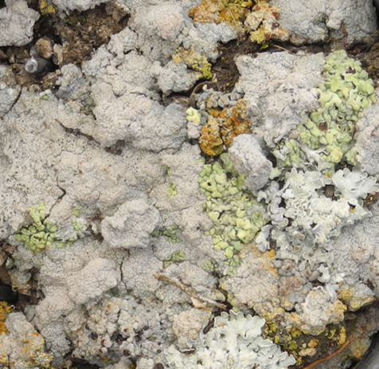
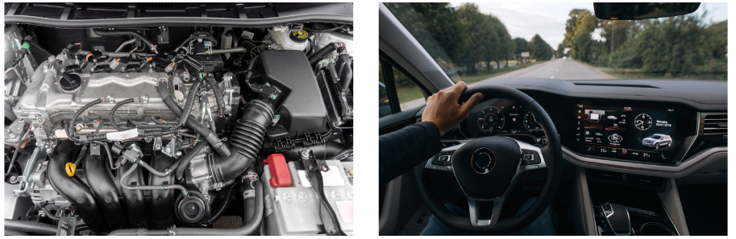
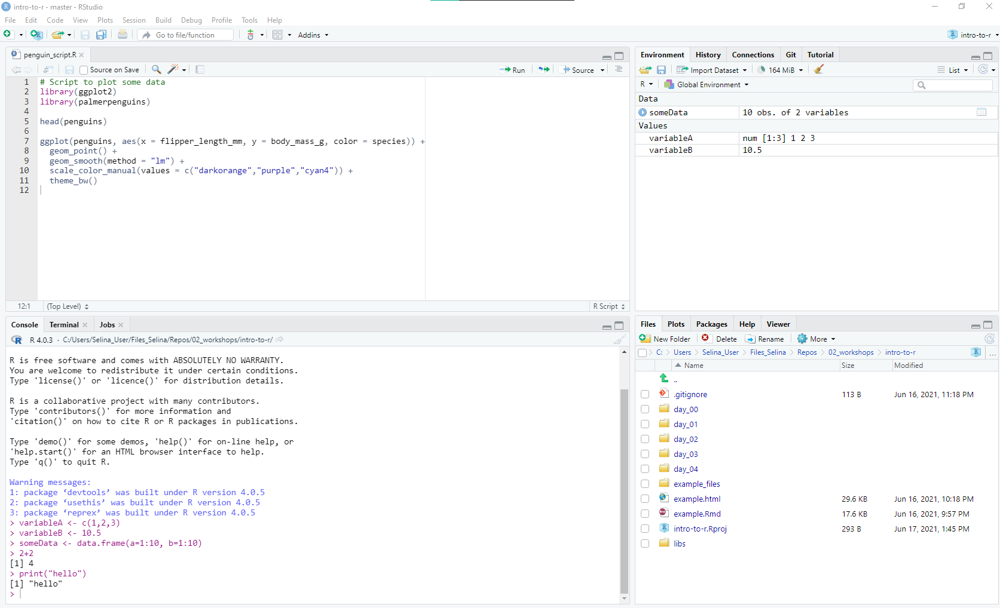
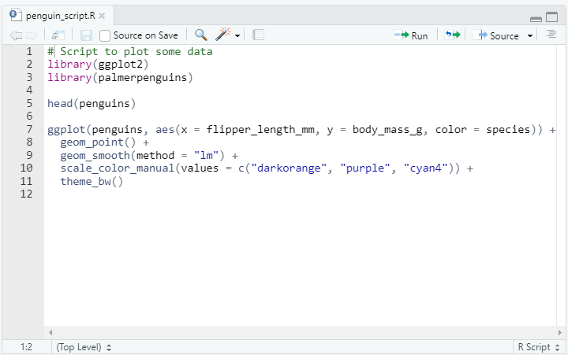
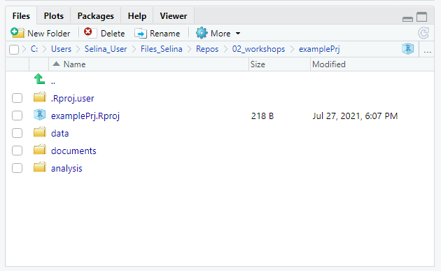
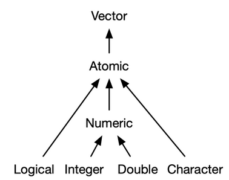

```{r setup, include=FALSE}
knitr::opts_chunk$set(echo = TRUE,
                      warning = FALSE,
                      message = FALSE)
library(fontawesome)
```

```{r child="title_slide_allison.Rmd"}

```

---

# Who am I?

.pull-left[

- scientific modeler with ecology background

- working in the theoretical ecology group ([Theoretical Ecology, AG Tietjen](https://www.bcp.fu-berlin.de/biologie/arbeitsgruppen/botanik/ag_tietjen/index.html))

- PhD student at Freie Universität Berlin 
  - Topic: Modelling the impact of biological soil crusts on dryland hydrology
  
#### Teaching

- Statistics with R for Biology Master students
- Workshops on R packages, R development, ...
]

.pull-right[
.center[
<br><br>

]
]

---
# What do I use `r fa("r-project")` for?


- Short answer: everything
--
- Long answer:
  - modelling biocrusts
  - **cleaning data**
  - **visualizing data**
  - writing (interactive) documents 
  - doing presentations
  - **performing statistical analyes**
  - **wrangling data**
  - workflow automation
  - ...
  
---
 
# Who are you?

- [Results of questionnaire](https://docs.google.com/forms/d/12t0jqM5-XjWKFLzbyoFUeGZsPNjokoygEiwo-iHlpEM/edit#responses)

---

# The Workshop: Topics

<table style='width:100%;font-size:16pt'>
  <tr>
    <th>Day&nbsp&nbsp&nbsp&nbsp&nbsp</th>
    <th>Main topic</th>
    <th>Details</th>
  </tr>
  <tr>
    <td><b>1</b></td>
    <td><b>Introduction to and programming with R</></td>
    <td>
      <ul>
       <li> R Basics
       <li> Functions
       <li> Data frames
       <li>Get help
      </ul>
    </td>
  </tr>
  <tr>
    <td><b>2</b></td>
    <td><b>Data analysis with the tidyverse</b></td>
    <td>
      <ul>
      <li> Data visualization with ggplot
      <li> Data transformation
      <li> Data import and tidy data
      </ul>
    </td>
  </tr>
  <tr>
    <td><b>3</b></td>
    <td><b>Statistical models</b></td>
    <td>
      <ul>
        <li> Linear models
        <li> Generalized linear models: poisson and binary/binomial data
      </ul>
    </td>
  </tr>
  <tr>
    <td><b>4</b></td>
    <td><b>Bring your own data</b></td>
    <td>Analyse your own research data in groups</td>
  </tr>
</table>

---

# The Workshop: Schedule and Organization

🕘 9 a.m. - 4 p.m. (🥪 ~ 12 a.m. - 1 p.m.)<br>
📍  Webex meeting


#### Organization
- input sessions
  - presentation and demonstration of a topic
  - some examples
  
- task regarding this topic
  - solve them in small groups
  
- discuss the tasks and additional questions

---

# The Workshop: Material

- All material can be found and downloaded from the workshop's website
  - presentations
  - tasks
  - solutions
  - additional resources

--

- [Joint document](https://hackmd.io/@selinaZitrone/r12pL71C_/edit) for all participants
  - collection of everything that comes up during the workshop
  - questions we should discuss together
  - additional resources and helpful links that you found
  - things we could look at if we have enough time

---

# Last workshop day: Bring your own data

- small Hackaton on last workshop day

- work on your own research data in small groups (or alone if you prefer)
    - I will also provide some real life data sets from different topics

--
**Idea**

- define a question/goal beforehand and then work on it
- use any of the methods from the course, try new thing, ...
- present your results at the end of the day

---

# Bring your own data - preparation

- keep the last workshop day in mind during the next days

  - take note if you learn something that might be applicable to your data
  
  - think of questions that you would like to answer for your data set
  
--

- during the group work

  - when you are finished with the group tasks: talk about your own data and questions -> you might already find common interests and questions
  
---

# Bring your own data - preparation

If you think you have a suitable data set:

- send it to me via email with a short description
  - I will check if the data is suitable
  - I will let you know what you have to do to prepare the data set for the Hackaton

- Tomorrow we will learn about good practices for data preparation

--

If you want to offer your data set for the Hackaton:

- Add it to our [joint document](https://hackmd.io/@selinaZitrone/r12pL71C_/edit)
- Others can go through the list and add their names to the data set they are interested in

---
# Before we get started I

This is the first time that I am doing this workshop.

So any feedback is very welcome.

I am curious to know

- what you liked/disliked
- what you missed
- which tasks were too easy/too difficult or just right
- ...

If you have feedback or suggestions please let me know.
There is also a feedback section at the end of our [joint document]([joint document](https://hackmd.io/@selinaZitrone/r12pL71C_/edit))

---
# Before we get started II

.large[Did anyone have problems installing R and RStudio?]

<br>

 Download and install R from [https://cran.r-project.org](https://cran.r-project.org/)

 Download and install RStudio from             [https://www.rstudio.com](https://www.rstudio.com/products/rstudio/download/#download  )


---
class: inverse, middle, center

.large[# Let's get started]

---

# Why learn `r fa("r-project")`?

- free and open source

- lingua franca in computational statistics (can I find a graph?)

- regular updates, large community

- packages for extensions

- easy documentation

- reproducible workflows

- ...

BUT: You have to learn some programming (I see this as an advantage though)

<!-- ---  -->

<!-- # History of R -->

<!-- - principles of S implemented in first R version in 1995 (**R**oss Ihaka and **R**obert Gentleman) -->
<!-- - Now version 4 (with numerous subversions) -->
<!-- - freely available under GNU GPL -->
<!-- - hostend on Comprehensive R Archive Network [CRAN](cran.r-project.org) for windows, mac and linux -->
---
class: inverse, middle, center

# First things first

## An introduction to RStudio
---
# Difference between R and RStudio


.pull-left[
.center[
    <br>
    ]
    
  R is the **programming language** and the programm that does the actual work
    
  - can be use with many different programming environments (But RStudio is the best for R)
]

--
.pull-right[
.center[
    <br>
     ]
  
  Rstudio is the **integrated development environment** (IDE)
   - provides an interface to R
   - specifically built around R code 
   - execute code
   - syntax highlighting
   - file and project management
   - ...
]

--
<br>

.content-box-grey[`r fa("arrow-right")` You can use R without RStudio but RStudio without R would be of very little use.]

---

# Difference between R and RStudio

.pull-left[
.center[
    **R** is like the engine
    ]
  ]
.pull-right[
.center[
  **RStudio** is more like the dashboard, etc.
     ]
     ]

.center[]


.footnote-right[analogy and image from 
[ModernDive Book](https://moderndive.com/1-getting-started.html#r-rstudio)]

---

# A quick tour around RStudio

.center[]

---

# Console pane

.pull-left[
- execute R code

- output from R code in scripts is printed there

- type command into the console and execute with `Enter/Return`

.content-box-gray[`r fa("lightbulb")` Use the arrow keys to bring back the last commands
]]

.pull-right[
  
]

---

# Script pane

.pull-left[

- write scripts with R code
  - scripts are text files with R commands (file ending `.R`)
  - use scripts to save commands for reuse
-**
- create a new R script: <br> `File -> New File -> R Script`
- save an R script:<br> `File -> Save` (`Ctrl/Cmd + S`)
- run code line by line with `Run` button (`Ctrl + Enter/Cmd + Return`)
- you can open multiple scripts at the same time

]

.pull-right[
  
]
`r fa("lightbulb")` Use scripts for all your analysis and for commands that you want to save. Use the console for temporary commands, e.g. if you just want to test something.

---

# Environment pane

.pull-left[
- shows objects currently present in the R session
- is empty if you start R
]

.pull-right[
  
]


---

# Files pane

.pull-left[
- similar to Explorer/Finder
- browse project structure and files
  - find and open files
  - create new folders
  - delete files
  - rename files 
  - ...
]

.pull-right[
.right[
  
]

---

# Plot pane

.pull-left[
- Plots that are created with R will be shown here
- You can export plots by clicking on export button
  - but better to do it by code 
]

.pull-right[
  
]

---

# Project oriented workflow

.pull-left[
- one directory with all files relevant for project
  - scripts, data, plots, documents, ...
- an RStudio project is just a normal directory with an `*.Rproj` file

- advantages of using RStudio projects
    - easy to navigate projects within R Studio (`File` pane)
    - easy to find and access scripts from within RStudio
    - project root is working directory
    - open multiple projects simultaneously in separate RStudio instances
]    

.pull-right[
.center[

```{}
Project
|
|- data
|
|- documents
|   |
|   |- notes
|   |- reports
|
|- analysis
|   |
|   |- clean_data.R 
|   |
|   |- statistics.R
|
|- *.RProj
```
]
]
.footnote-right[Example of a project structure]

---
# Create an RStudio project

.pull-left[
Create a project from scratch:
  
1. `File -> New Project -> New Directory -> New Project`
2. Enter a directory name (this will be the name of your project)
3. Choose the Directory where the project should be initiated
4. `Create Project`

RStudio will now create and open the project for you. 
]

.pull-right[

]
.footnote-right[Example of RStudio project structure]

---

# Navigate an RStudio project

.center[

]

---

# Open a project from outside RStudio

To open an RStudio project from within your file explorer, just double click on the `*.Rproj` file
.center[

]
---
class: inverse, middle, center

# Task 1-1: Set up your own RStudio project for this workshop

#### Find the task description [here](www.github.com)
---
class: inverse

# Introduction to `r fa("r-project")`
---
# R as a calculator

## Arithmetic operators

.left-column[
<br>
  <table style='width:100%;font-size:16pt'>
  <tr>
    <td><b style='color:#67676;'>Addition</b></td>
    <td>+</td>
    </td>
  </tr>
    <tr>
    <td><b style='color:#67676;'>Subtraction</b></td>
    <td>-</td>
    </td>
  </tr>
    <tr>
    <td><b style='color:#67676;'>Multiplication</b></td>
    <td>*</td>
    </td>
  </tr>
    <tr>
    <td><b style='color:#67676;'>Division</b></td>
    <td>/</td>
    </td>
  </tr>
    <tr>
    <td><b style='color:#67676;'>Modulo</b></td>
    <td>%%</td>
    </td>
  </tr>
    <tr>
    <td><b style='color:#67676;'>Power</b></td>
    <td>^</td>
    </td>
  </tr>
</table>

]

.right-column[

```{r arithmetic operators, eval=FALSE}
# Addition
2 + 2
# Subtraction
5.432 - 34234
# Multiplication
33 * 42
# Division
3 / 42
# Modulo (Remainder)
2 %% 2
# Power
2^2
# Combine operations
((2 + 2) * 5)^(10 %% 10)
```

]

---

# R as a calculator

## Relational operators

.left-column[
<br>
  <table style='width:100%;font-size:16pt'>
  <tr>
    <td><b>Equal to</b></td>
    <td><code>==</code></td>
    </td>
  </tr>
    <tr>
    <td><b>Not equal to</b></td>
    <td><code>!=</code></td>
    </td>
  </tr>
    <tr>
    <td><b>Less than</b></td>
    <td><code><</code></td>
    </td>
  </tr>
    <tr>
    <td><b>Greater than</b></td>
    <td><code>></code></td>
    </td>
  </tr>
    <tr>
    <td><b>Less or equal than</b></td>
    <td><code><=</code></td>
    </td>
  </tr>
    <tr>
    <td><b>Greater or equal than</b></td>
    <td><code>>=</code></td>
    </td>
  </tr>
</table>

]

.right-column[

```{r relational operators, eval=TRUE}
# Equal to
2 == 2
2 == 4
# Not equal to
2 != 2
2 != 4
# Less/greater than
2 < 4
2 > 4
# Less/greater or equal than
2 <= 2
33 >= 32
```

]

---

#  R as a calculator

## Logical operators

.left-column[
<br>
  <table style='width:100%;font-size:16pt'>
  <tr>
    <td><b style='color:#67676;'>Not</b></td>
    <td><code>!</code></td>
    </td>
  </tr>
    <tr>
    <td><b style='color:#67676;'>And</b></td>
    <td><code>&</code></td>
    </td>
  </tr>
    <tr>
    <td><b style='color:#67676;'>Or</b></td>
    <td><code>|</code></td>
    </td>
  </tr>
</table>
]
.right-column[

```{r logical operators, eval=TRUE}
# Not
!TRUE
!(3 < 1)
# And
(3 < 1) & (3 == 3) # FALSE & TRUE = FALSE
(1 < 3) & (3 == 3) # TRUE & TRUE = TRUE
(3 < 1) & (3 != 3) # FALSE & FALSE = FALSE
# Or
(3 < 1) | (3 == 3) # FALSE | TRUE = TRUE
(1 < 3) | (3 == 3) # TRUE | TRUE = TRUE
(3 < 1) | (3 != 3) # FALSE | FALSE = FALSE
```
]

---
# Comments

- Comments are like notes that you can add to your code to make it more readable
- Everything that follows a `#` is a comment
- Comments are not evaluated
- Comments can be used for
  - Explanation of your code (only if necessary)
  - Include a link to a website where you found the solution
  - Mark different sections of your code (`r fa("lightbulb")` try `Ctrl/Cmd + Shift + R`)

```{r, eval=FALSE}

# Reading and cleaning the data -----------------

data <- read_csv("data/my-data.csv")
# clean all column headers 
# (found on https://stackoverflow.com/questions/68177507/)
data <- janitor::clean_names(data)

# Analysis --------------------------------------
```

---
class: inverse, middle, center

# Objects and data types in `r fa("r-project")`

---

# Variables

- store values under meaningful names to reuse them

--

- a variable has a .col1[<b>name</b>] and .col2[<b>value</b>] and is created using the .col3[<b>assignment operator</b>]

.center[.large[.strong[.col1[radius] &nbsp; .col3[<-] &nbsp; .col2[5]]]]

--
- variable are available in the global environment (remember the Environment pane of RStudio?)
--
- R is case sensitive: **r**adius != **R**adius
--
- choose meaningful variable names
  - make your code easier to read
  - variable names should start with a letter

---

# Variables


```{r eval=FALSE}
# create a variable
radius <- 5
# use it in a calculation and save the result
circumference <- 2 * pi * radius
# change value of variable radius
radius <- radius + 1
```` 
--
```{r eval=FALSE}
# print a variable's value -----------------------
radius # just use the name to print the value
# or print it in a sentence
print(paste0("With a radius of ", radius, " the circumference is ",
             circumference)) 
# does this print the correct circumference for radius?
```
--
```{r eval=FALSE}
# Remove variables from global environment -------
rm(radius) # remove radius
rm(list = ls()) # remove all elements
```

---

# Atomic data types

There are 6 so-called atomic data types in R. The 4 most important are:
--
<br><br>
**Numeric:** There are two numeric data types: 

  **Double:** can be specified in decimal (`1.243` or `-0.2134`), scientific notation (`2.32e4`) or hexadecimal (`0xd3f1`)

  **Integer:** numbers that are not represented by fraction. Must be followed by an `L` (`1L`, `2038459L`, `-5L`)
<br><br>
--

**Logical:** only two possible values `TRUE` and `FALSE` (abbreviation: `T` or `F` - but better use non-abbreviated form)
--

<br><br>
**Character:** also called string. Sequence of characters surrounded by quotes (`"hello"` , `"sample_1"`)

---
# Check the type of a variable

- check the type of a variable with `typeof()`
- check if a variable is of a specific data type with `is.*()`

```{r}
var <- 123L
typeof(var)
is.integer(var)
is.double(var)
is.numeric(var)
is.integer(123)
is.logical(TRUE)
is.logical("TRUE")
is.character("TRUE")
is.character(FALSE)
```

---
# Explicit type conversion

You can convert a value from one data type to the other using `as*()`

```{r}
as.character(1L)
as.integer(TRUE)
as.double(FALSE)
as.integer("hello")
as.integer("2")
```

---
# Implicit type conversion

Type conversion can happen implicitly

```{r error=TRUE}
typeof(1L + 2.5) # integer -> double
typeof(1L + TRUE) # logical -> integer (TRUE = 1, FALSE = 0)
typeof(1.34 + FALSE) # logical -> double
typeof("hello" + FALSE) # Error: no implicit conversion from string to other data types
```

---
class: inverse, middle, center

# Vectors

---

# Vectors

Vectors are data structures that are built onto atomic data types.<br>
Imagine a vector as a **collection of values** that are all **of the same data type**.

.center[


]

.footnote-right[Image from [Advanced R book](https://adv-r.hadley.nz/vectors-chap.html#atomic-vectors)]

---

# Creating vectors: `c()`

We can use the function `c()` to *combine* values into a vector

```{r}
lgl_var <- c(TRUE, TRUE, FALSE)
dbl_var <- c(2.5, 3.4, 4.3)
int_var <- c(1L, 45L, 234L)
chr_var <- c("These are", "just", "some strings")
```
--
You can also combine multiple vectors into one:

```{r}
# Combine multiple vectors
v1 <- c(1,2,3)
v2 <- c(800, 83, 37)
v3 <- c(v1, v2)
# Be aware of implicit type conversion when combining
# vectors of different types
c(int_var, lgl_var)
```

---

# Creating vectors: `:` and `seq()`

The `:` operator creates a sequence between to numbers with an increment of (-)1
```{r}
1:10
```
--

The `seq()` function creates a sequence of values

```{r}
seq(from = 1, to = 10, by = 1) # specify increment of sequence with by
seq(from = 1, to = 10, length.out = 10) # specify desired length with length.out
```

---

# Creating vectors: `rep()`

Repeat values multiple times with `rep()`

```{r}
rep("hello", times = 5)
```
--

You can also repeat entire vectors

```{r}
rep(c(TRUE, FALSE, TRUE), times = 2) # repeat the whole vector twice
```

```{r}
rep(c(1, 2 ,3), each = 2) # repeat each element of the vector twice
```

---

# Working with vectors

Let's create some vectors to work with.


```{r}
# list of 10 biggest cities in Europe
cities <- c("Istanbul", "Moscow", "London", "Saint Petersburg", "Berlin", "Madrid", "Kyiv", "Rome", "Bucharest", "Paris")

population <- c(15.1e6, 12.5e6, 9e6, 5.4e6, 3.8e6, 3.2e6, 3e6, 2.8e6, 2.2e6, 2.1e6)

area_km2 <- c(2576, 2561, 1572, 1439,891,604, 839, 1285, 228, 105 )
```

--
We can check the length of a vector using the `length()` function:

```{r}
length(cities)
```

.footnote-right[Data from [Wikipedia](https://en.wikipedia.org/wiki/List_of_European_cities_by_population_within_city_limits)]

---

# Working with vectors

Divide the population and area vector to calculate the population density in each city:

```{r}
population / area_km2
```

The operation is performed separately for each element of the two vectors and the result is a vector.<br>
--

The same happens, if a vector is divided by vector of length 1 (i.e. a single number).
The result is always a vector.

```{r}
mean_population <- mean(population) # calculate the mean of vector population
population / mean_population
```

---

# Working with vectors

We can also work with relational and logical operators

```{r}
population > mean_population
```

The result is a vector containing `TRUE` and `FALSE`, depending on whether the city's population is larger than the mean population or not.

--
Logical and relational operators can also be combined

```{r}
# population larger than mean population OR population larger than 3 million
population > mean_population | population > 3e6
```

---

# Working with vectors

The `%in%` operator checks whether *multiple* elements occur in a vector.

So instead of writing this:

```{r}
cities == "Istanbul" | cities == "Berlin" | cities == "Madrid"
```
we can also write this: 

```{r}
to_check <- c("Istanbul", "Berlin", "Madrid")
cities %in% to_check
```

---
# Indexing vectors

You can use square brackets `[]` to access specific elements from an object.
The basic structure is:<br><br>
.center.strong[[.col1[vector] [ .col2[vector of indexes to select] ]]]
--
```{r}
cities[5]
```
--
```{r}
cities[1:3] # the three most populated cities
```
--
```{r}
cities[length(cities)] # the last entry of the cities vector
```

---

# Indexing vectors

Change the values of a vector at specified indexes using the assignment operator `<-`

Imagine for example, that the population of 
- Istanbul (index 1) increased to 20 Million
- Rome (index 8) changed but is unknown
- Paris (index 10) decreased by 200,000.

--

```{r}
# first copy the original vector to leave it untouched
population_new <- population
# Update Istanbul (1) and Rome(8)
population_new[c(1, 8)] <- c(20e6, NA) # NA means missing value
# Update Paris (10)
population_new[10] <- population_new[10] - 200000 
```

```{r}
population_new
```

---

# Indexing vectors

You can also index a vector using logical tests. The basic structure is:<br>

.center[.strong[.col1[vector][.col2[ logical vector of same length ]]]]

```{r}
mega_city <- population > mean_population
mega_city
```

Now extract only the cities that return `TRUE` for the comparison of their population
against the mean population

```{r}
cities[mega_city] # or short: cities[population > mean_population]
```

---

# Summary

.content-box-purple[asdfölaksdjföasldkfjasdfkdddddddddddddddddddddddddddddddddddddddddddddddddddddddddddddddddddddddddddddddddddddddddddddddddddddddddddddddddddddddddd<br>
dlsakfjasödlfkjasdf]

---
# Resources

- [Getting started with R and RStudio](https://moderndive.com/1-getting-started.html#r-rstudio)
- [More about RStudio projects](https://rstats.wtf/project-oriented-workflow.html#work-in-a-project)


