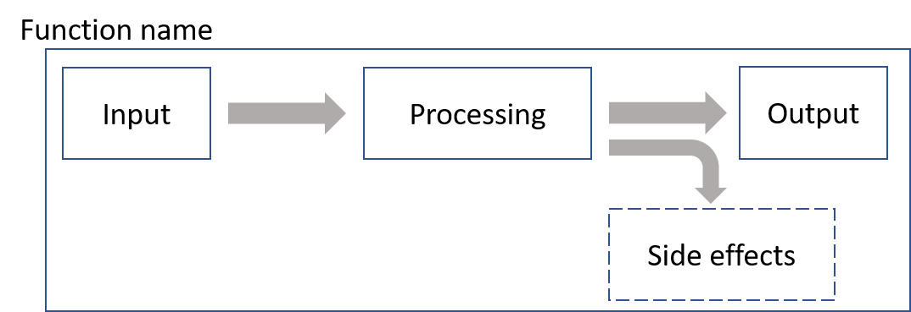
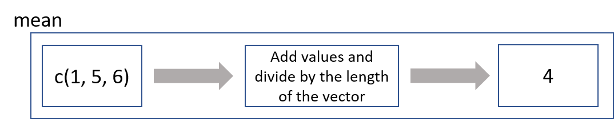
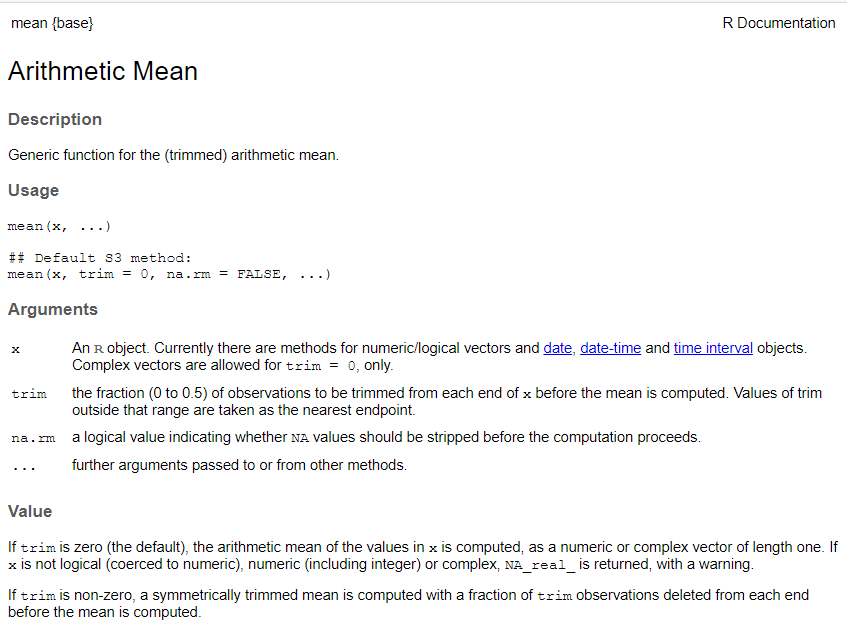
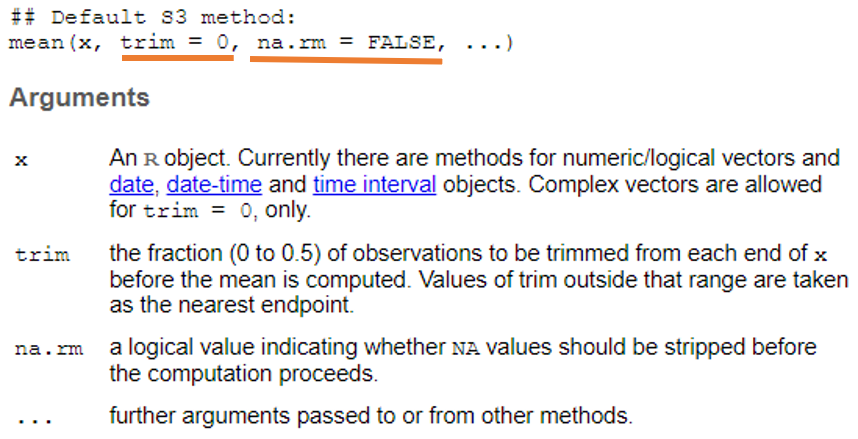

```{r setup, include=FALSE}
knitr::opts_chunk$set(echo = TRUE,
                      warning = FALSE,
                      message = FALSE)
library(fontawesome)
```

```{r child="title_slide.Rmd"}

```

---

# Functions

- multiple operations available under one command 

.pull-left[
Functions in R:
- have a name
- have (0, 1, or any number of) arguments as input
- they calculate something using the arguments
- usually they have a return value (the output)
- can have side effects (like plotting)
]

.pull-right[

]

General structure of a function call:

<b>.col1[function_name] ( .col2[argument] = .col3[value] )</b>


---

# The mean function

.pull-left[

<br>
  <b>.col1[mean] ( .col2[x] = .col3[c(1,5,6)] )</b>

]

.pull-right[

]

--

```{r}
mean(x = c(1,5,6)) # or short: mean(c(1,5,6))
```

--

- arguments can also be variables
- the output of a function can be stored in a variable

```{r}
values <- c(1,5,6)
result <- mean(x = values)
result
```

---

# `?mean`

But what does the mean function do? What are the arguments that I can use?

--

.pull-left[

`r fa("arrow-right")` &nbsp; call the function help using `?`

```{r eval=FALSE}
?mean
```
]
.pull-right[

]

---
.center[

]
---

# Function arguments

- functions can provide default argument values for some arguments
- default values for arguments are indicated in the function help

<br>


---

# Function arguments

```{r}
# NA is a missing value
values <- c(1,5,6,NA)
mean(x = values)
```

What happened?&nbsp;&nbsp;
--
`r fa("arrow-right")`&nbsp;  `na.rm` argument is `FALSE` by default.<br>
--
Set it to true if you want to calculate the mean despite missing values:

```{r}
mean(x = values, na.rm = TRUE)
```
--

Arguments with default values are optional, arguments without default values are not!

```{r error=TRUE}
mean()
```

---

# Function arguments

**Argument matching** can be achieved by **position** or by **name**

```{r, eval=FALSE}
mean(x, trim = 0, na.rm = FALSE, ...)
values <- c(1, 5, 6, NA)
```

--

```{r, eval=FALSE}
mean(values, , TRUE) # by position
mean(x = values, na.rm = TRUE) # by name
mean(na.rm = TRUE, x = values) # this also works but is not really nice
mean(values, na.rm = TRUE) # a mix of both
```
--
- named arguments are preferred (generally)
  - better to remember
  - easier to read
  - some function can have a lot of arguments
--
- however, it is common to match the first argument of a function by position (especially when the first argument is some kind of data)

---
# Where do functions come from?

.pull-left[
- built into R (base R functions)
]
.pull-right[
```{r eval=FALSE}
mean() # calculate mean
seq()  # generate a sequence of values
lm()   # fit a linear model
```
]

--

.pull-left[
 - from additional packages
  - packages must be installed first
  - call a function from a package using `packageName::functionName()`
]
.pull-right[
```{r eval=FALSE}
readr::read_csv() # read a csv file
beepr::beep() # make a beep sound
stringr::str_extract() # extract a part from a string
```
]

--

.pull-left[
- custom functions
]

.pull-right[

```{r eval = FALSE}
# custom function that prints input in a sentence
my_function <- function(x) {
  print(paste(
    "The variable value is", x
  ))
}
my_function(5)
```

]
