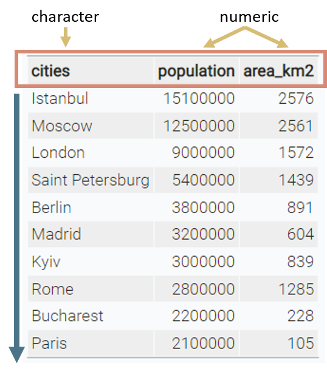
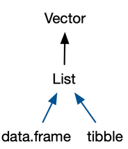

```{r setup, include=FALSE}
knitr::opts_chunk$set(echo = TRUE,
                      warning = FALSE,
                      message = FALSE)
library(fontawesome)
```

```{r child="title_slide.Rmd"}

```

---

# Data frames

.pull-left[

- most data is stored in tables

- vectors in R can't represent a table with data that is connected

> Data frames are one of the biggest and most important ideas in R, and one of the things that make R different from other programming languages.<br>(Wickham, [Advanced R](https://adv-r.hadley.nz/vectors-chap.html#tibble))

]

.pull-right[

```{r echo=FALSE}
# list of 10 biggest cities in Europe
cities <- c("Istanbul", "Moscow", "London", "Saint Petersburg", "Berlin", "Madrid", "Kyiv", "Rome", "Bucharest", "Paris")
population <- c(15.1e6, 12.5e6, 9e6, 5.4e6, 3.8e6, 3.2e6, 3e6, 2.8e6, 2.2e6, 2.1e6)
area_km2 <- c(2576, 2561, 1572, 1439,891,604, 839, 1285, 228, 105 )

data.frame(cities = cities,
           population = population,
           area_km2 = area_km2) |> 
  knitr::kable()
```

]
--

- the built-in data structure for tables in R is `data frame`

---
# Data frames

A data frame is a **named list of vectors** of the same length.

.pull-left[

#### Basic properties of a data frame

- every .col1[column is a vector]
- columns have a .col2[header]
- within one column, all values are from the .col3[same data type]
- every column has the same length

]
.pull-right[
.center[

 ]
]

---
# Data frames

We can create data frames by using the function `data.frame()`:

.pull-left[

```{r eval=FALSE}
cities <- c(
  "Istanbul", "Moscow", "London", 
  "Saint Petersburg", "Berlin","Madrid",
  "Kyiv", "Rome", "Bucharest","Paris")
population <- c(
  15.1e6, 12.5e6, 9e6, 5.4e6, 3.8e6,
  3.2e6, 3e6, 2.8e6, 2.2e6, 2.1e6)
area_km2 <- c(2576, 2561, 1572, 1439, 
  891, 604, 839, 1285, 228, 105)
```
```{r eval=FALSE}
data.frame( #<<
  cities = cities, #<<
  population = population, #<<
  area_km2 = area_km2)#<<
```
]

--

.pull-right[
```{r echo=FALSE}
# list of 10 biggest cities in Europe
cities <- c("Istanbul", "Moscow", "London", "Saint Petersburg", "Berlin", "Madrid", "Kyiv", "Rome", "Bucharest", "Paris")
population <- c(15.1e6, 12.5e6, 9e6, 5.4e6, 3.8e6, 3.2e6, 3e6, 2.8e6, 2.2e6, 2.1e6)
area_km2 <- c(2576, 2561, 1572, 1439, 891, 604, 839, 1285, 228, 105)

data.frame(
  cities = cities,
  population = population,
  area_km2 = area_km2
)
```

]
---
# Tibbles

Tibbles are 

>a modern reimagining of the data frame. Tibbles are designed to be (as much as possible) drop-in replacements for data frames. <br>(Wickham, [Advanced R](https://adv-r.hadley.nz/vectors-chap.html#tibble)) 

--

Have a look at [this book chapter](https://adv-r.hadley.nz/vectors-chap.html#tibble) for a full list of the differences.

--

.pull-left[
- tibbles have the exact same basic properties as data frames (named list of vectors)

- everything that you can do with data frames, you can do with tibbles

]

.pull-right[
.center[
]
]

---
# Tibbles

Tibbles are a available from the `tibble` package.

.pull-left[

Before we can get started with tibbles, we need to install the package once using `install.packages`:

```{r eval=FALSE}
# This has do be once
install.packages("tibble")
```

Then, we need to load and attach the package to our current R session using `library`:

```{r eval=FALSE}
# This has to be done when R restarts
# Put it at the beginning of a script
library(tibble)
```
]

.pull-right[.center[]]

---
# Tibbles

Create a tibble using the `tibble()` function:

.pull-left[
```{r eval=FALSE}
library(tibble) #<<

tibble( #<<
  cities = cities,
  population = population,
  area_km2 = area_km2
) #<<
```
]
.pull-right[
```{r echo=FALSE}
library(tibble)
tibble(
  cities = cities,
  population = population,
  area_km2 = area_km2
)
```
]

.small[Note: If you want to use a function from a package you can attach it using `library(package)` or you can use `package::function` to tell R where a function is from (e.g. `tibble::tibble()`). I will sometimes do this to clearly distinguish between base R and package functions.]

---

# Tibbles

Convert a data frame to a tibble using `as_tibble()`:

```{r}
cities_df <- data.frame(
  cities = cities,
  population = population,
  area_km2 = area_km2
)
cities_tbl <- as_tibble(cities_df) #<<
```

---
# Exploring tibbles

Look at the structure of your data using `str()`:

```{r}
str(cities_tbl)
```
- This function shows you:
  - data type of object (`tbl_df/tbl/data.frame`)
  - extent of the data (10 rows times 3 columns)
  - column names and data types

- This function works for every R object and is often a life saver if your code does not work and you don't know why
---
# Exploring tibbles

How many rows?

```{r}
nrow(cities_tbl)
```
--
How many columns?

```{r}
ncol(cities_tbl)
```
--
What are the column headers?

```{r}
names(cities_tbl)
```
---
# Exploring tibbles

Look at the entire table in a separate window with `view()`:

```{r eval=FALSE}
tibble::view(cities_tbl)
```

--

Get a quick summary of all columns:

```{r}
summary(cities_tbl)
```

---
# Indexing tibbles

Indexing tibbles works similar to indexing vectors but with two dimensions instead of 1:<br>

.center[ <b>tibble [ .col1[row_index], .col2[col_index or col_name] ]</b>]

Missing row_index or col_index means *all rows* or *all columns* respectively.

--

```{r}
# First row and first column
cities_tbl[1, 1]
```

-- 

This is the same as 

```{r eval=FALSE}
cities_tbl[1, "cities"]
```
--

Indexing a tibble using `[]` always returns another tibble.

---
# Indexing tibbles: rows

What happens here?

```{r}
cities_tbl[(nrow(cities_tbl) - 2):nrow(cities_tbl), ]
```

--
This was the same as writing:

```{r eval=FALSE}
cities_tbl[8:10, ]
```

---
# Indexing tibbles: columns

.pull-left[

```{r eval=FALSE}
# rows 1 & 5, first two columns:
cities_tbl[c(1, 5) ,1:2]
# same as 
cities_tbl[c(1, 5),
           c("cities", "population")]
```
]

.pull-right[
```{r echo=FALSE}
cities_tbl[c(1,5), 1:2]
```
]

--

.pull-left[
If you want to index only columns, you can use `[]` without comma:

```{r eval=FALSE}
cities_tbl[1:2]
cities_tbl[c("cities", "population")]
# same as:
cities_tbl[1:2, ]
cities_tbl[c("cities", "population"), ]
```
]

.pull-right[
```{r echo=FALSE}
cities_tbl[ ,c("cities", "population")]
```
]
---
# Indexing tibbles: columns

Indexing columns by name is usually preferred to indexing by index.

```{r eval=FALSE}
cities_tbl[1:2] # okay
cities_tbl[c("cities", "population")] # better
```

#### Why?

--

- code is much easier to read
--
- makes code more robust against
  - changes in column order
--
  - mistakes in the code
  
```{r eval=FALSE}
cities_tbl[c(1,3)] # 3 instead of 2 -> wrong but no error
cities_tbl[c("cities", "popluation")] # typo -> wrong and error
```

--
<br>
.content-box-blue[`r fa("lightbulb")` General rule: Good code produces errors when something unintended or wrong happens]

---
# Tibbles: Selecting columns with `$`

Select a column from a tibble using `$` (this returns a vector instead of a tibble):

```{r}
cities_tbl$cities
```
--

After selecting a column as vector, you can work with the vector as you are used to:

```{r}
cities_tbl$cities[1:3] # first 3 cities
```
--

```{r error=TRUE}
cities_tbl$cities[1,1] # This is wrong now
```

---
# Logical indexing

As with vectors, we can use us logical tests to select rows from a tibble. 
The basic structure is:<br>

.center[<b>tibble [ .col1[logical vector of length nrow(tibble)], .col2[cols to select] ]</b>]

Only rows that match a `TRUE` in the indexing vector get selected.

```{r}
# select all rows for which the population exceeds 15 Mio
cities_tbl[ cities_tbl$population > 15e6, ]
```

---
# Logical indexing

```{r eval=FALSE}
cities_tbl[ cities_tbl$population > 15e6, ]
```

**What is happening in detail?**

```{r}
cities_tbl$population # vector with population
```

```{r}
cities_tbl$population > 15e6 # logical vector after relational test
```

So we actually subset the tibble like this:

```{r}
cities_tbl[c(TRUE, FALSE, FALSE, FALSE, FALSE,
             FALSE, FALSE, FALSE, FALSE, FALSE), ]
```

---
# Logical indexing

Some more examples:

```{r}
cities_tbl[cities_tbl$cities != "Istanbul" & cities_tbl$area_km2 > 1000, ] #<<
```

---

# Logical indexing

Some more examples:

```{r eval=FALSE}
cities_tbl[cities_tbl$cities != "Istanbul" & cities_tbl$area_km2 > 1000, ]
cities_tbl[cities_tbl$cities %in% c("Istanbul", "Madrid", "Paris"), ] #<<
```


```{r echo=FALSE}
cities_tbl[cities_tbl$cities %in% c("Istanbul", "Madrid", "Paris"), ]
```

---

# Logical indexing

Some more examples:

```{r eval=FALSE}
cities_tbl[cities_tbl$cities != "Istanbul" & cities_tbl$area_km2 > 1000, ]
cities_tbl[cities_tbl$cities %in% c("Istanbul", "Madrid", "Paris"), ]
cities_tbl[!(cities_tbl$cities %in% c("Istanbul", "Madrid", "Paris")) | #<<
             cities_tbl$area_km2 >= 2000, ] #<<
```


```{r echo=FALSE}
cities_tbl[!(cities_tbl$cities %in% c("Istanbul", "Madrid", "Paris")) | 
             cities_tbl$area_km2 >= 2000, ]
```

---
# Changing values

As with vectors, we can use indexing to change specific values in the tibble.

**Idea:** First create a subset of only the numbers you want to change, then overwrite them using the assignment operator `<-`

--

If for example, the population of Madrid changed and we don't know the new population, we can replace the population value from Madrid with NA.

```{r eval = TRUE}
cities_tbl[cities_tbl$cities == "Madrid", "population"] <- NA
# Did it work?
cities_tbl[6, ] # row 6 is Madrid
```

---

# Adding new columns

New columns can be added as vectors using the `$` operator. The vectors need to have the same length as the tibble has rows.

```{r}
# add a country column
cities_tbl$country <- c("Turkey", "Russia", "UK", "Russia", "Germany", "Spain",
                        "Ukraine", "Italy", "Romania", "France")
```
```{r echo=FALSE}
cities_tbl
```
---
# Adding new columns

Adding a new column based on other columns:

```{r}
cities_tbl$density <- cities_tbl$population / cities_tbl$area_km2
```

```{r echo=FALSE}
cities_tbl
```

---
# Adding new columns

Adding new columns based on a condition

```{r}
cities_tbl$category <- ifelse(cities_tbl$population > 5e6,
                              "very large",
                              "large")
```
```{r echo=FALSE}
cities_tbl
```

---

# Resources

- [Differences between tibbles and data frames](https://adv-r.hadley.nz/vectors-chap.html#tibble)
