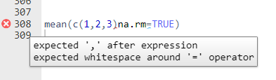
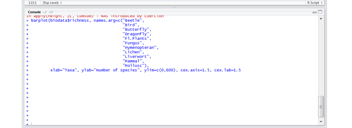

```{r setup, include=FALSE}
knitr::opts_chunk$set(echo = TRUE,
                      warning = FALSE,
                      message = FALSE)
library(fontawesome)
```

```{r child="title_slide.Rmd"}

```

---
class: center

When learning a programming language, you have to be prepared to spend a lot of 
your time with fixing bugs in the code. So don't worry: It's not you, it's just how programming works!

.footnote-right[Artwork by [Allison Horst](https://twitter.com/allison_horst)]

---
# Debugging

Debugging can be annoying and we can't avoid it, but ...

.pull-left[

- ... it's an effective learning experience (I actually learned the most from debugging my code)

- ... it will get easier over time

- ... there are some techniques to decrease the time in stages 2-7

- ... if nothing helps, there are great people all over the internet willing to help

]
.pull-right[]
.footnote-right[The stages of debugging. Artwork by [Allison Horst](https://twitter.com/allison_horst)]

---
class: inverse

# Most common `r fa("r-project")`  errors or problems for beginners and how to deal with them

---

# Syntax errors

#### Example:

```{r error=TRUE}
mean(c(1,2,3)na.rm=TRUE)
```
--
#### How to fix

- look for missing commas, misspelled arguments, ...
- read the error message
- the RStudio syntax checker warns you before you run code with syntax errors
  - look for &nbsp;&nbsp; next to line numbers in your script


---
# Error: could not find function

#### Examples

```{r, echo=FALSE, error=TRUE}
mutate(data, a=1:10)
```
```{r, echo=FALSE, error=TRUE}
lenght(1:10)
```
--
#### How to fix

`"Could not find function"` errors have two main reasons:

1. You forgot to load the package that the function belongs to
  - load the package using `library()` or call the function with `packageName::functionName()`
2. You have a typo in your function call (e.g. `lenght()` instead of `length()`)

---
# Error: object `x` not found

#### Example

```{r echo=FALSE,error=TRUE}
j
```

#### How to fix

- you are trying to access an object that does not exist
- Mostly because:
  - typos in variable name (variable name is `variableA` but you try to access `variable_A`)
  - forgot to put quotes around string: `print(hello)` -> looks for the variable hello but instead you wanted to print the string `print("hello")`

---
# Wrong data format

#### Example

- does not necessarily trigger an error message
- if there is an error message, it can also appear later in your code

#### How to fix it

- Look at `str()` of your data and check whether all columns are there and in correct format
- Do that at multiple locations in your script to find the line where the error actually happens

---
# R crashes

- sometimes R crashes completely and you see this:


--
#### How to fix it

- There is no fix but to start a new session
- make sure to save your scripts regularly!

---
# Console prints `+`

R is not running your code anymore and the console only prints `+`. This means R still expects input.


#### How to fix it

- First, go to the console and hit `Escape`
- Likely this happened because you forgot to close a bracket somewhere. Go to your script and check for where this happened
  - look for &nbsp;&nbsp; next to line numers

---

# Warnings

R can give you warnings for many reasons, e.g.

- you have `NA` values in your data and try to plot them
- the function you are using is deprecated
- the package you are using was built for another version of R
- ...

--

Warnings are no errors and can sometimes be ignored but:

- make sure to read and understand warnings
- only ignore them if you know that that's okay, otherwise fix the underlying issue

---
class: inverse

# How to troubleshoot R code: A step by step guide

---
# Troubleshoot R: Step by step

Often, you don't need to do all the steps but a systemmatic approach to errors is helpful.

**Step 1:** Carefully read the error message and try to fix it <br>
--
**Step 2:** Is it any of the errors you learned about just now? <br>
--
**Step 3:** If the error is about data: Did you look at the structure using
`str()`?<br>
--
**Step 4:** If the error is about a function: Read the documenation of that function using `?functionName`. 
  - Did you use the function correctly?
  - Did you forget an argument?<br>
--

**Step 5:** Look for answers online

---
# Step 5: Look for answers online

- Search with keywords **R** + [**package name**] + **Error message/Warning**

- If you don't know how do do something try searching **R** + [**package name**] + **What you want to do**, e.g.
  - *"R ggplot change axis title"*
  - *"R sort vector"*
  
- Usually you can pick any of the top search results, but I recommend results from [stackoverflow](https://stackoverflow.com/)
  
- Always search in English to get more results<br>

.content-box-grey[`r fa("lightbulb")` Change language of R messages to English with `Sys.setenv(LANGUAGE='en')`]

---
# Troubleshoot R: Step by step

Often, you don't need to do all the steps but a systemmatic approach to errors is helpful.

**Step 1:** Carefully read the error message and try to fix it <br>
**Step 2:** Is it any of the errors you learned about just now? <br>
**Step 3:** If the error is about data: Did you look at the structure using
`str()`?<br>
**Step 4:** If the error is about a function: Read the documenation of that function using `?functionName`. 
  - Did you use the function correctly?
  - Did you forget an argument?<br>
**Step 5:** Look for answers online<br>
**Step 6:** Ask others for help

---
# Step 6: Ask others for help

There are plenty of places where you can ask for help online.
Some common and good options are:

- Ask a question on Stack overflow
- Ask in the R Discord server
  - usually fast answers
- Ask on Twitter using the #rstats hashtag

But: You have to make sure that before, you tried all the other 5 steps.

---


