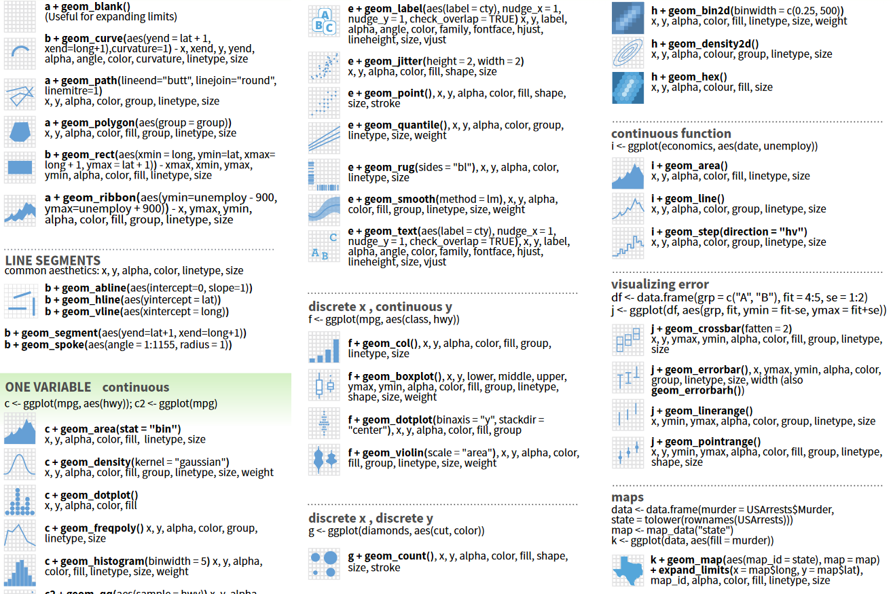

```{r setup, include=FALSE}
knitr::opts_chunk$set(
  echo = TRUE, 
  warning = FALSE, 
  message = FALSE, 
  collapse = TRUE,
  fig.height = 6.3,
  fig.allign = 'center',
  fig.retina = 3.5,
  fig.showtext = TRUE
)


library(fontawesome)
library(tidyverse)
theme_set(theme_grey(base_size = 16))
```

```{r child="title_slide.Rmd"}

```

---
class: inverse, center, middle

# .large[A ggplot showcase]

## Some examples of plots you can create with ggplot

---
class: center, middle
background-image: url("https://raw.githubusercontent.com/jkaupp/tidytuesdays/master/2021/week27/tw27_plot.png")
background-size: 90%

.footnote-right[Visualization by [Jake Kaupp](https://twitter.com/jakekaupp), code available on [Github](https://github.com/jkaupp/tidytuesdays/tree/master/2021/week27)]

---
class: center, middle
background-image: url("https://raw.githubusercontent.com/bbc/bbplot/master/chart_examples/bbplot_example_plots.png")
background-size: 90%

.footnote-right[Visualizations produced by the [BBC News data team](https://github.com/bbc/bbplot)]

---
class: center, middle
background-image: url("https://raw.githubusercontent.com/Z3tt/TidyTuesday/master/plots/2020_31/2020_31_PalmerPenguins.png")
background-size: contain

.footnote-right[Visualization by [Cédric Scherer](https://twitter.com/CedScherer),<br> code available on [Github](https://github.com/z3tt/TidyTuesday/blob/master/R/2020_31_PalmerPenguins.Rmd)]

---
# Advantages of ggplot

- **Consistent** grammar/structure

--

- **Flexible** structure allows you to produce any type of plots

--

- Highly **customizable appearance** (themes)

--

- Many **extension packages** that provide 
  - Additional plot types
	- Additional themes
	- Color palettes
	- Animation
	- Composition of multiple plots
	- ...
	
--

- Active community that provides help and inspiration

--

- Perfect package for **exploratory data analysis** and **beautiful plots**

---
# The data

The [`lterdatasampler` package](https://lter.github.io/lterdatasampler/) contains a
data set called `and_vertebrates` about the length and weight of a fish and a salamander
species in both clear cut and old growth coniferous forest sections. 

Data variables (among others):

- `year`: observation year
- `section`: CC (clear cut forest) or OG (old growht forest)
- `unittype`: channel unit classification (C = Cascade, P = Pool, ...)
- `species`: Species measured
- `length_1_mm`: body length [mm]
- `weight_g`: body weight [g]

```{r echo=FALSE}
library(lterdatasampler)
and_vertebrates <- and_vertebrates %>% 
  select(year, section, unittype, species, length_1_mm, weight_g) %>% 
  filter(species != "Cascade torrent salamander")
```

---
class: center, middle
background-image: url("img/AllisonHorst/ggplot2_exploratory.png")
background-size: contain

.footnote-right[Artwork by [Allison Horst](https://twitter.com/allison_horst)]


---
# `ggplot(data)`

The `ggplot()` function initializes a ggplot object. Every ggplot needs this function.


.pull-left[

```{r eval=FALSE}
library(ggplot2) # or library(tidyverse)

ggplot(data = and_vertebrates) #<<
```

- Empty plot because we did not specify the mapping of data variables

]

.pull-right[
```{r echo=FALSE}
ggplot(data = and_vertebrates)
```
]

---
# `aes(x, y)`

The **aes**thetic mapping defines how variables are mapped to aesthetic properties of the plot.

--

.pull-left[

```{r eval=FALSE}
ggplot(data = and_vertebrates,
       mapping = aes( #<<
         x = length_1_mm, #<<
         y = weight_g)) #<<
```

- Map variable `length_1_mm` to x-axis and `weight_g` to y-axis
- Default scales are automatically adapted to range of data
]

.pull-right[
```{r echo=FALSE}
ggplot(data = and_vertebrates,
       aes(x = length_1_mm, y = weight_g))
```
]

---
# `aes(x, y)`

The **aes**thetic mapping defines how variables are mapped to aesthetic properties of the plot.

.pull-left[

```{r eval=FALSE}
ggplot(data = and_vertebrates,
       mapping = aes( 
         x = length_1_mm, 
         y = weight_g)) 
```

- Map variable `length_1_mm` to x-axis and `weight_g` to y-axis
- Default scales are automatically adapted to range of data

This is the same but shorter:

```{r eval=FALSE}
ggplot(and_vertebrates, #<<
       aes(x = length_1_mm,#<<
           y = weight_g))#<<
```

Remember argument matching by position?
]

.pull-right[
```{r echo=FALSE}
ggplot(data = and_vertebrates,
       aes(x = length_1_mm, y = weight_g))
```
]

---
# `geom_*()`

`geoms` define how data points are represented. There are many different geoms to chose from


---
class: middle, center



.footnote-right[from [ggplot cheatsheet](https://raw.githubusercontent.com/rstudio/cheatsheets/master/data-visualization-2.1.pdf)]

---
# `geom_point()`

--

.pull-left[

```{r eval=FALSE}
ggplot(data = and_vertebrates,
       aes(x = length_1_mm, 
           y = weight_g)) +
  geom_point() #<<
```

- New plot layers added with `+`
- Warning that points could not be plotted due to missing values
- `data` and `aes` defined in `ggplot` call are inherited to all plot layers
]

.pull-right[
```{r echo=FALSE, warning=TRUE}
ggplot(data = and_vertebrates,
       aes(x = length_1_mm, 
           y = weight_g)) +
  geom_point() 
```
]

---
# `geom_point()`

.pull-left[

```{r eval=FALSE}
ggplot(data = and_vertebrates,
       aes(x = length_1_mm, 
           y = weight_g)) +
  geom_point()
```

- New plot layers added with `+`
- Warning that points could not be plotted due to missing values
- `data` and `aes` defined in `ggplot` call are inherited to all plot layers
- `data` and `aes` can be local to a layer:

```{r eval=FALSE}
ggplot(data = and_vertebrates,) +
  geom_point(aes(x = length_1_mm, #<<
                 y = weight_g)) #<<
```

Here, it does not make a difference.

]

.pull-right[
```{r echo=FALSE, warning=TRUE}
ggplot(data = and_vertebrates) +
  geom_point(aes(x = length_1_mm, y = weight_g))
```
]

---
# `aes(color)`: mapping color to a variable

Looks like there are two groups of data: **Map color of points to a variable** by adding it to aesthetics:

--

.pull-left[

```{r eval=FALSE}
ggplot(data = and_vertebrates,
       aes(x = length_1_mm, 
           y = weight_g,
           color = species)) + #<<
  geom_point()
```

- Map the `species` variable to the color aesthetic of the plot
]

.pull-right[
```{r echo=FALSE}
ggplot(data = and_vertebrates,
       aes(x = length_1_mm, 
           y = weight_g,
           color = species)) + #<<
  geom_point()
```
]

---
# `aes(size)`: mapping size to a variable

We can do the same with size:

--

.pull-left[

```{r eval = FALSE}
ggplot(data = and_vertebrates,
       aes(x = length_1_mm, 
           y = weight_g,
           size = species)) + #<<
  geom_point()
```

]
.pull-right[
```{r echo=FALSE}
ggplot(data = and_vertebrates,
       aes(x = length_1_mm, 
           y = weight_g,
           size = species)) + #<<
  geom_point()
```
]

---
# `aes(shape)`: mapping shape to a variable

We can do the same with shape:

--

.pull-left[

```{r eval = FALSE}
ggplot(data = and_vertebrates,
       aes(x = length_1_mm, 
           y = weight_g,
           shape = species)) + #<<
  geom_point()
```

]
.pull-right[
```{r echo=FALSE}
ggplot(data = and_vertebrates,
       aes(x = length_1_mm, 
           y = weight_g,
           shape = species)) + #<<
  geom_point()
```
]

---
# Combine color, size and shape

We can also combine these aesthetics and map different variables

.pull-left[

```{r eval = FALSE}
ggplot(data = and_vertebrates,
       aes(x = length_1_mm, 
           y = weight_g,
           color = unittype, #<<
           shape = species, #<<
           size = year)) + #<<
  geom_point()
```

- This is a bit too much for this plot, but sometimes can be useful

]
.pull-right[
```{r echo=FALSE}
ggplot(data = and_vertebrates,
       aes(x = length_1_mm, 
           y = weight_g,
           color = unittype, #<<
           shape = species, #<<
           size = year)) + #<<
  geom_point()
```
]

---
# Changing  the scales of the aesthetics

The scales onto which the aesthetic elements are mapped can be changed.

.pull-left[

```{r eval=FALSE}
ggplot(data = and_vertebrates,
       aes(x = length_1_mm, 
           y = weight_g,
           color = species)) + 
  geom_point()
```

- Exponential relationship?
- How does it look like on the log scale?

]

.pull-right[
```{r echo=FALSE}
ggplot(data = and_vertebrates,
       aes(x = length_1_mm, 
           y = weight_g,
           color = species)) + 
  geom_point()
```
]

---
# `scale_x_log10()`

The scales onto which the aesthetic elements are mapped can be changed.

.pull-left[

```{r eval=FALSE}
ggplot(data = and_vertebrates,
       aes(x = length_1_mm, 
           y = weight_g,
           color = species)) + 
  geom_point() +
  scale_x_log10() + #<<
  scale_y_log10() #<<
```

- Scales can be changed for all elements of `aes`
- The general format of scale functions are:

<b>scale\_.col1[aes-name]\_.col2[scale-type]</b>

In this example we scale the <b>.col1[x]</b> and the  <b>.col1[y]</b>  aesthetic to <b>.col2[log10]</b>.

]

.pull-right[
```{r echo=FALSE}
ggplot(data = and_vertebrates,
       aes(x = length_1_mm, 
           y = weight_g,
           color = species)) + 
  geom_point() +
  scale_x_log10() + #<<
  scale_y_log10() #<<
```
]

---
# `geom_smooth()`

Add a smoothing line that helps see patterns in the data

--

.pull-left[
```{r eval =FALSE}
ggplot(data = and_vertebrates,
       aes(x = length_1_mm, 
           y = weight_g,
           color = species)) + 
  geom_point(alpha = 0.3) +
  geom_smooth(method = "lm") +#<<
  scale_x_log10() + 
  scale_y_log10()
```

- With `method = "lm"`, a linear regression line is added
- All geoms are done separately for the species
  - Color is defined globally
- alpha makes the points transparent (0-1 with 0 being invisible)
]

.pull-right[
```{r echo=FALSE}
ggplot(data = and_vertebrates,
       aes(x = length_1_mm, 
           y = weight_g,
           color = species)) + 
  geom_point(alpha = 0.3) +
  geom_smooth(method = "lm") + #<<
  scale_x_log10() + 
  scale_y_log10()
```  
]

---
# `geom_boxplot`

Compare groups using a boxplot

--

.pull-left[
```{r eval =FALSE}
ggplot(and_vertebrates, 
       aes(x = species, 
           y = length_1_mm)) +
  geom_boxplot() #<<
```

]

.pull-right[
```{r echo=FALSE}
ggplot(and_vertebrates, 
       aes(x = species, 
           y = length_1_mm)) +
  geom_boxplot() #<<
```  
]

---
# `geom_boxplot`

Compare groups using a boxplot

.pull-left[
```{r eval =FALSE}
ggplot(and_vertebrates, 
       aes(x = species, 
           y = length_1_mm)) +
  geom_boxplot(notch = TRUE) #<<
```

- If notches don't overlap, the medians of the groups are likely different

]

.pull-right[
```{r echo=FALSE}
ggplot(and_vertebrates, 
       aes(x = species, 
           y = length_1_mm)) +
  geom_boxplot(notch = TRUE) #<<
```  
]

---
# `geom_boxplot`

Map the `unittype` to the **color** aesthetic of the box

--

.pull-left[
```{r eval =FALSE}
ggplot(and_vertebrates, 
       aes(x = species, 
           y = length_1_mm,
           color = unittype)) + #<<
  geom_boxplot() 
```

]

.pull-right[
```{r echo=FALSE}
ggplot(and_vertebrates, 
       aes(x = species, 
           y = length_1_mm,
           color = unittype)) + #<<
  geom_boxplot() 
```  
]

---
# `geom_boxplot`

Map the `unittype` to the **fill** aesthetic of the box

--

.pull-left[
```{r eval =FALSE}
ggplot(and_vertebrates, 
       aes(x = species, 
           y = length_1_mm,
           fill = unittype)) + #<<
  geom_boxplot(notch = TRUE) 
```


]

.pull-right[
```{r echo=FALSE}
ggplot(and_vertebrates, 
       aes(x = species, 
           y = length_1_mm,
           fill = unittype)) + #<<
  geom_boxplot(notch = TRUE) 
```  
]

---
# `geom_histogram`

.pull-left[
```{r eval =FALSE}
ggplot(and_vertebrates, 
       aes(x = length_1_mm, 
           fill = section)) +
  geom_histogram() #<<
```

- Careful: By default the histogram is stacked for the different groups!

]

.pull-right[
```{r echo=FALSE}
ggplot(and_vertebrates, 
       aes(x = length_1_mm, 
           fill = section)) +
  geom_histogram() #<<
```  
]

---
# `geom_histogram`

.pull-left[
```{r eval =FALSE}
ggplot(and_vertebrates, 
       aes(x = length_1_mm, 
           fill = section)) +
  geom_histogram(
    position = "identity", #<<
    alpha = 0.5) #<<
```

- Change the position of the histogram to `"identity"`, if you
don't want it stacked
- `alpha` makes sure that you see overlapping areas

]

.pull-right[
```{r echo=FALSE}
ggplot(and_vertebrates, 
       aes(x = length_1_mm, 
           fill = section)) +
  geom_histogram(
    position = "identity", #<<
    alpha = 0.5) #<<
```  
]

---
# `geom_tile`

You can create a simple heatmap with `geom_tile`

--

.pull-left[
```{r eval =FALSE}
ggplot(and_vertebrates, 
       aes(x = section,
           y = species,
           fill = weight_g)) +
  geom_tile() #<<
```

- Here we would have to chose a different color scheme to see differences

]

.pull-right[
```{r echo=FALSE}
ggplot(and_vertebrates, 
       aes(x = section,
           y = species,
           fill = weight_g)) +
  geom_tile() #<<
```  
]

---
# Small multiples with `facet_wrap`

Split your plots along one variable with `facet_wrap`

--

.pull-left[

```{r eval=FALSE}
ggplot(data = and_vertebrates,
       aes(x = length_1_mm, 
           y = weight_g,
           color = species)) + 
  geom_point() +
  facet_wrap(~section) #<<
```

]

.pull-right[
```{r echo=FALSE}
ggplot(data = and_vertebrates,
       aes(x = length_1_mm, 
           y = weight_g,
           color = species)) + 
  geom_point() +
  facet_wrap(~section)
```
]

---
# Small multiples with `facet_wrap`

Split your plots along one variable with `facet_wrap`

.pull-left[

```{r eval=FALSE}
ggplot(data = and_vertebrates,
       aes(x = length_1_mm, 
           y = weight_g,
           color = species)) + 
  geom_point() +
  facet_wrap(~section, 
             nrow = 2,#<<
             scales = "free")#<<
```

- Specify number of rows and columns with `nrow`/`ncol`
- Set separate scales for x and y with `scales`
  - `"free"`: x and y axis are free
  - `"free_y"`: only y-axis is free
  - `"free_x"`: only x-axis is free

]

.pull-right[
```{r echo=FALSE}
ggplot(data = and_vertebrates,
       aes(x = length_1_mm, 
           y = weight_g,
           color = species)) + 
  geom_point() +
  facet_wrap(~section, 
             scales = "free",#<<
             nrow = 2) #<<
```
]

---
# Small multiples with `facet_grid`

Split your plots along two variables with `facet_grid`

--

.pull-left[

```{r eval=FALSE}
ggplot(data = and_vertebrates,
       aes(x = length_1_mm, 
           y = weight_g,
           color = unittype)) + 
  geom_point() +
  facet_grid(section ~ species) #<<
```

- `facet_grid(rows ~ columns)`

]

.pull-right[
```{r echo=FALSE}
ggplot(data = and_vertebrates,
       aes(x = length_1_mm, 
           y = weight_g,
           color = unittype)) + 
  geom_point() +
  facet_grid(section ~ species) #<<
```
]

---
class: inverse, middle, center

# .large[Now you]

## Task 1: Exploratory data analysis with the penguin data set (45 min)

#### Find the task description [here](https://selinazitrone.github.io/intro-r-data-analysis/02_tasks_controller.html#ggplot2)


---
# Change appearance of points

The basic things we can change about points are their **size, shape and color**:

.pull-left[

```{r eval=FALSE}
ggplot(data = msleep,
       aes(x = brainwt, 
           y = sleep_total)) +
  geom_point(size = 4, #<<
             shape = 17, #<<
             color = "blue") + #<<
  scale_x_log10() 
```
- Have a look [here](http://www.cookbook-r.com/Graphs/Shapes_and_line_types/) for the point shape codes:

.center[]

]

.pull-right[
```{r echo=FALSE}
ggplot(data = msleep,
       aes(x = brainwt, y = sleep_total)) +
  geom_point(size = 4, shape = 17, 
             color = "blue") +
  scale_x_log10()
```
]


---

# `scale_color_viridis_d()`

Back to our plot `g` with color as additional aesthetic. We can change the color scale:

--

.pull-left[

```{r eval=FALSE}
# g + 
#   scale_color_viridis_d(option = "inferno") #<<
```

- The viridis color palette is designed for viewers with common forms of color blindness
- Different options of viridis color palettes are are:
  - `"magma"`, `"inferno"`, `"plasma"`, `"viridis"`, `"cividis"`

]

.pull-right[
```{r echo=FALSE}
# g + scale_color_viridis_d(option = "inferno")
```
]

---
# `scale_color_viridis_d()`

The `scale_color_viridis_d` function by default does not map color to missing data points (`NA` values). We have to explicitly state the color for `NA`:

--

.pull-left[

```{r eval=FALSE}
# g + 
#   scale_color_viridis_d(
#     option = "inferno",
#     na.value = "grey") #<<
```

- Whether or not you have to do this, depends on the default of the `na.value` argument of the color scale that you use
- You can also remove missing values from your data set before plotting (we will learn that later)

]

.pull-right[
```{r echo=FALSE, out.height = 430}
# g + scale_color_viridis_d(option = "inferno", na.value = "grey")
```
]

---
# `scale_color_manual()`

We can also manually specify colors:

.pull-left[

```{r eval=FALSE}
# g <- g + 
#   scale_color_manual( #<<
#     values = c("dodgerblue4", #<<
#                "darkolivegreen4", #<<
#                "darkorchid3", #<<
#                "orange", #<<
#                "grey")) #<<
# g
```

- Length of color vector has to match number of levels in your aesthetic
- Specify colors 
  - Via their name (see [here](http://www.stat.columbia.edu/~tzheng/files/Rcolor.pdf) for all color names)
  - Via their Hex color codes (use websites to generate your own color palettes, e.g. [here](https://coolors.co/))

]

.pull-right[

```{r echo=FALSE}
# g <- g + scale_color_manual(values = c("dodgerblue4",
#                                    "darkolivegreen4",
#                                    "darkorchid3",
#                                    "orange", "grey"))
# g
```
]

---
# Other color scales

There are many packages with preset color palettes, e.g.:

**ggsci:** scientific journal and sci-fi themed palettes

```{r eval=FALSE}
install.packages("ggsci")
# Examples
ggsci::scale_color_npg() # nature publishing group
ggsci::scale_color_rickandmorty()
```

--

**ggthemes:** software and publisher themed palettes:

```{r eval=FALSE}
install.packages("ggthemes")
#Examples
ggthemes::scale_color_excel_new() # colors from new Excel version
ggthemes::scale_color_economist() # color palette from Economist graphs
```

--

For a comprehensive list of color palettes available, check out [this repository](https://github.com/EmilHvitfeldt/r-color-palettes) by Emil Hvitfeldt.

---
# `facet_wrap()` and `facet_grid()`

Facets split a plot into small multiples along values of a variable from the data.

--

.pull-left[
```{r eval=FALSE}
g +
  facet_wrap(~conservation) #<<
```

- You can even split plots along two variables using `facet_grid()` instead of `facet_wrap()`
- The basic functioning is `facet_grid(yvar ~ xvar)` 
  - `yvar` will be displayed as columns
  - `xvar` will be displayed as rows

]

.pull-right[
```{r, echo=FALSE}
# g +
#   facet_wrap(~conservation)

```
]

---
# `labs()`: change axis and legend titles and add plot title

.pull-left[
```{r eval=FALSE}
g <- g +
  labs(
    x = "brain weight [kg]",#<<
    y = "total sleep [h/day]", #<<
    color = "Diet", #<<
    title = "Brain weight and sleep time in mammals",#<<
    subtitle = "Larger brains seem to sleep less",#<<
    caption = "Data from the ggplot2 package")#<<
g
```

]


.pull-right[
```{r echo=FALSE}
# g <- g +
#   labs(x = "brain weight [kg]",
#        y="total sleep [h/day]", 
#        color = "Diet", #<<
#        title = "Brain weight and sleep time in mammals",
#        subtitle = "Larger brains seem to sleep less",
#        caption = "Data from the `ggplot2` package")
# g
```

]

---
# `theme_*()`: change appearance

`ggplot2` offers many pre-defined themes that we can apply to change the appearance of a plot.

--

.pull-left[
```{r eval=FALSE}
g + 
  theme_classic()#<<
```

```{r echo=FALSE, out.height=370}
# g + 
#   theme_classic(base_size = 16)#<<
```

]

.pull-right[
```{r eval=FALSE}
g + 
  theme_linedraw()#<<
```

```{r echo=FALSE, out.height=370}
# g + 
#   theme_linedraw(base_size = 16)#<<
```

]

---
# `theme_*()`: change appearance

`ggplot2` offers several pre-defined themes that we can apply to change the appearance of our plot.

.pull-left[
```{r eval=FALSE}
g + 
  theme_dark()#<<
```

```{r echo=FALSE, out.height=370}
# g + 
#   theme_dark(base_size = 16)
```

]

.pull-right[
```{r eval=FALSE}
g + 
  theme_minimal()#<<
```

```{r echo=FALSE, out.height=370}
# g + 
#   theme_minimal(base_size = 16)
```

]

---
# `theme()`: customize theme

You can manually change a theme or even create an entire theme yourself. 
The elements you can control in the theme are:

- titles (plot, axis, legend, ...)
- labels
- background
- borders
- grid lines
- legends

If you want a full list of what you can customize, have a look at 

```{r eval=FALSE}
?theme
```

---
# `theme()`: customize theme

To edit a theme, just add another `theme()` layer to your plot.

--

.pull-left[
```{r eval=FALSE}
# g + 
#   theme_minimal() + 
#   theme(#<<
#     axis.text = element_text(face = "bold"),#<<
#     axis.title = element_text(face = "italic"),#<<
#     legend.position = "bottom", #<<
#     plot.background = element_rect(#<<
#       fill = "lightblue",#<<
#       color = "yellow") #<<
#   )#<<
```

- The basic functioning is:

```{r eval=FALSE}
theme(
  element_name = element_function()
)
```

- Look [here](https://github.com/claragranell/ggplot2/blob/main/ggplot_theme_system_cheatsheet.pdf) for an overview of the elemtens that you can change and the corresponding functions

]
.pull-right[
```{r echo=FALSE}
# g + 
#   theme_minimal(base_size=16) +
#   theme(
#     axis.text = element_text(face = "bold"),#<<
#     axis.title = element_text(face = "italic"),#<<
#     legend.position = "bottom",
#     plot.background = element_rect(
#       fill = "lightblue",
#       color = "yellow")
#   )
```
]

---
# `theme_set()`: set global theme

You can set a global theme that will be applied to all ggplot objects in the current R session. 

```{r eval=FALSE}
# Globally set theme_minimal as the default theme
theme_set(theme_minimal())
```

Add this to the beginning of your script.

--

You can also specify some defaults, e.g. the text size:

```{r eval=FALSE}
theme_set(theme_minimal(base_size = 16))
```

This is very practical if you want to achieve a consistent look, e.g. for a scientific journal.

---
# `geom_boxplot()`

A boxplot can be created with `geom_boxplot`:

.pull-left[
```{r eval=FALSE}
ggplot(msleep, aes(x = vore, y = bodywt)) +
  geom_boxplot() + #<<
  scale_y_log10() 
```
  
]

.pull-right[
```{r echo=FALSE}
ggplot(msleep, aes(x = vore, y = bodywt)) +
  geom_boxplot() +
  scale_y_log10() +
  theme_minimal(base_size = 16)
```
]

---
# `aes(fill)` and `scale_fill_*()`

Pay attention to fill vs. color aesthetic

.pull-left[
```{r eval=FALSE}
ggplot(msleep, aes(x = vore, y = bodywt)) +
  geom_boxplot(
    aes(fill = vore) #<<
  ) + 
  scale_y_log10() +
 ggthemes::scale_fill_tableau(  #<<
    na.value = "gray",#<<
    guide = "none") #<<
```
  
]

.pull-right[
```{r echo=FALSE}
ggplot(msleep, aes(x = vore, y = bodywt)) +
  geom_boxplot(
    aes(fill = vore) 
  ) + 
  scale_y_log10() +
  ggthemes::scale_fill_tableau( 
    na.value = "gray",
    guide = "none") +
  theme_minimal(base_size = 16)
```
]

---
# `aes(color)`and `scale_color_*()`

Pay attention to fill vs. color aesthetic

.pull-left[
```{r eval=FALSE}
ggplot(msleep, aes(x = vore, y = bodywt)) +
  geom_boxplot(
    aes(color = vore) #<<
  ) + 
  scale_y_log10() +
  ggthemes::scale_color_tableau(  #<<
    na.value = "gray",#<<
    guide = "none") #<<
```
  
- `color` means the border color or the color of points and lines
- `fill` means the fill color of boxes, bars, ...
]

.pull-right[
```{r echo=FALSE}
ggplot(msleep, aes(x = vore, y = bodywt)) +
  geom_boxplot(
    aes(color = vore)
  ) + 
  scale_y_log10() +
 ggthemes::scale_color_tableau(  #<<
    na.value = "gray",#<<
    guide = "none")+
  theme_minimal(base_size = 16)
```
]

<!-- --- -->
<!-- class: inverse, center, middle -->

<!-- # .large[More geoms] -->

<!-- ## Some more plot types you can create with ggplot for your reference -->

---
# Histograms: `geom_histogram()`

Basic histogram of total sleep time:

.pull-left[
```{r eval=FALSE}
ggplot(msleep, aes(x=sleep_total)) +
  geom_histogram() + #<<
  labs(x = "Total sleep time [h]", 
       y = "Frequency")
```
  
]

.pull-right[
```{r echo=FALSE}
ggplot(msleep, aes(x=sleep_total)) +
  geom_histogram() + #<<
  labs(x = "Total sleep time [h]", 
       y = "Frequency") +
  theme_minimal(base_size = 16)
```
]

---
# Discrete vs. continous variables

Let's add a sleep category to the data set depending on the hours of sleep an animal gets in total:

```{r}
msleep$category <- ifelse(
  msleep$sleep_total < 5, 
  1,
  ifelse(msleep$sleep_total > 5 & msleep$sleep_total < 10,
         2,
         3)
)
str(msleep)
```

---
# Discrete vs. continous variables

What's happening here?

.pull-left[
```{r eval=FALSE}
ggplot(msleep, 
       aes(x = category, 
           y = bodywt)) +
  geom_boxplot() + 
  scale_y_log10()
```

```{r echo=FALSE, out.width="65%", fig.align='center'}
ggplot(msleep, aes(x = category, y = bodywt)) +
  geom_boxplot() + scale_y_log10()
```

]

.pull-right[
```{r eval=FALSE}
ggplot(msleep,
       aes(x = brainwt, 
           y = sleep_total, 
           color = category)) +
  geom_point() +  scale_x_log10()
```

```{r echo=FALSE, out.width="65%", fig.align='center'}
ggplot(msleep,aes(x = brainwt, 
           y = sleep_total, color = category)) +
  geom_point() +
  scale_x_log10()
```

]

---
# Discrete vs. continous variables

.center[]

.footnote-right[Artwork by [Allison Horst](https://twitter.com/allison_horst)]


---
# Discrete vs. continous variables 

Solution: Turn continuous variable into a factor before plotting

.pull-left[
```{r eval=FALSE}
ggplot(msleep, 
       aes(x = factor(category), #<<
           y = bodywt)) +
  geom_boxplot() + 
  scale_y_log10()
```

```{r echo=FALSE, out.width="65%", fig.align='center'}
ggplot(msleep, aes(x = factor(category), y = bodywt)) +
  geom_boxplot() + scale_y_log10()
```

]

.pull-right[
```{r eval=FALSE}
ggplot(msleep,
       aes(x = brainwt, 
           y = sleep_total, 
           color = factor(category))) +#<<
  geom_point() + scale_x_log10()
```

```{r echo=FALSE, out.width="65%", fig.align='center'}
ggplot(msleep,aes(x = brainwt, 
           y = sleep_total, color = factor(category))) +
  geom_point() +
  scale_x_log10()
```

]

---
# Let's look at an example

.left-column[
What are the layers in this plot?

- data
- aesthetic mapping
- geoms
- themes
]
.right-column[

]

.footnote-right[Visualization from the [palmerpenguins package](https://allisonhorst.github.io/palmerpenguins/)]

---
# `ggsave()`

A ggplot object can be saved on disk in different formats.

Without specifications:

```{r eval=FALSE}
# save plot g in img as my_plot.pdf
ggsave(filename = "./img/my_plot.pdf", plot = g)
# save plot g in img as my_plot.png
ggsave(filename = "./img/my_plot.png", plot = g)
```

--

Or with specifications:

```{r eval=FALSE}
# save a plot named g in the img directory under the name my_plot.png with width 16 cm and height 9 cm
ggsave(filename = "./img/my_plot.png",
       plot = g,
       width = 16,
       heigth = 9,
       units = "cm")
```

Have a look at `?ggsave` to see all options.

---
# Summary I

#### Tidyverse and ggplot

- The tidyverse is a collections of R packages for data analysis, including `ggplot2`,`readr`, `tidyr`, `dplyr`, `tibble`
- All tidyverse packages are designed to work together seamlessly
- basic idea of `ggplot` is to stack distinct layers of graphical elements to create a plot 

- Check out the [ggplot cheatsheet](https://raw.githubusercontent.com/rstudio/cheatsheets/master/data-visualization-2.1.pdf) for an overview of how to create a ggplot

---
class: inverse, middle, center

# .large[Now you]

## Task 1: Create your own penguin ggplots (90 min)

#### Find the task description [here](https://selinazitrone.github.io/intro-r-data-analysis/02_tasks_controller.html#ggplot2)
