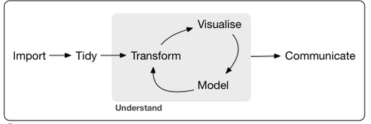
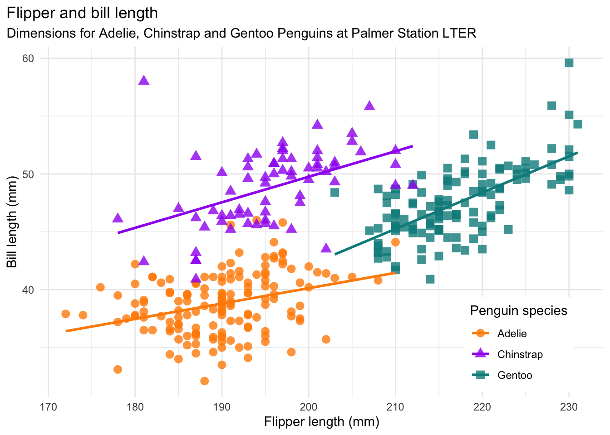

```{r setup, include=FALSE}
knitr::opts_chunk$set(echo = TRUE,
                      warning = FALSE,
                      message = FALSE)
library(fontawesome)
library(tidyverse)
```

```{r child="title_slide.Rmd"}

```

---
# Workflow data analysis

.center[
]
.footnote-right[Image from Wickham & Grolemund: [R for Data Science](https://r4ds.had.co.nz/introduction.html)]

---
# The tidyverse

> The tidyverse is an opinonated **collection of R packages** designed for data science. All packages share an underlying design philosophy, grammar, and data structures.<br>
([www.tidyverse.org](https://www.tidyverse.org/))                                                                                                                     

These are the main packages from the tidyverse that we will use:<br><br>

.center[]

&nbsp; Data structure &nbsp; &nbsp;&nbsp; Import &nbsp;&nbsp;&nbsp; Tidy &nbsp;&nbsp;&nbsp;&nbsp; Visualise &nbsp; Transform

---
# The tidyverse

To install and use the tidyverse, you can just 

```{r eval=FALSE}
install.packages("tidyverse")
```

And to load and attach the packages at the beginning of your script:

```{r eval=FALSE}
library(tidyverse)
```
Of course it is also possible to install and load each of the tidyverse packages individually, but since we will use so many of the tidyverse packages together, we will just load and attach them together.


---
class: inverse

# Plotting with ggplot2

---
# ggplot2


- ggplot2 was developed by Hadley Wickham in 2005
- most popular package for building graphics in R
- one of the most downloaded packages from CRAN

```{r}
# Print 10 most downloaded packages from the last month
#cranlogs::cran_top_downloads("last-month",10)
```

---
class: center, middle


---
class: center, middle


---
class: inverse

# ggplot short showcase 

---
class: center, middle

.footnote-right[Visualization by [Jake Kaupp](https://twitter.com/jakekaupp), code available on [Github](https://github.com/jkaupp/tidytuesdays/tree/master/2021/week27)]
---
class: center, middle


.footnote-right[Visualizations produced by the [BBC News data team](https://github.com/bbc/bbplot)]
---
class: center, middle


.footnote-right[Visualizations by [Cédric Scherer](https://twitter.com/CedScherer), code available on [Github](https://github.com/z3tt/TidyTuesday/blob/master/R/2020_05_TreesSF.Rmd)]

---
class: center, middle

.footnote-right[Visualizations by [Cédric Scherer](https://twitter.com/CedScherer), code available on [Github](https://github.com/z3tt/TidyTuesday/blob/master/R/2020_31_PalmerPenguins.Rmd)]

---
# Advantages of ggplot

- consistent grammar/structure for producing plots
- flexible structure allows you to produce any type of plot
- highly customizable appearance (themes)
- many extension packages that provide 
	• Additional plot types
	• Additional themes
	• Colour palettes
	• Animation
	• Composition of multiple plots
- Easy to get help an inspiration from active community

---
# Basic idea of ggplot

> shorten the distance from mind to page
(Hadley Wickham)

`ggplot2` is an implementation of the grammar of graphics by Leland Wilkinson

- coherent system for describing and building graphs
- basic idea: stack distinct layers of graphical elements to create a plot

---
# Layers of a ggplot
<table>
  <tr>
    <th>Layer</th>
    <th>Function</th>
    <th>Details</th>
  </tr>
  <tr>
    <td><b>Data</b></td>
    <td><code>ggplot(data)</code></td>
    <td>The data that you want to plot.</td>
  </tr>
  <tr>
    <td><b>Mapping&nbsp;&nbsp;&nbsp;&nbsp;&nbsp;&nbsp;&nbsp;&nbsp;&nbsp;&nbsp;&nbsp;&nbsp;&nbsp;&nbsp;&nbsp;&nbsp;</b></td>
    <td><code>aes()</code></td>
    <td>Aesthetic mappings of the geometric and statistical objects.</td>
  <tr>
    <td><b>Geometries</b></td>
    <td><code>geom_*()</code></td>
    <td>Graphical representation of aesthetics as point, line, polygon, ...</td>
  </tr>
</table>


---
# Layers of a ggplot

<table>
  <tr>
    <th>Layer</th>
    <th>Function</th>
    <th>Details</th>
  </tr>
  <tr>
    <td><b>Data</b></td>
    <td><code>ggplot(data)</code></td>
    <td>The data that you want to plot.</td>
  </tr>
  <tr>
    <td><b>Mapping&nbsp;&nbsp;&nbsp;&nbsp;&nbsp;&nbsp;&nbsp;&nbsp;&nbsp;&nbsp;&nbsp;&nbsp;&nbsp;&nbsp;&nbsp;&nbsp;</b></td>
    <td><code>aes()</code></td>
    <td>Aesthetic mappings of the geometric and statistical objects.</td>
  <tr>
    <td><b>Geometries</b></td>
    <td><code>geom_*()</code></td>
    <td>Graphical representation of aesthetics as point, line, polygon, ...</td>
  </tr>
  <tr>
    <td><b>Scales</b></td>
    <td><code>scale_*()</code></td>
    <td>Translate between variable values and properties (e.g. categories -> colour)</td>
  </tr>
  <tr>
    <td><b>Coordinates</b></td>
    <td><code>coord_*()</code></td>
    <td>Interprets and maps the position values of the data.</td>
  </tr>
  <tr>
    <td><b>Facets</b></td>
    <td><code>facet_*()</code></td>
    <td>Split your plot into multiples.</td>
  </tr>
  <tr>
    <td><b>Themes</b></td>
    <td><code>theme()</code> and&nbsp;&nbsp;<code>theme_*()</code></td>
    <td>Visual look of the plot not related to the data.</td>
  </tr>
</table>

---
# The data

The `ggplot` package has a built-in data set called `msleep` which I will use.

The data set is about the sleep times of 83 different mammals. 
The variables that are included in the data set (among others) are:

- **name:** common name of mammal
- **genus**
- **vore:** carnivore, omnivore, herbivore?
- **conservation:** conservation status of the animal
- **sleep_total:** total amount of sleep [h]
- **sleep_rem:** rem sleep [h]
- **brainwt:** brain weight [kg]
- **bodywt:** body weight [kg]

If you want to know more about the data set:
```{r eval=FALSE}
library(ggplot2)
str(msleep)
?msleep
```
---

# The data

Exploratory data analysis:<br>
***Do mammals with a larger brain need more sleep?***

---
# ggplot(data)

.pull-left[

```{r eval=FALSE}
library(ggplot) # or library(tidyverse)

ggplot(data = msleep) #<<
```

- Empty plot because we did not specify the mapping of data variables

]

.pull-right[
```{r echo=FALSE}
ggplot(data = msleep)
```
]

---
# aes()

.pull-left[

```{r eval=FALSE}
ggplot(data = msleep,
       aes(x = brainwt, #<<
           y = sleep_total)) #<<
```

- map the variable `brainwt` to the x-axis and `sleep_total` to the y-axis
- default scales automatically adapted to range of data

This is the same but a bit shorter:

```{r eval=FALSE}
ggplot(msleep, 
       aes(brainwt, sleep_total))
```

Remember argument matching by position?


]

.pull-right[
```{r echo=FALSE}
ggplot(data = msleep,
       aes(x = brainwt, y = sleep_total))
```
]

---
# geom_*()

Here a screenshot from the ggplot cheatsheet

.footnote-right[from [ggplot cheatsheet]()]
---
# geom_point()

.pull-left[

```{r eval=FALSE}
ggplot(data = msleep,
       aes(x = brainwt, 
           y = sleep_total)) +
  geom_point() #<<
```

- new plot layers are added with `+`
- warning that 27 points can not be plotted due to missing values
- `data` and `aes` defined in `ggplot` call are inherited to all plot layers
- `data` and `aes` can be local to a layer:

```{r eval=FALSE}
ggplot(msleep) +
  geom_point(aes(brainwt, sleep_total))
```

Here, it does not make a difference.

]

.pull-right[
```{r echo=FALSE, warning=TRUE}
ggplot(data = msleep,
       aes(x = brainwt, y = sleep_total)) +
  geom_point()
```
]

---
# scale_x_log10()


.pull-left[

```{r eval=FALSE}
ggplot(data = msleep,
       aes(x = brainwt, 
           y = sleep_total)) +
  geom_point() +
  scale_x_log10() #<<
```

- scales can be changed for all elements of `aes`
- the general format of scale functions are:

.center[scale_.col1[aes-name]_.col2[scale-type]]

In this example we scale the .col1[x] aesthetic to .col2[log10].

]

.pull-right[
```{r echo=FALSE}
ggplot(data = msleep,
       aes(x = brainwt, y = sleep_total)) +
  geom_point()+
  scale_x_log10()
```
]

---
# Change appearance of points

The basic things we can change about points are their size, shape and color:

.pull-left[

```{r eval=FALSE}
ggplot(data = msleep,
       aes(x = brainwt, 
           y = sleep_total)) +
  geom_point(size = 2, #<<
             shape = 17, #<<
             color = "blue") + #<<
  scale_x_log10() 
```
- have a look [here](http://www.cookbook-r.com/Graphs/Shapes_and_line_types/) for the point shape codes

]

.pull-right[
```{r echo=FALSE}
ggplot(data = msleep,
       aes(x = brainwt, y = sleep_total)) +
  geom_point(size = 5, shape = 17, 
             color = "blue") +
  scale_x_log10()
```
]
---
# Mapping color to a variable

Instead of changing the color for all points, we can map the color to a variable by adding it to the aesthetics

.pull-left[

```{r eval=FALSE}
g <- ggplot(
  data = msleep,
  aes(
    x = brainwt,
    y = sleep_total,
    color = vore #<<
  )
) + 
  geom_point(size = 5, shape = 17) +
  scale_x_log10()
g
```

- map the `vore` variable to the color aesthetic of the plot
- plots can also be saved in variables
]

.pull-right[
```{r echo=FALSE}
g<- ggplot(data = msleep,
       aes(x = brainwt, y = sleep_total,color=vore)) +
  geom_point(size = 4, shape = 17)+
  scale_x_log10()
g
```
]


---
# Mapping size and shape to a variable

We can do the same thing with shape and size as well:

.pull-left[

```{r eval = FALSE}
ggplot(
  data = msleep,
  aes(
    x = brainwt,
    y = sleep_total,
    color = vore,
    size = bodywt #<<
  )
) + 
  geom_point() +
  scale_x_log10()

```

]
.pull-right[
```{r echo=FALSE}
ggplot(
  data = msleep,
  aes(
    x = brainwt,
    y = sleep_total,
    color = vore,
    size = bodywt
  )
) + 
  geom_point() +
  scale_x_log10()
```
]

---
# Mapping size and shape to a variable

We can do the same thing with shape and size as well:

.pull-left[

```{r eval = FALSE}
ggplot(
  data = msleep,
  aes(
    x = brainwt,
    y = sleep_total,
    color = vore,
    shape = conservation #<<
  )
) + 
  geom_point() +
  scale_x_log10()

```

]
.pull-right[
```{r echo=FALSE}
ggplot(
  data = msleep,
  aes(
    x = brainwt,
    y = sleep_total,
    color = vore,
    shape = conservation
  )
) + 
  geom_point() +
  scale_x_log10()
```
]

---

# scale_color_viridis_*()

Back to our plot `g` with only color as additional aesthetic. We can change the colors the values are scaled to:

.pull-left[

```{r eval=FALSE}
g + 
  scale_color_viridis_d(option = "inferno") #<<
```

- the viridis color palette is designed for viewers with common forms of color blindness
- different options of viridis color palettes are are:
  - "magma", "inferno" "plasma", "viridis", "cividis"

]

.pull-right[
```{r echo=FALSE}
g + scale_color_viridis_d(option = "inferno")
```
]

---
# scale_color_viridis_*()

The `scale_color_viridis_d()` function does not have a default color to map missing data points (`NA` values) to. We have to explicitly say which color `NA` should have:

.pull-left[

```{r eval=FALSE}
g + 
  scale_color_viridis_d(
    option = "inferno",
    na.value = "grey") #<<
```

- whether or not you have to do this, depends on the default of the color scale that you use
- you can also remove missing values from your data set before plotting (we will learn that later)

]

.pull-right[
```{r echo=FALSE}
g + scale_color_viridis_d(option = "inferno", na.value = "grey")
```
]

---
# scale_color_manual()

We can manually specify colors:

.pull-left[

```{r eval=FALSE}
g <- g + 
  scale_color_manual( #<<
    values = c("dodgerblue4", #<<
               "darkolivegreen4", #<<
               "darkorchid3", #<<
               "orange", #<<
               "grey")) #<<
g
```

- length of color vector has to match number of levels in your aesthetic
- specify colors 
  - via their name (see [here](http://www.stat.columbia.edu/~tzheng/files/Rcolor.pdf) for all color names)
  - via their HEX value

]

.pull-right[

```{r echo=FALSE}
g <- g + scale_color_manual(values = c("dodgerblue4",
                                   "darkolivegreen4",
                                   "darkorchid3",
                                   "orange", "grey"))
g
```
]

---
# other color scales

There are several packages with preset color palettes:

**ggsci:** scientific journal and sci-fi themed palettes:

```{r eval=FALSE}
install.packages("ggsci")
# Examples
ggsci::scale_color_npg() # nature publishing group
ggsci::scale_color_rickandmorty()
```

**ggthemes:** software and publisher themed palettes:

```{r eval=FALSE}
install.packages("ggthemes")
#Examples
ggthemes::scale_color_excel_new() # colors from new Excel version
ggthemes::scale_color_economist() # color palette from Economist graphs
```

For a comprehensive list of color palettes available, check out [this repository](https://github.com/EmilHvitfeldt/r-color-palettes) by Emil Hvitfeldt.

---

# Facets

Facets split your plot into small multiples along the values of a variable in your data set. We can e.g. split our plot along the conservation status of the animals:

.pull-left[
```{r eval=FALSE}
g +
  facet_wrap(~conservation) #<<
```

- you can even split plots along two variables using `facet_grid()` instead of `facet_wrap()`
- The basic functioning is `facet_grid(yvar ~ xvar)` 
  - `yvar` will be displayed as columns
  - `xvar` will be displayed as rows

]

.pull-right[
```{r, echo=FALSE}
g +
  facet_wrap(~conservation)

```

]

---

# Changing axis labels and legend names and adding a title

We can change the labes of x- and y-axis and plot title as well as the title of the legend:

.pull-left[
```{r eval=FALSE}
g <- g +
  labs(x = "log brain weight [kg]",#<<
       y="total sleep [h/day]", #<<
       title = "Relationship between brain weigth and sleep time in mammals")#<<
g
```

]


.pull-right[
```{r echo=FALSE}
g <- g +
  labs(x = "log brain weight [kg]",
       y="total sleep [h/day]", 
       title = "Relationship between brain weigth and sleep time in mammals")
g
```

]

---
# Changing the theme

`ggplot2` offers several pre-defined themes that we can apply to change the appearance of our plot.
Some examples are:

.pull-left[
```{r}
g + 
  theme_classic()#<<
```

]

.pull-right[
```{r}
g + 
  theme_linedraw()#<<
```

]

---
# Changing the theme

`ggplot2` offers several pre-defined themes that we can apply to change the appearance of our plot.
Some examples are:

.pull-left[
```{r}
g + 
  theme_dark()#<<
```

]

.pull-right[
```{r}
g + 
  theme_minimal()#<<
```

]

---
# Customize a theme

You can manually change a theme or even create an entire theme yourself. 
The elements you can control in the theme are:

- titles (plot, axis, legend, ...)
- labels
- background
- borders
- grid lines
- legends

If you want a full list of what you can customize, have a look at 

```{r eval=FALSE}
?theme
```

---
# Custom theme

To edit a theme, just add another `theme()` layer to your plot:

.pull-left[
```{r eval=FALSE}
g + 
  theme_minimal() + 
  theme(#<<
    axis.text = element_text(face = "bold"),#<<
    legend.position = "bottom", #<<
    plot.background = element_rect(fill = "yellow") #<<
  )
```
]
.pull-right[
```{r echo=FALSE}
g + 
  theme_minimal() +
  theme(
    axis.text = element_text(face = "bold"),#<<
    legend.position = "bottom",
    plot.background = element_rect(fill = "yellow")
  )
```
]

---

# Set a theme for all plots

You can set a theme that will be applied to all ggplots in the current R session, by adding 

```{r eval=FALSE}
theme_set(theme_minimal())
```

to the beginning of your script.

---
# geom_boxplot()

Pay attention to fill vs. color aesthetic

.pull-left[
```{r}
ggplot(msleep, aes(x = vore, y = bodywt, fill = vore)) +
  geom_boxplot() + #<<
  scale_y_log10() +
  scale_fill_brewer( #<<
    palette = "Set1", #<<
    guide = "none") #<<
theme_classic()
```
  
]

.pull-left[
```{r }
ggplot(msleep, aes(x = vore, y = bodywt, color = vore)) +
  geom_boxplot() + #<<
  scale_y_log10() +
  scale_color_brewer( #<<
    palette = "Set1",#<<
    guide = "none"#<<
  ) +#<<
  theme_classic()
```
]

---
# Example I
.pull-left[
**What are the layers of this plot?**

- data
- aesthetic mapping
- geoms
- theme

]
.pull-right[
]

---


---
# Resources

tidyverse.org

