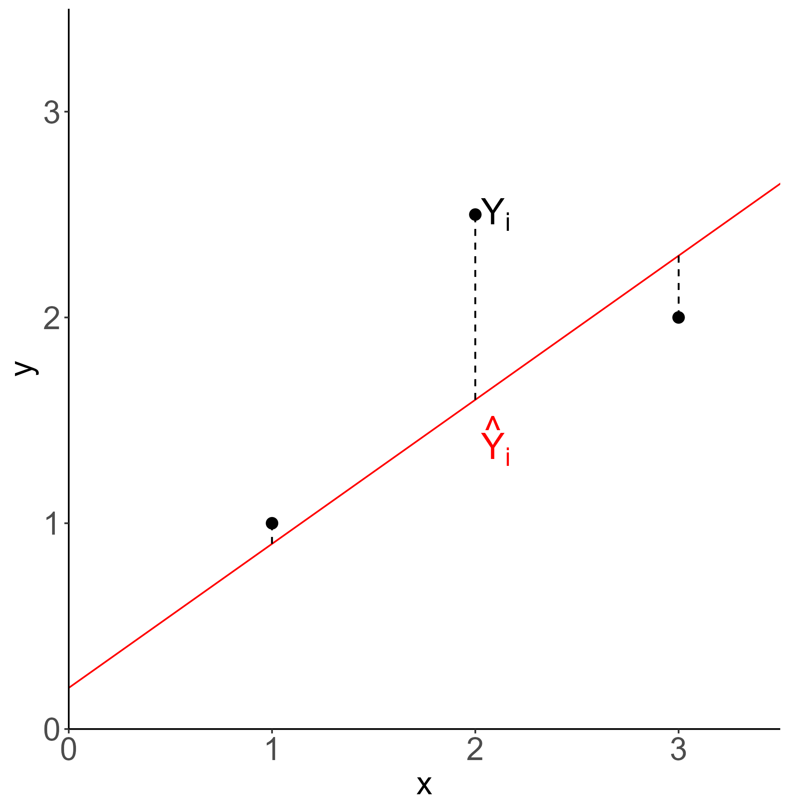
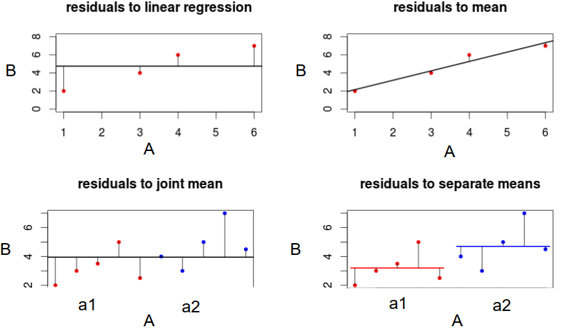
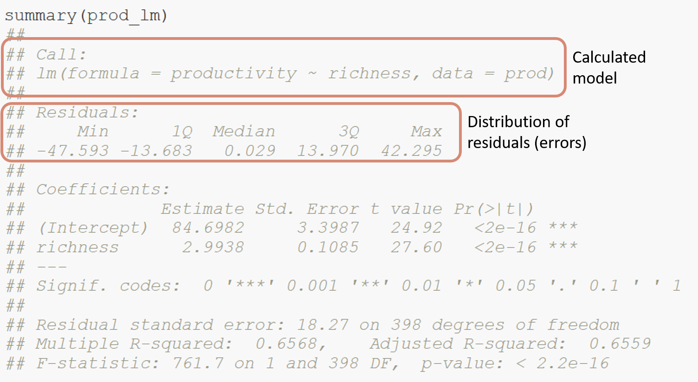
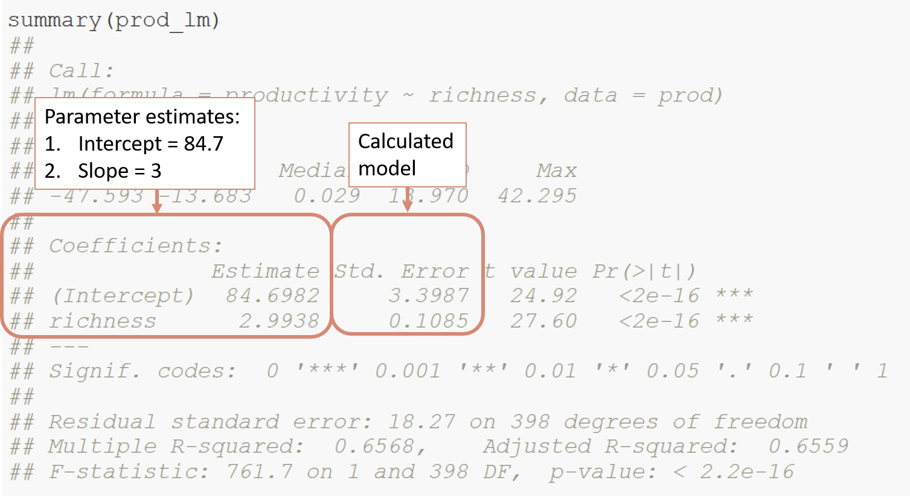
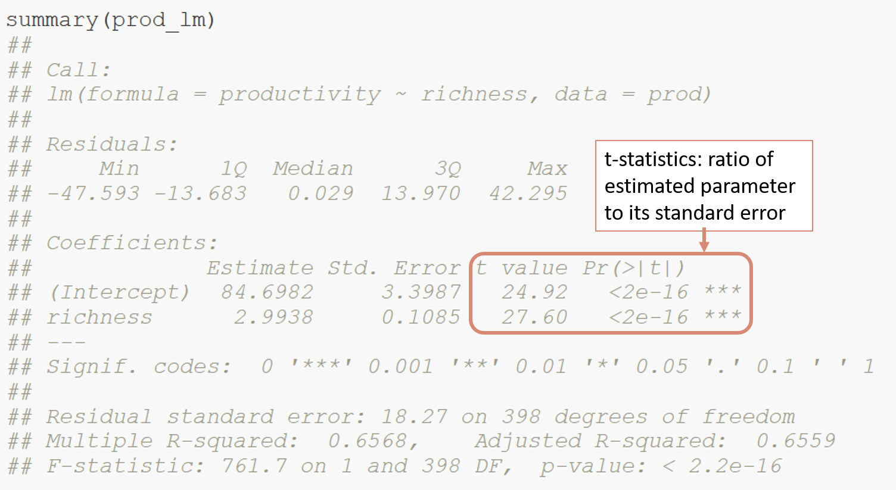
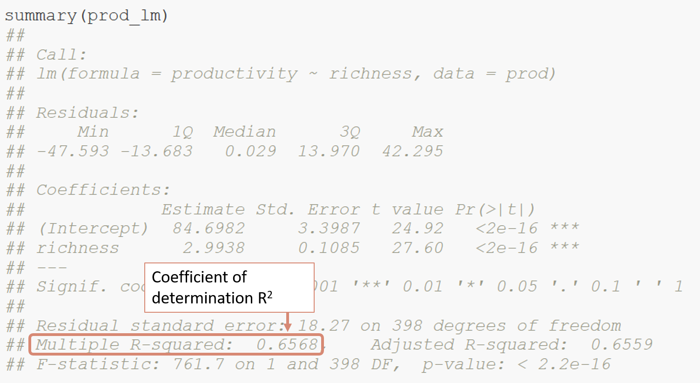
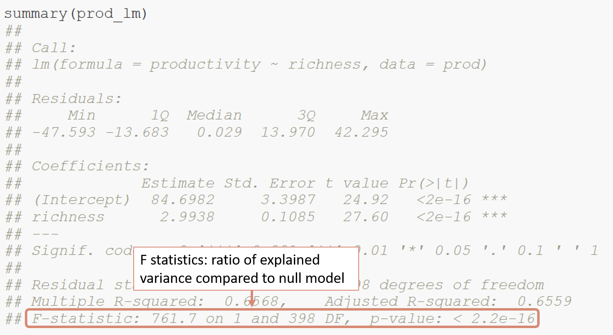

```{r setup, include=FALSE}
knitr::opts_chunk$set(
  echo = TRUE, 
  warning = FALSE, 
  message = FALSE, 
  collapse = TRUE,
  fig.height = 6.3,
  fig.allign = 'center',
  fig.retina = 3.5,
  fig.showtext = TRUE
)
library(fontawesome)
library(tidyverse)
library(patchwork)

theme_set(theme_classic(base_size=16))
```

```{r child="title_slide.Rmd"}

```

---
class: inverse, middle, center

# A little bit of theoretical background

---
# Linear models background

#### The data:

  - random sample of n data points ( $Y_i, X_{i1}, X_{i2},..., X_{ip}$, $i = 1...n$) 
  
    - $X_{i1}, X_{i2},..., X_{ip}$ are p **independent predictor** variables
    
    - $Y_i$ is the **dependent** observation and **response variable**

--

#### Aim of linear model:

  - (How) do the predictor variables impact the response variable?
  
  - Can we better predict values for the response variable, if we account for the predictor variables?    
  

---
# Linear models background

```{r echo=FALSE, fig.height=7.5}
prod <- readr::read_tsv(here::here("data/slides/03_productivity.txt")) %>% 
  mutate(across(site, as_factor))

# Hypothesis 1: Productivity increases with species richness:
regr <- ggplot(prod, aes(x=richness, y=productivity))+
  geom_point()+
  geom_smooth(method="lm", alpha = 0) +
  labs(x="species richness", title = "Linear regression") 
regr_m <- ggplot(prod, aes(color = site, x=richness, y=productivity))+
  geom_point()+
  geom_smooth(method="lm", alpha = 0) +
  labs(x="species richness", title = "Analysis of covariance")

box <- ggplot(prod, aes(x=site, y=productivity))+
  geom_boxplot(aes(color = site))+
  labs(title = "Analysis of variance")

```

.pull-left[
<br>

**Linear regression**

- numerical response
- numerical predictor(s)


**Analysis of variance**

- numerical response
- categorical predictor(s)


**Analysis of covariance**

- numerical response
- numerical and categorical predictor(s)

]

.pull-right[
```{r echo=FALSE, fig.height = 7.5}
(regr  / box / regr_m)
```

]

---
# Linear models background

Linear relation with two predictor variables $X_1$ and $X_2$ ( $i = 1...n$ ):

**Without interaction**

$Y_i = \beta_0 + \beta_1*X_{1,i} + \beta_2*X_{2,i} + \epsilon$

--

**With interaction**

$Y_i = \beta_0 + \beta_1*X_{1,i} + \beta_2*X_{2,i} + \beta_3*X_{1,i}*X_{2,i} + \epsilon$

with

- $Y_i$ value of response variable
- $\beta_0, \beta_1, \beta_2$ model coefficients
- $X_{1,i}$ value of predictor $X_1$
- $X_{2,i}$ value of predictor $X_2$
- $\epsilon$ error term

---
# Goodness of fit linear model

.pull-left[

#### Model residuals

$Y_i - \hat{Y}_i$

#### Residual sum of squares (RSS)

$RSS = \sum_{i=1}^{n} Y_i - \hat{Y}_i$


#### Aim of the model fitting:
Find the parameters that lead to the lowest sum of squares.
]

.pull-right[


 
]

---
# Significant effects

If we account for variable A: do the residuals become significantly smaller?

.center[]

---
# Assumptions for linear models

Finding the parameters that lead to the lowest residual sum of squares works only if:

.pull-left[

- residuals are normally distributed

- residual variance is constand

- no strong outliers


]

.pull-right[


]

--


This has to be checked for every linear model!

---
class: inverse, middle, center

# How to fit linear models in `r fa("r-project")`

---
# The data

We use productivity data from grassland sites. <br>
The data set is called `prod` and has  3 variables: site, productivity and richness (species richness):

```{r eval=FALSE}
prod
```

```{r echo=FALSE}
print(prod, n=4)
```

The variable site is a factor with two levels: site1 and site2

```{r}
levels(prod$site) # get all levels of the factor
```

---
# Linear regression in R

.pull-left[

#### Lets start with a Hypothesis $H_0$

Productivity increases with species richness.
 
#### Or in other words
 
Can we significantly increase the accuracy of productivity predictions by taking into account species richness?
]

.pull-right[

```{r echo=FALSE}
prod_scatter <- ggplot(prod, aes(x=richness, y=productivity))+
  geom_point()
prod_scatter
```
]

---
# Linear regression in R

Use the `lm` function to fit a linear model in R.

The general structure of the function call is like this:

.center[<code><b>lm ( formula = .col1[Y] ~ .col2[X], data = .col3[dat] )</b></code>]

with

- <b>.col1[Y]</b> being the response variable
- <b>.col2[X]</b> being the predictor(s)
- <b>.col3[dat]</b> being the name of the data

--

Multiple predictors can be added with `+`, `:` or `*` depending on interaction:

- <code><b>`Y ~ X1 + X2`</b></code> tests effects without interaction
- <code><b>`Y ~ X1 + X2 + X1:X2`</b></code> tests single effects and interaction between `X1` and `X2`
- <code><b>`Y ~ X1 * X2`</b></code> is short for testing all single effects and all interactions (here same as line above)

---
# Linear regression in R

.pull-left[

Let's fit a linear model to test our hypothesis

<code><b>lm ( formula = .col1[Y] ~ .col2[X], data = .col3[dat] )</b></code>

```{r}
prod_lm <- lm(productivity ~ richness, 
              data = prod)
```
]

.pull-right[
```{r echo=FALSE}
prod_scatter +
  theme(
    axis.title.y = element_text(color = "#4C7488", face = "bold"),
    axis.title.x = element_text(color = "#D78974", face = "bold")
  )
```
]

---
# Linear regression in R

Is the effect of richness on productivity significant?

**Or in other words**

Does the model with richness as predictor significantly reduce the residual sum of squares?

--

#### Hypothesis testing using F-Tests

Compare the complex model with a simple model that does not contain the predictor

$H_0$: The error variance in the simple model is not significantly higher than in the more complex model

--

- $H_0$ accepted: simplification was justified `r fa("arrow-right")` use simple model without predictor

--

- $H_0$ rejected: simplification reduced explanatory power `r fa("arrow-right")` use complex model with predictor

---
# Linear regression in R

#### Hypothesis testing using F-Tests in R


$H_0$: The error variance in the simple model is not significantly higher than in the more complex model

`drop1` deletes single terms from the model and performs an F-test: 

```{r eval=FALSE}
drop1(prod_lm, test = "F")
```

--

```{r echo=FALSE}
drop1(prod_lm, test = "F")
```

--

Result: The error variance of the simple model (Null model) is significantly higher than of the model with richness. `r fa("arrow-right")` Richness increases productivity ($F_{1,399}$ = 761.71, p < 0.001)

---

# Extracting the coefficients

```{r}
summary(prod_lm)
```

---
# Summary table

.center[]

---
# Summary table

.center[]

---
# Summary table

.center[]

---
# Summary table

.center[]

---
# Summary table

.center[]

---
# Test model assumptions

.pull-left[

Test model assumptions:

- normality of residuals
- homogeneity of variance
- outliers

```{r eval=FALSE}
# install.packages("performance")
performance::check_model(prod_lm)
```

This looks perfectly fine. We can use our linear model.

]

.pull-right[
```{r echo=FALSE}
performance::check_model(prod_lm)
```

]
---
# Plot the model

**Option 1**
<br>
Extract coefficients of the model and add the regression line:

```{r}
# These are the coefficients of the lm
prod_lm$coefficients
```

```{r}
intercept <- prod_lm$coefficients[1]
slope <- prod_lm$coefficients[2]
```

Add a line defined by slope and intercept using `geom_abline()`:

```{r}
 ggplot(prod, aes(x=richness, y=productivity))+
  geom_point() +
  geom_abline(slope = slope, intercept = intercept) #<<
```

---
# Plot the model

**Option 2**

Use `geom_smooth()` to add the model directly:

```{r}
 ggplot(prod, aes(x=richness, y=productivity))+
  geom_point() +
  geom_smooth(method = "lm") #<<
```

Or without the confidence interval:

```{r}
 ggplot(prod, aes(x=richness, y=productivity))+
  geom_point() +
  geom_smooth(method = "lm", alpha = 0) #<<
```

But careful with `geom_smooth()`: Always plots the model with all interactions. Here it does not matter, but if you have multiple predictors, keep that in mind!

---
# Analysis of covariance


```{r}
 ggplot(prod, aes(x=richness, y=productivity, color = site))+
  geom_point()
```


```{r}
prod_lm2a <- lm(productivity ~ richness + site, data = prod) #without interaction
prod_lm2b <- lm(productivity ~ richness + site + richness:site, data = prod) #with interaction
```

---
# Analysis of covariance

```{r}
drop1(prod_lm2a, test = "F")
```

```{r}
drop1(prod_lm2b, test = "F")
```

---
# Analysis of covariance

```{r}
summary(prod_lm2a)
```

---
# Test model assumptions

```{r}
performance::check_model(prod_lm2a)
```

---
# Plot the model

To plot the additive model without interaction, we cannot use `geom_smooth()` because it plots a model with interaction between the predictors:

```{r}
 ggplot(prod, aes(x=richness, y=productivity, color = site))+
  geom_point()+
  geom_smooth(method = "lm") #<<
```

This plot is not appropriate if the model you present is without interaction

---
# Plot the model

**Option 1**
.pull-left[
Extract coefficients

```{r}
prod_lm2a$coefficients
```


```{r}
slope <- prod_lm2a$coefficients[2]
intercept1 <- prod_lm2a$coefficients[1]
intercept2 <- prod_lm2a$coefficients[1] + prod_lm2a$coefficients[3]
```


Add the lines using `geom_abline()`:

```{r eval=FALSE}
ggplot(prod, aes(x=richness, y=productivity, color= site))+
  geom_point() +
  geom_abline(slope = slope, intercept = intercep1 , color = "red")+
  geom_abline(slope = slope, intercept = intercept2 , color = "blue")
```

]

.pull-right[
```{r echo=FALSE}
ggplot(prod, aes(x=richness, y=productivity, color= site))+
  geom_point() +
  geom_abline(slope = slope, intercept = intercept1 , color = "red")+
  geom_abline(slope = slope, intercept = intercept2 , color = "blue")
```

]
---
# Plot the model 

**Option 2**

Use the `predict()` function.

The general workflow for this option is:

- **step 1:** use `expand_gride` to create a tibble with values for all predictor variables
- **step 2:** use `predict` to predict response variable with the model using input predictor values from tibble in step 1
- **step 3:** add predictions as column to the tibble from step 1
- **step 4:** add predictions to the plot using a new `geom_*()` layer based on the tibble from step 3

---
# Plot the model

**Option 2**

Use the `predict()` function.

In practice this looks like this:

```{r eval=FALSE}
# step 1: create some data to predict from
pred_data <- expand_grid(
  richness = min(prod$richness):max(prod$richness), 
  site = c("site1", "site2")
)
# step2: predict productivity values from pred_data
predictions <- predict(lm4, newdata = pred_data)
# step 3: add predictions to the tibble
pred_data$productivity <- predictions
```

Explanation:
- `expand_grid` returns a tibble with all combinations of site and richness given as input
- `predict` uses the `lm4` model and the data produced with `expand_grid` to predict productivity values for each combination of site and richness.

---

# Plot the model 

**Option 2**

Use the `predict()` function.

Add a new `geom_*()` layer to the plot from the prediction data:

```{r eval=FALSE}
# or using the predict function
pred_data <- expand_grid(
  richness = min(prod$richness):max(prod$richness), 
  site = c("site1", "site2")
)
predictions <- predict(lm4, newdata = pred_data)
pred_data$productivity <- predictions

ggplot(prod, aes(x=richness, y=productivity, color= site))+
  geom_point() +
  geom_line(data= pred_data)

```
---
# Anova

Let's quickly look at an example with only categorical variables using a built-in data set of R called `chickwts`.
The dataset is about the weight of chickens fed with different diets. 

.pull-left[

```{r, eval=FALSE}
chickwts
```

```{r, echo=FALSE}
print(tibble(chickwts),n=4)
```
]

.pull-right[
```{r}
ggplot(chickwts, aes(x=factor(feed), y= weight))+
  geom_boxplot()
```

]
---
# Anova

<b>$H_0$:</b> The diet has an effect on the mean weight of chicken.

```{r}
lm_chicken <- lm(weight ~ feed, data = chickwts)
drop1(lm_chicken, test = "F")
```

---
# Anova

```{r}
summary(lm_chicken)
```

---
# Anova

```{r}
performance::check_model(lm_chicken)
```

---
# Plot results in a boxplot

```{r}
ggplot(chickwts, aes(x=feed, y= weight)) +
  geom_boxplot() +
  labs(x = "Diet", y= "Weight [g]")
```

---
# Plot the results in a boxplot

If you want a slightly nicer boxplot, you could do something like this:


```{r eval=TRUE}
chickwts %>% 
  mutate(feed = as.factor(feed)) %>% 
  mutate(feed = fct_reorder(feed, -weight)) %>% 
  ggplot(aes(x=feed, y=weight, color = feed))+
    geom_boxplot()+
    geom_jitter(size = 3, alpha = 0.25, width = 0.2)+
    coord_flip()+
    ggsci::scale_color_uchicago()+
    labs(y = "weight [g]", x = "Diet")+
    theme(legend.position = "none")

```

.footnote-right[Design taken from Cédric Scherers ["Evolution of a ggplot"(https://www.cedricscherer.com/2019/05/17/the-evolution-of-a-ggplot-ep.-1/#sort)]]


---

# Summary

Follow the following steps to perform a linear model:

1. Come up with a hypothesis that you would like to test 
  - e.g. The diet has an effect on the weight of chicken with horsebean leading to the highest weights.
2. Make plots of the data and explore them
  - for regression chose a scatterplot
  - for analysis of covariance chose a scatterplot with colors
  - for analysis of variance chose boxplot (or similar)
3. Fit model using `lm` function
  - Add the interactions that you want to test according to your hypothesis
4. Check model assumptions by looking at diagnostic plots e.g. from `performance::check_model`
  - residuals normally distributed
  - constant variance
  - no strong outliers
5. Check significant variables
  - use `anova` (F-tests) to check whether your predictors significantly improve the models sum of squares
6. Check the effect sizes e.g. in the `summary` table
6. Add model results to plot (only plot regression lines if significant)
  - for regression: regression line with `geom_smooth`, `geom_abline` or `geom_line` and predicted values
  - for analysis of covariance: regression lines
  - for analysis of variance: boxplots or similar
(7. Make predictions using the `predict` function)

---
class: inverse

# Transformations
---
---
# When to transform?

Transformation of the response variable Y can help with potential violations of the model assumptions:

- residuals non-normally distributed
  - skewed distribution
  - outliers
- trends in the residuals
- non-constant variance

--
**Example**

- Non-linear function $y = a * e^{b*x}$
- Transformed to a linear model: $log(y) = log(a) + b * x$

--
- Common natural processes: exponential growth and decay

---
# Example

Dataset `decay` on the decay of soil organic matter over time.

Two variables:
- `amount` of orgnic matter
- `time`

```{r eval=FALSE}
decay <- read_tsv("day03/data/Decay.txt")
```


```{r}
decay <- read_tsv(here::here("data/slides/03_Decay.txt"))
ggplot(decay, aes(x=time, y= amount))+
  geom_point()
```

---
# Example

First, let's try to fit a model to the untransformed data and look at the diagnostic plots:

.pull-left[
```{r eval = FALSE}
mod1 <- lm(amount ~ time, data = decay)
performance::check_model(mod1)
```

Diagnostic plots look bad:

- pattern in the residuals
- skewed distribution

]
.pull-right[
```{r echo=FALSE}
mod1 <- lm(amount ~ time, data = decay)
performance::check_model(mod1)
```
]

---
# Exercise

Let's refit the model to transformed data:

.pull-left[
```{r eval = FALSE}
mod2 <- lm(log(amount) ~ time, data = decay)
performance::check_model(mod2)
```

Diagnostic plots look much better (though not perfect)

- no patterns anymore

]
.pull-right[
```{r echo=FALSE}
mod2 <- lm(log(amount) ~ time, data = decay)
performance::check_model(mod2)
```
]

---
# Plot the results

If we want to plot the results of the model on the transformed scale, we can just use `geom_smooth` in combination with `scale_y_log10`:

.pull-left[
```{r eval = FALSE}
ggplot(decay, aes(x = time, y = amount)) +
  geom_point() +
  scale_y_log10() + #<<
  geom_smooth(method = "lm") #<<
```

]

.pull-right[
```{r echo = FALSE}
ggplot(decay, aes(x= time, y=amount))+
  geom_point()+
  scale_y_log10()+
  geom_smooth(method = "lm")
```

]

---
# Plot the results

However, we mostly want to plot the model on the scale of the original data. For this, we need to use `predict`:

.pull-left[
```{r eval=FALSE}
# on the original scale using predict
pred_data <- tibble(time = 0:30)
amount_pred <- predict(mod, newdata = pred_data)
# backtransform to original scale
pred_data$amount <- exp(amount_pred) #<<

ggplot(decay, aes(x= time, y=amount))+
  geom_point()+
  geom_line(data = pred_data)
```

- The trick here is that we have to backtransform our predictions using `exp` as the inverse function of `log`

]

.pull-right[
```{r echo=FALSE}
# on the original scale using predict
pred_data <- tibble(time = 0:30)
amount_pred <- predict(mod2, newdata = pred_data)
# backtransform to original scale
pred_data$amount <- exp(amount_pred)

ggplot(decay, aes(x= time, y=amount))+
  geom_point()+
  geom_line(data = pred_data)
```

]
---
# Summary

**General Protocol**

1. Plot raw data
2. Fit a model to untransformed data
3. Check diagnostic plots
4. Apply a transformation
5. Re-fit model to transformed data
6. Check diagnostic plots again
7. Plot raw data and add model predictions *based on the transformed data*
  - Backtransform predictions appropriately:
    - $log(y) <=> exp(y)$
    - $sqrt(y) <=> y^2$
    
---

# Resources

https://stats.libretexts.org/Bookshelves/Applied_Statistics/Book%3A_Learning_Statistics_with_R_-_A_tutorial_for_Psychology_Students_and_other_Beginners_(Navarro)/16%3A_Factorial_ANOVA/16.06%3A_ANOVA_As_a_Linear_Model
