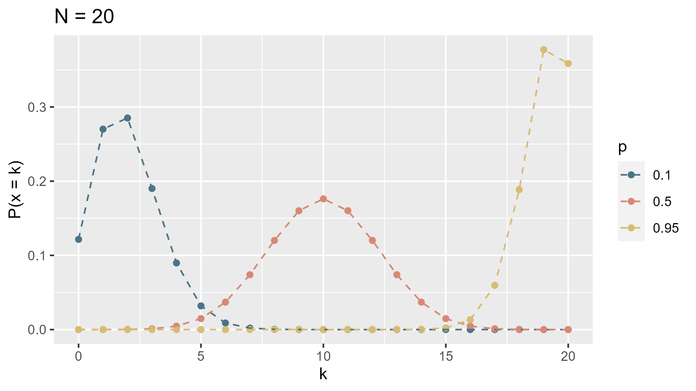
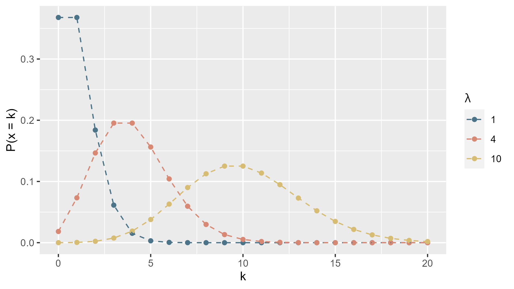

```{r setup, include=FALSE}
knitr::opts_chunk$set(
  echo = TRUE, 
  warning = FALSE, 
  message = FALSE, 
  collapse = TRUE,
  fig.height = 6.3,
  fig.allign = 'center',
  fig.retina = 3.5,
  fig.showtext = TRUE
)
library(fontawesome)
library(tidyverse)

theme_set(theme_classic(base_size = 16))
cols <- c( "#4C7488","#D78974", "#D7BC74")
```

```{r child="title_slide.Rmd"}
```
---
# GLMs background

Assumptions of linear models:

- Normal distribution of residuals
  - errors and response not bounded

- Constant variance of residuals
  - no relationship between mean and variance of y
  
--

There are types of data that (generally) violate these assumptions.

---
# GLMs background

**Count data**

- are bounded (cannot be < 0)
- variance increases with the mean<br>
`r fa("arrow-right")` response described by a ***poisson distribution***

--

**Proportion data**

- percentages: bounded between 0 and 1
- variance highest at p = 0.5, lower towards p = 0 and 1<br>
`r fa("arrow-right")` response described by a ***binomial distribution*** (# successes in N trials with probability p)

--

**Binary data**

- Only 0 and 1
- variance highest at p = 0.5, lower towards p = 0 and 1<br>
`r fa("arrow-right")` response described by a ***bernoulli distribution*** (binomial distribution with N=1)

---
# GLMs background

**Components of a GLM**

- Linear predictor $\eta_i = \beta_0 + \sum \beta_j * X_{i,j}$
  - like a linear model: linear combination of the effects of the predictors $X_j$

--

- Error structure 
  - non-normal distribution e.g. skewed, bounded, non-negative (e.g. Poisson distribution)
  
--

- Link function $g(\mu_i) = \eta_i$
  - relates the expected response values $\mu_i$ to the linear predictor
  - A linear model is also a glm with a gaussian link function (identity `=`)
  - predicted values: require inverse link function!

---
# Parameter estimation in GLMS

#### Linear models

- Ordinary Least Squares (OLS)
- Minimizing the residual sum of squares to find parameters
- This method only works if linera model assumptions are not violated

--

#### GLMs

- Maximizing the likelihood (ML)
- **Likelihood:** Probability of the data *given* the model
- **Likelihood function:** How does the likelihood depend on the model parameters? `r fa("arrow-right")` Maximum: ML parameter estimates of the GLM

---
# Binomial distribution

- Frequency distribution of the number of successes of an event with success probability p and N trials.
  - E.g. No of "six" with 10 dice: $p = 0.5$, $N = 10$
  
.pull-left[

$f(k) = \binom{N}{k} p^k * (1-p)^{N - k}$

$E(k) = N*p$

$Var(k) = N*p*(1-p)$

with $k$ being the number of "successes"
]
.pull-right[

]

--

**Bernoulli** distribution as special case with N = 1 (e.g. coin flip).

---
# Binomial and binary GLMs
<br>

- logit link function: $logit(p_i) = ln(\frac{p_i}{1-p_i}) = \eta_i$

- inverse link function: $p_i = \frac{e^{\eta_i}}{1+e^{\eta_i}}$

- binomial error distribution: $\epsilon \sim B(p_i, N = n)$

---
# Poisson distribution

- Frequency distribution of counts of rare events
  - E.g. Bird count in forests
  
.pull-left[

$f(k) = \frac{e^{-\lambda}\lambda^k}{k!}$

$E(k) = \lambda$

$Var(k) = \lambda$

with $k$ being the number of occurrences
]

.pull-right[

]

---
# Poisson GLMs
<br>

- log link function: $ln(\lambda_i) = \eta_i$

- inverse link function: $\lambda_i = e^{\eta_i}$

- poisson error distribution: $\epsilon \sim P(\lambda_i)$

---
class: inverse, middle, center

# GLMs in `r fa("r-project")`

## Let's look a poisson GLM as example

---
# The data

Data set: Species diversity in plots with different soil pH

.pull-left[

- **Response variable:**
  - number of plant species
- **Predictor variables:**
  - Plot biomass
  - soil pH

```{r eval=FALSE}
specdat
```

```{r echo=FALSE}
specdat <- read_tsv(here::here("data/slides/03_species.txt"))
print(specdat, n=4)
```

]

.pull-right[
```{r echo=FALSE}
spec_plot <- ggplot(specdat, aes(y=Species, x=Biomass, color = pH))+
  geom_point(size = 2)+
  scale_color_manual(values = cols)
spec_plot
```
]

---
# Fit the model

**Question:** How do biomass and soil pH influence species richness?

--

Fit the most complex model with interaction to describe our hypothesis:

```{r}
mod1 <- glm(Species ~ Biomass + pH + Biomass:pH, 
            data = specdat,
            family = "poisson") #<<
```

--

- same structure as `lm`

- add family argument to specify the error distribution
  - by default, R will pick the corresponding link function for the error distribution.
  
  - you could also be explicit about link function with `family = poisson(link = "log")`
  
  - for more information have a look at `?family`

---
# Summary table

```{r}
summary(mod1)
```

---
# Summary table

- Coefficients are on scale of link function `r fa("arrow-right")` cannot be directly interpreted on the scale of the data

- For glms: deviance as measure of goodness-of-fit (for lms it was sum of squared residuals)

---
# Hypothesis tests in GLMs

- for linear models: F-tests

  - $F = \frac{\frac{SSR}{df(mod1)}}{\frac{SSR}{df{mod2}}}$
  
  - in R: `drop1(mod1, test = "F")`
  
--
  
- for generalized linear models: likelihood-ratio (LR) test

  - $LR = deviance(mod1) - deviance(mod2)$
  
  - LR follows a $\chi^2$ distribution
  
  - in R: `drop1(mod1, test = "Chisq")`
  
---
# Hypothesis tests in GLMs

Test the significant of the predictors in our model with

```{r}
drop1(mod1, test = "Chisq")
```

--

If we remove the interaction between biomass and pH from the model, the deviance increases significantly <br>
`r fa("arrow-right")` There is a significant effect or biomass and pH on species richness.

---
# Plot the model

**Option 1: Use predict function**

```{r}
# step 1: creat some data to predict from
pred_dat <- expand_grid(
  Biomass = seq(
    from = min(specdat$Biomass), 
    to = max(specdat$Biomass), 
    length.out = 200),
  pH = unique(specdat$pH)
)
```

--

```{r}
# step 2: predict species with the new data
# careful: add type = response
pred_dat$Species <- predict(mod1, newdata = pred_dat, 
                            type = "response") #<<

```

With `type = response` we predict **on the scale of the response variable** (i.e. the data) and not on the scale of the link function

---
# Plot the model

**Option 1: Use predict function**

.pull-left[
```{r eval=FALSE}
# define some colors
cols <- c( "#4C7488","#D78974", "#D7BC74")

# step 3: Add model predictions to the plot
ggplot(specdat, aes(
  y = Species,
  x = Biomass,
  color = pH
)) +
  geom_point() +
  geom_line(data = pred_dat) + #<<
  scale_color_manual(values = cols)
```

]
.pull-right[

```{r echo=FALSE}
spec_plot +
  geom_line(data = pred_dat)+
  scale_color_manual(values = cols)
```

]

---
# Plot the results

**Option 2: Use `geom_smooth`**

.pull-left[
```{r eval=FALSE}
ggplot(specdat, aes(y = Species, x = Biomass, color = pH)) +
  geom_point() +
  geom_smooth(
    method = "glm", #<<
    method.args = list( #<<
      family = "poisson" #<<
    )
  )
```

- careful: `geom_smooth` always uses most complex model with all interactions
  - in this case: we want exactly that

]
.pull-right[
```{r echo=FALSE}
spec_plot +
  geom_smooth(
    method = "glm", #<<
    method.args = list( #<<
      family = "poisson" #<<
    )
  )
```
]

---
class: inverse, middle, center

# .large[GLM with binary data]

---
# Example

Odonates in water filled bromeliads in Costa Rica.

.pull-left[

Variables:

- `site`: location
- `logmaxvolume`: bromeliad size
- `Odonatepresence`: Odonates present (1) or not (0)

Question: How does bromeliad size influence the presence of Odonates?

```{r eval=FALSE}
mod <- glm(Odonatepresence ~ logmaxvolume + site, data = bromeliad, family = "binomial")
```


]

.pull-right[

```{r echo=FALSE, fig.height=6.1}
bromeliads <- read_csv(here::here("data/slides/bromeliads.txt"))
bromeliads %>% 
  filter(site != "Picinguaba") %>% 
ggplot(aes(x=logmaxvolume, y = Odonatepresence, color = site))+
  geom_smooth(method = "glm",se=FALSE,
              method.args = list(
                family = "binomial"
              ))+
  geom_point(size = 3, alpha = 0.2)+
  ggsci::scale_color_uchicago()+
  theme(legend.position = c(0.15, 0.85))
```
]

.footnote-right[Petermann et al., *Ecology* (2015)]

---
class: inverse, middle, center

# .large[Now you]

## Task 1: Poisson and binary glms with R

#### Find the task description [here](https://selinazitrone.github.io/intro-r-data-analysis/01_tasks_controller.html)

---
class: inverse, middle, center

# .large[GLMs with proportion data]
## Let's look at an example

---
# The data

Winter mortality of black-tailed prairie dogs

.pull-left[

**Question**:

How do

- successful mating
- achievement of a certain minimum weight before winter
- hibernation

predict the ***probability of survival & death*** in winter?


]
.pull-right[
.center[]
]
.footnote-right[By I, <a rel="nofollow" class="external text" href="https://sites.google.com/site/thebrockeninglory/">Brocken Inaglory</a>, <a href="http://creativecommons.org/licenses/by-sa/3.0/" title="Creative Commons Attribution-Share Alike 3.0">CC BY-SA 3.0</a>, <a href="https://commons.wikimedia.org/w/index.php?curid=2542206">Link</a>]

---
# The data

Winter mortality of black-tailed prairie dogs

.pull-left[

```{r eval=FALSE}
pdogs
```

```{r echo=FALSE}
pdogs <- read_csv(here::here("data/slides/03_prairiedogs.csv"))
print(pdogs, n = 3)
```

- 3 categorical predictors: `mated`, `hibernation`, `min.weight`
- total no. of animals (`n.tot`)
- number of dead animals (`n.death`)

`r fa("arrow-right")` What is the response variable here?

]

.pull-right[
.center[]
]

.footnote-right[By I, <a rel="nofollow" class="external text" href="https://sites.google.com/site/thebrockeninglory/">Brocken Inaglory</a>, <a href="http://creativecommons.org/licenses/by-sa/3.0/" title="Creative Commons Attribution-Share Alike 3.0">CC BY-SA 3.0</a>, <a href="https://commons.wikimedia.org/w/index.php?curid=2542206">Link</a>]


---
# The response variable

Winter mortality of black-tailed prairie dogs

.pull-left[

Response variable: **proportion** of surviving (or dead) animals

`r fa("arrow-right")` Response has to be calculated first:

```{r}
pdogs <- pdogs %>%
  mutate(
    n.surv = n.tot - n.death,
    p.surv = n.surv / n.tot,
    p.dead = 1 - p.surv
  )
```

]

.pull-right[
.center[]
]

.footnote-right[By I, <a rel="nofollow" class="external text" href="https://sites.google.com/site/thebrockeninglory/">Brocken Inaglory</a>, <a href="http://creativecommons.org/licenses/by-sa/3.0/" title="Creative Commons Attribution-Share Alike 3.0">CC BY-SA 3.0</a>, <a href="https://commons.wikimedia.org/w/index.php?curid=2542206">Link</a>]

---
# The response variable

The response variables (`p.dead` or `p.surv` depending on the question) are now added to the data

```{r echo=FALSE}
print(pdogs, n = 5)
```

--

But what could be the problem with that?

--
`r fa("arrow-right")` loss of information in proportions!

- 2 survivors / 4 total = 50% 
- 100 survivors / 200 total = 50%
**But** 100 out of 200: more information than 2 out of 4

--

`r fa("arrow-right")` data points with higher total number need more weight in model fitting

---
# Fit the model

**Option 1:** Give **proportion of success** as response AND **total number** as weights

```{r eval=FALSE}
mod1 <- glm(
  formula = p.surv ~ ..., # choose predictors according to your hypothesis
  data = pdogs,
  family = "binomial", #<<
  weights = n.tot #<<
)
```

- `family = "binomial"` by default uses logit link function

---
# Fit the model

**Option 2:** Give a **table with two columns** as response:
- No of successes
- No of failures

```{r eval=FALSE}
mod1 <- glm(
  cbind(n.surv, n.death) ~ ..., #<<
  data = pdogs,
  family = "binomial" #<<
)
```

---
# Now you

