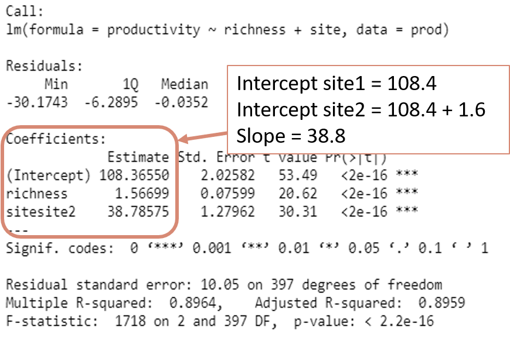
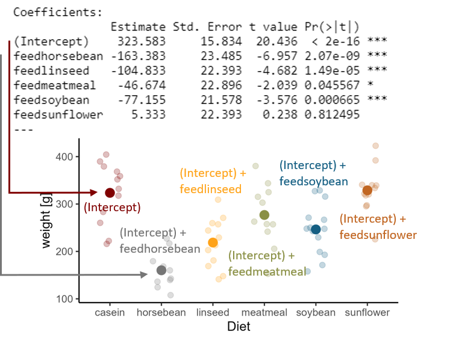

```{r setup, include=FALSE}
knitr::opts_chunk$set(
  echo = TRUE, 
  warning = FALSE, 
  message = FALSE, 
  collapse = TRUE,
  fig.height = 6.3,
  fig.allign = 'center',
  fig.retina = 3.5,
  fig.showtext = TRUE
)
library(fontawesome)
library(tidyverse)
library(patchwork)

theme_set(theme_classic(base_size=16))
options(scipen = 0)
```

```{r child="title_slide.Rmd"}

```

---
class: inverse, middle, center

# .large[A little bit of theoretical background]

---
# Linear models background

#### The data:

  - Random sample of n data points ( $Y_i, X_{i1}, X_{i2},..., X_{ip}$, $i = 1...n$) 
  
    - $X_{i1}, X_{i2},..., X_{ip}$ are p **independent predictor** variables
    
    - $Y_i$ is the **dependent** observation and **response variable**

--

#### Example

Data set of grassland productivity ( $Y_i$ ) depending on plant species richness ( $X_{i1}$ ) and the location/measurement site  ( $X_{i1}$ ).

**Aim of linear model:**

- Do the predictors (species richness, location) have a significant effect on the response (grassland productivity)?

---
# Linear models background

#### The data:

  - Random sample of n data points ( $Y_i, X_{i1}, X_{i2},..., X_{ip}$, $i = 1...n$) 
  
    - $X_{i1}, X_{i2},..., X_{ip}$ are p **independent predictor** variables
    
    - $Y_i$ is the **dependent** observation and **response variable**

#### The model:

$Y_i = \beta_0 + \beta_1*X_{1,i} + \beta_2*X_{2,i} + \epsilon$

- $Y_i$ value of response variable
- $\beta_0, \beta_1, \beta_2$ model coefficients
- $X_{1,i}$ value of predictor $X_1$
- $X_{2,i}$ value of predictor $X_2$
- $\epsilon$ error term
  
---
# Linear models background

```{r echo=FALSE, fig.height=7.5}
prod <- readr::read_tsv(here::here("data/slides/03_productivity.txt")) %>% 
  mutate(across(site, as_factor))

# Hypothesis 1: Productivity increases with species richness:
regr <- ggplot(prod, aes(x=richness, y=productivity))+
  geom_point()+
  geom_smooth(method="lm", alpha = 0) +
  labs(x="species richness", title = "Linear regression") 
regr_m <- ggplot(prod, aes(color = site, x=richness, y=productivity))+
  geom_point()+
  geom_smooth(method="lm", alpha = 0) +
  labs(x="species richness", title = "Analysis of covariance")

box <- ggplot(prod, aes(x=site, y=productivity))+
  geom_boxplot(aes(color = site))+
  labs(title = "Analysis of variance")

```

.pull-left[
<br>

**Linear regression**

- numerical response
- numerical predictor(s)


**Analysis of variance**

- numerical response
- categorical predictor(s)


**Analysis of covariance**

- numerical response
- numerical and categorical predictor(s)

]

.pull-right[
```{r echo=FALSE, fig.height = 7.5}
(regr  / box / regr_m)
```

]

---
# Linear models background

.left-column-large[
Linear relation with two predictors $X_1$ and $X_2$ ( $i = 1...n$ )

**Without interaction**

$Y_i = \beta_0 + \beta_1*X_{1,i} + \beta_2*X_{2,i} + \epsilon$


**With interaction**

$Y_i = \beta_0 + \beta_1*X_{1,i} + \beta_2*X_{2,i} + \beta_3*X_{1,i}*X_{2,i} + \epsilon$

with

- $Y_i$ value of response variable
- $\beta_0, \beta_1, \beta_2$ model coefficients
- $X_{1,i}$ value of predictor $X_1$
- $X_{2,i}$ value of predictor $X_2$
- $\epsilon$ error term
]

.right-column-small[


]
---
# Goodness of fit linear model

.pull-left[

#### Model residuals

$Y_i - \hat{Y}_i$

#### Residual sum of squares (RSS)

$RSS = \sum_{i=1}^{n} (Y_i - \hat{Y}_i)^2$


#### Aim of the model fitting:
Find the model coefficients that lead to the lowest sum of squares.
]

.pull-right[


 
]

---
# Assumptions for linear models

Finding the model estimates that lead to the lowest residual sum of squares works only if:

1) Residuals are normally distributed

2) Residual variance is constant

3) No strong outliers

--


This has to be checked for every linear model!

If assumptions are not fullfilled, a different model approach has to be chosen.

---
class: inverse, middle, center

# .large[How to fit linear models in `r fa("r-project")`]

---
# The data

We use productivity data from grassland sites. <br>
The data set is called `prod` and has  3 variables: site, productivity and richness (species richness):

```{r eval=FALSE}
prod
```

```{r echo=FALSE}
print(prod, n=4)
```

The variable site is a factor with two levels: site1 and site2

```{r}
levels(prod$site) # get all levels of the factor
```

---
class: inverse, middle, center

# .large[Linear regression in `r fa("r-project")`]

---
# Linear regression in R

.pull-left[

$H_1$: Species richness has an effect on productivity
 
]

.pull-right[

```{r echo=FALSE}
prod_scatter <- ggplot(prod, aes(x=richness, y=productivity))+
  geom_point()
prod_scatter
```
]

---
# Linear regression in R

Use the `lm` function to fit a linear model in R.

The general structure of the function call is like this:

.center[<code><b>lm ( formula = .col1[Y] ~ .col2[X], data = .col3[dat] )</b></code>]

with

- <b>.col1[Y]</b> being the response variable
- <b>.col2[X]</b> being the predictor(s)
- <b>.col3[dat]</b> being the name of the data

--

Multiple predictors can be added with `+` and  `:` depending on interaction:

- <code><b>`Y ~ X1 + X2`</b></code> tests effects without interaction

--

- <code><b>`Y ~ X1 + X2 + X1:X2`</b></code> tests single effects and interaction between `X1` and `X2`

---
# Linear regression in R

.pull-left[

Let's fit a linear model to test our hypothesis

<code><b>lm ( formula = .col1[Y] ~ .col2[X], data = .col3[dat] )</b></code>

```{r}
prod_lm <- lm(productivity ~ richness, 
              data = prod)
```
]

.pull-right[
```{r echo=FALSE}
prod_scatter +
  geom_smooth(method = "lm", se = FALSE) +
  theme(
    axis.title.y = element_text(color = "#4C7488", face = "bold"),
    axis.title.x = element_text(color = "#D78974", face = "bold")
  )
```
]

---
# Linear regression in R

Is the effect of richness on productivity significant?

**Or in other words**

Does the model with richness as predictor significantly reduce the residual sum of squares?

--

#### Hypothesis testing using F-Tests

Compare the complex model with a simple model that does not contain the predictor

$H_0$: The error variance in the simple model is not significantly higher than in the more complex model

--

- $H_0$ accepted: simplification was justified `r fa("arrow-right")` use simple model without predictor

--

- $H_0$ rejected: simplification reduced explanatory power `r fa("arrow-right")` use complex model with predictor

---
# Linear regression in R

#### Hypothesis testing using F-Tests in R


$H_0$: The error variance in the simple model is not significantly higher than in the more complex model

`drop1` deletes single terms from the model and performs an F-test: 

```{r eval}
drop1(prod_lm, test = "F")
```

Result: Reject $H_0$ `r fa("arrow-right")` Richness increases productivity $(F_{1,398} = 761.71, p < 0.001)$

---
# Extracting the coefficients

Look at model coefficients using the model `summary`

```{r}
summary(prod_lm)
```

---
# Summary table

.center[]

---
# Summary table

.center[]

---
# Summary table

.center[]

---
# Summary table

.center[]

---
# Test model assumptions

Test model assumptions to make sure that:

1) Residuals are normally distributed

2) Variance is constant (homogeneous)

3) There are no strong outliers or very influential observations

--

We can check that by looking at diagnostic plots

```{r eval=FALSE}
# install.packages("performance")
performance::check_model(prod_lm)
```

---
# Test model assumptions

```{r eval = FALSE}
performance::check_model(prod_lm)
```
.center[
```{r echo=FALSE}
prod_lm_perf <- performance::check_model(prod_lm)
prod_lm_perf
```
]
---
# Test model assmptions

.pull-left[

Check the assumptions

- Residuals are normally distributed ✔️
- Variance is constant (homogeneous) ✔️
- There are no strong outliers or very influential observations ✔️ 

Checking diagnostic plots needs some experience

- Real life data (almost) never perfectly fit the assumptions
- Linear models are to some extent robust against violations of the assumptions
]

.pull-right[
```{r echo=FALSE}
prod_lm_perf
```
]

---
# Plot the model

#### Option 1

Add the regression line directly as a ggplot layer

--

.pull-left[

Use `geom_smooth()` to add the model directly:

```{r eval=FALSE}
ggplot(prod, aes(x = richness, y = productivity)) +
 geom_point() +
 geom_smooth(method = "lm", se = FALSE) #<<
```

]

.pull-right[

```{r echo=FALSE, fig.height=5.6}
prod_scatter +
  geom_smooth(method = "lm", se = FALSE)
```

]

---
# Plot the model

#### Option 2

Extract coefficients (slope + intercept) of the model and add the regression line

--

.pull-left[

```{r}
# These are the coefficients of the lm
prod_lm$coefficients
```

```{r}
intercept <- prod_lm$coefficients[1]
slope <- prod_lm$coefficients[2]
```

]

---
# Plot the model

#### Option 2
Extract coefficients (slope + intercept) of the model and add the regression line

.pull-left[

```{r}
intercept <- prod_lm$coefficients[1]
slope <- prod_lm$coefficients[2]
```

Add a line defined by slope and intercept using `geom_abline()`:

```{r eval=FALSE}
 ggplot(prod, aes(x=richness, y=productivity))+
  geom_point() +
  geom_abline(slope = slope, #<<
              intercept = intercept) #<<
```
]

.pull-right[
```{r echo=FALSE, fig.height=5.6}
prod_scatter +
  geom_abline(slope = slope, 
              intercept = intercept)
```
]


---
class: inverse, center, middle

# .large[Analysis of covariance]

---
# Analysis of covariance

One categorical and one numerical predictor variable

--

.pull-left[

Two possible models:


]

.pull-right[
```{r echo=FALSE}
 ggplot(prod, aes(x=richness, y=productivity, color = site))+
  geom_point()+
  geom_smooth(method = "lm", se = FALSE)
```
]

---
# Analysis of covariance

Fit the model with `lm`

--

#### Without interaction

Species richness has an effect on productivity and there is a difference between sites.

```{r}
prod_lm2a <- lm(productivity ~ richness + site, data = prod)
```

--

#### With interaction

Species richness has an effect on productivity and the effect differs between sites.

```{r}
prod_lm2b <- lm(productivity ~ richness + site + richness:site, data = prod)
```

---
# Analysis of covariance

Are the effects significant?

#### Without interaction

```{r}
drop1(prod_lm2a, test = "F") # no interaction
```

--

Both, the removal of site and richness significantly increase the model's RSS `r fa("arrow-right")` both site and richness are significant predictors

---
# Analysis of covariance

Are the effects significant?

#### With interaction

```{r}
drop1(prod_lm2b, test = "F") # interaction
```

--

The removal of the interaction does not significantly increase the model's RSS `r fa("arrow-right")` the interaction is not significant and the simpler model without interaction is just as good in predicting productivity.

---
# Extracting model coefficients

```{r}
summary(prod_lm2a)
```

---
# Extracting model coefficients



---
# Test model assumptions

.pull-left[

Check the assumptions

- Residuals are normally distributed ✔️
- Variance is constant (homogeneous) ✔️
- There are no strong outliers or very influential observations ✔️ 
]

.pull-right[
```{r}
performance::check_model(prod_lm2a)
```
]

---
# Plot the model

If we want to be precise, we could not use `geom_smooth()` for this model because it plots the full model with interaction between the predictors

--

.pull-left[

```{r eval=FALSE}
ggplot(prod, aes(x = richness, 
                 y = productivity, 
                 color = site)) +
  geom_point() +
  geom_smooth(method = "lm") #<<
```

This plot is not 100% appropriate if the model you present is without interaction
]
.pull-right[
```{r echo=FALSE, fig.height=6.1}
 ggplot(prod, aes(x = richness, y = productivity, color = site)) +
  geom_point() +
  geom_smooth(method = "lm") #<<
```
]

---
# Plot the model

#### Extract coefficients and add regression line


```{r}
# these are the model coefficients
prod_lm2a$coefficients
```


```{r}
slope <- prod_lm2a$coefficients[2]
intercept1 <- prod_lm2a$coefficients[1]
intercept2 <- prod_lm2a$coefficients[1] + prod_lm2a$coefficients[3]
```


---
# Plot the model

#### Extract coefficients and add regression line

.pull-left[

```{r eval=FALSE}
ggplot(prod, aes(x = richness, 
                 y = productivity, 
                 color = site)) +
  geom_point() +
  scale_color_manual(
    values = c("#4C7488", "#D78974")) +
  geom_abline(#<<
    slope = slope, #<<
    intercept = intercept1, #<<
    color = "#4C7488"#<<
  ) + #<<
  geom_abline(#<<
    slope = slope, #<<
    intercept = intercept2, #<< 
    color = "#D78974"#<<
  ) #<<
```

]

.pull-right[
```{r echo=FALSE, fig.height=5.6}
 ggplot(prod, aes(x=richness, y=productivity, color= site))+
   geom_point() +
   scale_color_manual(values = c("#4C7488", "#D78974")) +
   geom_abline(slope = slope, intercept = intercept1 , color = "#4C7488")+
   geom_abline(slope = slope, intercept = intercept2 , color = "#D78974")
```
]

---
# Plot the model

#### Option 2: Use the `predict()` function

--

```{r}
# step 1: create some data to predict from
pred_data <- tidyr::expand_grid(
  richness = min(prod$richness):max(prod$richness), 
  site = c("site1", "site2")
)
```

```{r echo=FALSE}
print(pred_data, n = 3)
```

--

- `tidyr::expand_grid` returns a tibble with all combinations of site and richness given as input
  - The `tidyr` package is part of the tidyverse
- The column names of the tibble that you create in this step have to correspond to the predictor names in the linear model

---
# Plot the model

#### Option 2: Use the `predict()` function

```{r}
# step 1: create some data to predict from
pred_data <- tidyr::expand_grid(
  richness = min(prod$richness):max(prod$richness), 
  site = c("site1", "site2")
)
```

```{r}
# step2: predict productivity values from pred_data
predictions <- predict(prod_lm2a, newdata = pred_data)#<<
```

- `predict` uses the `prod_lm2a` model and the data produced with `expand_grid` to predict productivity values for each combination of site and richness.

---
# Plot the model

#### Option 2: Use the `predict()` function

```{r}
# step 1: create some data to predict from
pred_data <- tidyr::expand_grid(
  richness = min(prod$richness):max(prod$richness), 
  site = c("site1", "site2")
)
```

```{r}
# step2: predict productivity values from pred_data
predictions <- predict(prod_lm2a, newdata = pred_data)
```

```{r}
# step 3: add predictions to the tibble
pred_data$productivity <- predictions#<<
```

---
# Plot the model 

#### Option 2: Use the `predict()` function

.pull-left[

Add a new `geom_*()` layer to the plot from the prediction data:

```{r eval=FALSE}
# step 4: Add predictions with geom_line
ggplot(prod, aes(x = richness, 
                 y = productivity, 
                 color = site)) +
  geom_point() +
  geom_line(data = pred_data) #<<
```

- The aesthetic mapping is inherited from the top level `ggplot` call to the `geom_line`

]
.pull-right[
```{r echo=FALSE, fig.height=5.7}
# step 4: Add predictions with geom_line
ggplot(prod, aes(x=richness, y=productivity, color= site))+
  geom_point() +
  geom_line(data= pred_data)

```
]

---
# Plot the model 

#### Option 2: Use the `predict()` function

** Summary of general workflow**

- **Step 1:** Use `expand_grid` to create a tibble with values for all predictor variables (the columns have to have the exact same name as the original data)

- **Step 2:** Use `predict` to predict response variable with the model using input predictor values from tibble in step 1

- **Step 3:** Add predictions as column to the tibble from step 1

- **Step 4:** Add predictions to the plot using a new `geom_line()` layer based on the tibble from step 3
---
class: inverse, middle, center

# .large[Analysis of variance (Anova)]

---
# Anova

Only categorical predictors.

--

**Example**: Data set `chickwts` about the weight of chickens fed with different diets. 

.pull-left[

```{r, eval=FALSE}
chickwts
```

```{r, echo=FALSE}
print(tibble(chickwts),n=4)
```
]

.pull-right[
```{r echo = FALSE, fig.height = 5.7}
ggplot(chickwts, aes(x=factor(feed), y= weight))+
  geom_boxplot()
```

]

---
# Anova

$H_1$: The diet has an effect on the weight of chicken.

--

Fit a linear model with `lm` and test the significance of the predictor:

```{r}
lm_chicken <- lm(weight ~ feed, data = chickwts)
drop1(lm_chicken, test = "F")
```

--

Removing the predictor `feed` from the model significantly increases the RSS `r fa("arrow-right")` The model with `feed` explains the data better than the model without `feed`, so the effect of `feed` on the chicken weight is significant.

---
# Extracting model coefficients

```{r}
summary(lm_chicken)
```

---
# Extracting model coefficients

.center[]

---
# Extracting model coefficients

.center[]

---
# Test model assumptions

.pull-left[

Check the assumptions

- Residuals are normally distributed ✔️
- Variance is constant (homogeneous) ✔️
- There are no strong outliers or very influential observations ✔️ 
]

.pull-right[
```{r}
performance::check_model(lm_chicken)
```
]

---
# Plot results

Plot anova results e.g. in a boxplot:

.pull-left[
```{r eval=FALSE}
ggplot(chickwts, aes(feed, weight)) +
  geom_boxplot() + #<<
  labs(x = "Diet", y= "Weight [g]")
```

]
.pull-right[

```{r echo=FALSE, fig.height=5.6}
ggplot(chickwts, aes(x=feed, y= weight)) +
  geom_boxplot() +
  labs(x = "Diet", y= "Weight [g]")
```
]

---
# Plot results

If you want a slightly nicer box plot, you could do something like this:
.pull-left[

```{r eval=FALSE}
chickwts %>%
  mutate(feed = as.factor(feed)) %>%
  mutate(feed = fct_reorder(feed, -weight)) %>%
  ggplot(aes(
    x = feed,
    y = weight,
    color = feed
  )) +
  geom_boxplot() +
  geom_point(
    size = 3, alpha = 0.25,
    position = position_jitter(width = 0.2, seed = 0)
  ) +
  coord_flip() +
  ggsci::scale_color_uchicago() +
  labs(y = "weight [g]", x = "Diet") +
  theme(legend.position = "none")
```
]
.pull-right[
```{r echo=FALSE, fig.height=6.1}
chickwts %>%
  mutate(feed = as.factor(feed)) %>%
  mutate(feed = fct_reorder(feed, -weight)) %>%
  ggplot(aes(x = feed, 
             y = weight,
             color = feed)) +
  geom_boxplot() +
  geom_point(size = 3, alpha = 0.25,
    position = position_jitter(width = 0.2, seed = 0)) +
  coord_flip() +
  ggsci::scale_color_uchicago() +
  labs(y = "weight [g]", x = "Diet") +
  theme(legend.position = "none")
```

]

.footnote-right[.small[Design adapted from [Cédric Scherer]((https://www.cedricscherer.com/2019/05/17/the-evolution-of-a-ggplot-ep.-1/#sort)]]]

---
# Linear models step by step

**Step 1: Explore** the data with plots

--

**Step 2**: Write down a **question/hypothesis** and think of the **model** to test it

--

**Step 3: Fit the linear model** using the `lm` function:

```{r eval=FALSE}
lm(formula = Y ~ X1 + X2 + X1:X2, data = dat)
```

- Use `+` for additive effects and `:` for interactions between predictors
  
--

**Step 4: Check model assumptions** by looking at the diagnostic plots

```{r eval=FALSE}
performance::check_model(mod)
```

- Normally distributed residuals
- Constant variance
- No strong outliers / influential data points

---
# Linear models step by step

**Step 5: Check significant variables** by conducting F-tests with `drop1`

```{r eval=FALSE}
drop1(mod, test = "F")
```

- If the removal of a variable significantly increases the RSS of the model, the predictor is significant

--

**Step 6: Check effect size** e.g. in the `summary` table

```{r eval=FALSE}
summary(mod)
```

- Extract coefficients from the model with `mod$coefficients`

--

**Step 7: Plot model**
  - Regression: regression line and scatterplot
  - Analysis of covariance: regression lines and scatter plot
  - Analysis of variance: boxplots, barplot, mean + sem or similar

---
# Options for model plotting

#### Option 1: `geom_smooth(method = "lm")`

- Plots a regression line with all interactions between variables
  - only use it if this is what you want to plot
  
--

#### Option 2: extract coefficients and use `geom_abline()`

- Extract slopes and intercepts from the model
  - `mod$coefficients`
- Add a `geom_abline` layer to your plot
  - `geom_abline(slope = your_slope, intercept = your_intercept)`

---
# Options for model plotting

#### Option 3: Use `predict` function

- This is the most flexible plotting option
- Step 1: Create a new tibble with data to predict from
  - Column names have to be same as predictors of linear model
  - Use e.g. `tidyr::expand_grid()` to create variable combinations
- Step 2: Predict the response for all value combinations from step 1
```{r eval=FALSE}
predict(mod, newdata = pred_data)
```
- Step 3: Add predicted response to tibble from step 1
- Step 4: Add a `geom_line` layer with the new data to your plot
```{r, eval=FALSE}
ggplot(orig_dat, aes(x = some_x, y = some_y, color = some_col)) +
  geom_point() +
  geom_line(data = pred_data) #<<
```

---
class: inverse, middle, center

# .large[Now you]

## Task 2: Linear models with the penugin data set

#### Find the task description [here](https://selinazitrone.github.io/intro-r-data-analysis/03_tasks_controller.html#linear-models)
